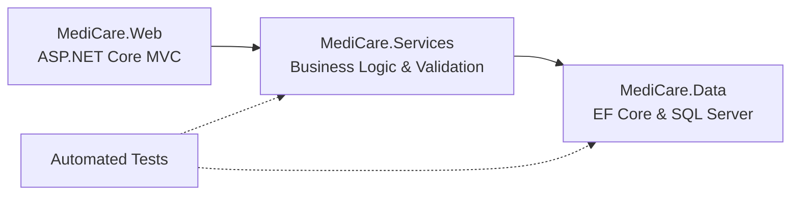

# MediCare — Clinic Management & Appointment System


## Quick Navigation

[Overview](#project-overview) · [Tech Stack](#technical-stack) · [Architecture](#architecture-at-a-glance) · [Features](#implementation-status-across-sprints) · [Local Setup](#local-development--setup-guide) · [Testing](#6-run-automated-tests) · [Documentation](#repository--documentation-structure)


## Project Overview
**MediCare** is an enterprise-grade Clinic Management and Appointment System developed as a graduation project for the **Digital Egypt Pioneers Initiative (DEPI) - .NET Full Stack Track** under the auspices of the Ministry of Communications and Information Technology (MCIT).

The system streamlines Egyptian outpatient clinic operations by offering dynamic, conflict-free appointment scheduling with SQL Server concurrency protection, role-based portals for patients, clinicians, and clinic administrators, real-time push notifications, digital prescription issuance with standardized print views, clinical history and allergy tracking, automated 24-hour background reminders, and multi-format administrative analytics.

---

## Technical Stack
- **Framework & Runtime:** ASP.NET Core MVC (.NET 8 LTS, C# 12)
- **Data Access & ORM:** Entity Framework Core 8, Microsoft SQL Server 2022 / LocalDB
- **Authentication & Security:** ASP.NET Core Identity 8, Role-Based Access Control, Anti-CSRF (`[ValidateAntiForgeryToken]`), BOLA/IDOR Defense, CSV Formula Injection Mitigation (CWE-1236)
- **Real-Time Communication:** ASP.NET Core SignalR (Strongly-Typed Hubs)
- **Background Processing:** Hosted Background Services (`BackgroundService`, `IServiceScopeFactory`)
- **Email & Messaging:** MailKit (SMTP via `IEmailService`), SendGrid adapter, Twilio SMS adapter, Mock SMS (`ISmsService`)
- **Frontend & UI:** Bootstrap 5, FullCalendar 6, Chart.js, Bootstrap Icons, CSS Print Media Queries
- **Validation & Testing:** FluentValidation, xUnit, Moq, FluentAssertions, SQL Server LocalDB Integration Tests
- **Reporting:** Multi-format exports (Sanitized CSV, Native OpenXML `.xlsx` Excel, Standard PDF)
- **CI/CD & Hosting:** GitHub Actions, Microsoft Azure App Service, Azure SQL Database

---

## Architecture at a Glance

MediCare separates the MVC presentation layer, application services, and data access into three projects. Controllers call service contracts rather than accessing the database directly.




## Implementation Status across Sprints

### Sprint 1: Foundation Phase
| Component | Status | Architectural Notes |
|---|:---:|---|
| **Solution Architecture** | &#10003; Complete | 3-Project N-Tier (`MediCare.Web` -> `MediCare.Services` -> `MediCare.Data`). Controllers inject services only. |
| **Data Entities & Schema** | &#10003; Complete | 11 domain entities + Identity. Automatic `CreatedAt`/`UpdatedAt` audit timestamps. No soft delete. |
| **Concurrency Safeguards** | &#10003; Complete | SQL Server Filtered Unique Index on `Appointments(DoctorId, AppointmentDate, StartTime) WHERE [Status] IN (1, 2)`. |
| **Database Migrations** | &#10003; Complete | Applied `InitialCreate` and `FinalGapClosureSchema` on SQL Server LocalDB (`(localdb)\mssqllocaldb`). |
| **Identity & Authentication** | &#10003; Complete | Roles (`Admin`, `Doctor`, `Patient`). Patient registration active immediately; Doctor registration requires approval (`IsApproved = false`). |
| **Database Seeder** | &#10003; Complete | `DbInitializer` seeds 1 Admin, 5 Specializations, 5 Doctors across Egyptian governorates with working hours, 5 Patients, past clinical encounters, prescriptions, and upcoming visits. |
| **Doctor Directory** | &#10003; Complete | Public list with search, governorate filtering, specialization, max fee, available day filters, pagination, and detailed doctor schedule profiles. |

### Sprint 2: Booking Engine Phase
| Component | Status | Architectural Notes |
|---|:---:|---|
| **Doctor Schedule Management** | &#10003; Complete | Doctor portal for weekly `WorkingHours` and `DoctorLeaves` with conflict detection warning if active appointments exist. |
| **Slot Calculation Engine** | &#10003; Complete | Pure, deterministic slot calculation engine in `MediCare.Services`. Excludes leaves, existing bookings, enforces 2h lead time, 30d advance booking window, and clinic local time (`Africa/Cairo`). |
| **Interactive Booking Flow** | &#10003; Complete | FullCalendar 6.1 interactive UI, slot selection modal, `AppointmentFactory`, booking review, and conflict pre-checking via `/api/appointments/check-conflict`. |
| **State Machine & Lifecycle** | &#10003; Complete | Full lifecycle transitions (`Pending` -> `Confirmed`/`Rejected`, `Cancelled` with 2h rule, `Completed`, `NoShow`) with ownership enforcement (403 IDOR prevention). |
| **Real-Time Push Notifications** | &#10003; Complete | Strongly-typed SignalR `AppointmentHub` (`IAppointmentNotificationClient`), persist-to-DB first architecture, unread counter badge, bell dropdown, and live toast popups. |

### Sprint 3: Clinical Encounters, Prescriptions & Admin Analytics
| Component | Status | Architectural Notes |
|---|:---:|---|
| **Clinical Encounter Documentation** | &#10003; Complete | Doctor digital encounter chart (`/MedicalRecords/Create/{appointmentId}`) with diagnosis, symptoms, visit notes, and diagnostic file upload (JPG/PNG/PDF &le; 5 MB) stored under `wwwroot/uploads/records/` with GUID safe names. |
| **Completion Rule Invariant** | &#10003; Complete | Appointment transitions to `Completed` **only** upon documenting an encounter for a `Confirmed` appointment whose scheduled start time has elapsed; updates `PaymentStatus = Paid` atomically in a single EF Core transaction. |
| **Itemized Digital Prescriptions** | &#10003; Complete | Prescriptions linked to encounter, doctor, and patient with dynamic multi-medication repeater (Medication, Dosage, Frequency, Duration Days, Instructions). |
| **Standardized Print View** | &#10003; Complete | Dedicated `/Prescriptions/Print/{id}` view with `@media print` CSS rules, clinic branding, doctor license metadata, patient age calculation, Rx body, and physician signature block. |
| **Admin Doctor Approvals** | &#10003; Complete | Admin portal (`/Admin/Approvals`) to review credentials, approve doctors (`IsApproved = true`), or decline with explanatory note; transactional emails sent via MailKit. |
| **Admin Dashboard & Analytics** | &#10003; Complete | Operational metrics ribbon (Total Visits, Active/Pending Doctors, Completed Rate, Paid Revenue, Pending Revenue), Chart.js monthly volume bar chart, and specializations distribution doughnut chart. |
| **RFC 4180 CSV Export** | &#10003; Complete | Full appointments CSV export (`/Admin/ExportAppointmentsCsv`) with UTF-8 BOM preamble for Excel compatibility and CSV Formula Injection mitigation (CWE-1236). |

### Sprint 4: Final Gap Closure & Compliance Hardening
| Component | Status | Architectural Notes |
|---|:---:|---|
| **Patient Profile & Allergies** | &#10003; Complete | Patient portal (`/Account/Profile`) to manage personal information, emergency contacts, recorded drug allergies, and chronic medical history with FluentValidation. |
| **Governorates Location Filter** | &#10003; Complete | Server-side bidirectional English/Arabic governorate filtering in `IDoctorRepository` across all 27 Egyptian governorates. |
| **Atomic Rescheduling** | &#10003; Complete | Atomic self-service appointment rescheduling (`/Appointments/Reschedule/{id}`) enforcing 2-hour lead time, working hours, doctor leaves, patient conflict checks, and DB index isolation. |
| **Admin Patient Management** | &#10003; Complete | Admin patient directory (`/Admin/Patients`) with multi-field search and instant account lockout/unlock management. |
| **Specializations CRUD** | &#10003; Complete | Clinical departments directory (`/Admin/Specializations`) with create, edit, and delete actions guarded against deleting active doctor specialties. |
| **Executive Analytics & Cohorts** | &#10003; Complete | Top 5 performing clinicians league table and patient demographic cohorts (`<18`, `18-35`, `36-50`, `50+`) on Admin dashboard and reports views. |
| **Multi-Format Export Subsystem** | &#10003; Complete | Native Microsoft Excel OpenXML (`.xlsx`) and branded PDF report generation alongside sanitized CSV exports. |
| **24-Hour Reminder Background Worker** | &#10003; Complete | Hosted `AppointmentReminderBackgroundService` scanning confirmed appointments in `[Now + 23h, Now + 25h]`, dispatching Email, SMS, and in-app SignalR alerts with `ReminderSent` flag tracking. |
| **Automated Testing Suite** | &#10003; Complete | **157 passing automated tests** (148 Unit Tests + 9 SQL Server LocalDB Integration Tests) with 0 regressions, 0 warnings, 0 errors. |

---

## Local Development & Setup Guide

### 1. Prerequisites
- **.NET 8 SDK (LTS)**: Check version using `dotnet --version`
- **SQL Server**: Microsoft SQL Server 2022 or SQL Server Express / LocalDB (`MSSQLLocalDB`)
- **Git**

### 2. Clone and Checkout
```bash
git clone https://github.com/foxelhadad812-design/MediCare.git
cd MediCare
```

### 3. Configure Local Connection String & Secrets
To avoid storing credentials in source control, configure secrets using `dotnet user-secrets`:
```bash
cd src/MediCare.Web
dotnet user-secrets init

# Set your local database connection string (LocalDB example):
dotnet user-secrets set "ConnectionStrings:DefaultConnection" "Server=(localdb)\mssqllocaldb;Database=MediCareDb;Trusted_Connection=True;MultipleActiveResultSets=true;TrustServerCertificate=True"

# Configure seeded account passwords:
dotnet user-secrets set "Seed:AdminPassword" "<YourSecureAdminPassword>"
dotnet user-secrets set "Seed:DefaultPassword" "<YourSecureDefaultPassword>"
```
*(An example configuration template is also provided at `src/MediCare.Web/appsettings.Development.json.example`).*

### 4. Apply Database Migrations
Run the EF Core database update from the repository root:
```bash
dotnet ef database update --project src/MediCare.Data --startup-project src/MediCare.Web
```

### 5. Run the Application
```bash
dotnet run --project src/MediCare.Web
```
Open your browser and navigate to the local HTTPS endpoint (typically `https://localhost:7001` or `http://localhost:5000`).
The database initializer automatically seeds demo specializations, doctors, and users upon first startup.

### 6. Run Automated Tests

Execute the automated test suite (the repository's existing test documentation reports 157 tests across unit and integration scenarios):

```bash
# Run the entire test suite (including SQL Server LocalDB integration tests)
dotnet test MediCare.sln

# Run unit tests only (isolated in-memory and mock tests)
dotnet test MediCare.sln --filter "Category!=Integration"

# Run SQL Server filtered unique index and concurrency integration tests
dotnet test MediCare.sln --filter "Category=Integration"
```

> **Note on Integration Tests:** The integration tests verify the filtered unique index concurrency guarantees and 10-thread parallel race conditions against Microsoft SQL Server LocalDB (`(localdb)\mssqllocaldb;Database=MediCare_IntegrationTests`) or the container configured via `MEDICARE_TEST_CONNECTION_STRING`.

---

## Pre-Seeded Demo Accounts

Passwords for seeded accounts are populated dynamically from your configured `Seed:AdminPassword` / `Seed:DefaultPassword` user-secrets (or environment variables in production). Never commit passwords to source control.

| Account Role | Email Address | Display Name / Clinical Specialty |
|---|---|---|
| **Administrator** | `admin@medicare.com` | System Administrator |
| **Doctor** | `ahmed.mahmoud@medicare.com` | Dr. Ahmed Mahmoud (Cardiology) |
| **Doctor** | `sara.alsayed@medicare.com` | Dr. Sara Al-Sayed (Dermatology) |
| **Doctor** | `youssef.nabil@medicare.com` | Dr. Youssef Nabil (Pediatrics) |
| **Doctor** | `mona.mansour@medicare.com` | Dr. Mona Mansour (Orthopedics) |
| **Doctor** | `tarek.ezzat@medicare.com` | Dr. Tarek Ezzat (General Internal Medicine) |
| **Patient** | `khaled.omar@medicare.com` | Khaled Omar |
| **Patient** | `nourhan.ali@medicare.com` | Nourhan Ali |
| **Patient** | `mostafa.hassan@medicare.com` | Mostafa Hassan |
| **Patient** | `dina.fathy@medicare.com` | Dina Fathy |
| **Patient** | `mohamed.selim@medicare.com` | Mohamed Selim |

---

## Repository & Documentation Structure

All project documentation follows the official DEPI guidelines and is organized as follows:

```
MediCare-docs/
├── .github/workflows/ci.yml                   # GitHub Actions CI build & test workflow
├── MediCare.sln                               # Visual Studio / .NET 8 solution
├── README.md                                  # Repository overview and setup guide
├── src/
│   ├── MediCare.Data/                         # Entities, DbContext, configurations, migrations, UoW
│   ├── MediCare.Services/                     # Service contracts, implementations, DTOs, FluentValidation
│   └── MediCare.Web/                          # ASP.NET Core MVC, Identity, controllers, Razor views
├── tests/
│   └── MediCare.Tests/                        # xUnit tests with FluentAssertions and Moq
└── docs/
    ├── 01-planning/                           # Phase 1: Planning and Management (Deadline: 16 Oct 2026)
    │   ├── project-proposal.md                # System overview, problem, scope, architecture & milestones
    │   ├── project-plan.md                    # 9-week timeline, Gantt chart, resource allocation & MVP rules
    │   ├── task-assignment.md                 # RACI matrix and solo engineering role coverage
    │   ├── risk-assessment.md                 # Risk matrix (RSK-01 to RSK-08) and mitigation strategies
    │   └── kpis.md                            # Quantifiable engineering KPIs and verification methods
    ├── 02-literature-review/                  # Phase 1: Literature Review (Deadline: 16 Oct 2026)
    │   └── literature-review.md               # Market analysis, system comparison & evaluator placeholders
    ├── 03-requirements/                       # Phase 1: Requirements Gathering (Deadline: 16 Oct 2026)
    │   ├── stakeholders-and-user-stories.md   # Stakeholders matrix and Given/When/Then user stories (US-01..08)
    │   ├── functional-requirements.md         # Numbered functional specifications (FR-01..28)
    │   └── non-functional-requirements.md     # Performance, security, reliability and usability NFRs
    ├── 04-design/                             # Phase 2: System Analysis and Design (Deadline: 6 Nov 2026)
    │   ├── README.md                          # Phase 2 documentation index
    │   ├── problem-statement-and-objectives.md# Clinical problems, 6 design goals & boundaries
    │   ├── use-case-diagram-and-descriptions.md # Use case model (UC-01..18) and detailed narratives
    │   ├── software-architecture.md           # 3-Project N-Tier design, request flows & patterns
    │   ├── database/                          # Relational data models and schemas
    │   │   ├── er-diagram.md                  # Mermaid ERD with cardinalities and keys
    │   │   └── logical-and-physical-schema.md # Data dictionary, filtered index & seed data
    │   ├── data-flow/                         # Process and data modeling
    │   │   └── dfd-context-and-level-1.md     # Context DFD, Level 1, and Level 2 booking flow
    │   ├── behavior/                          # UML dynamic behavior models
    │   │   ├── sequence-diagrams.md           # Sequence diagrams for 7 core workflows
    │   │   ├── activity-diagrams.md           # Activity diagrams for booking, visit & leaves
    │   │   ├── state-diagram.md               # Appointment and doctor approval state machines
    │   │   └── class-diagram.md               # Object-oriented class models across all tiers
    │   ├── ui-ux/                             # UI/UX specifications and guidelines
    │   │   ├── wireframes-spec.md             # Screen-by-screen layouts & sitemap for Figma
    │   │   └── ui-ux-guidelines.md            # WCAG 2.1 AA palette, typography & print CSS
    │   ├── deployment/                        # Infrastructure and hosting models
    │   │   ├── technology-stack.md            # Detailed technology inventory and rationale
    │   │   ├── deployment-and-component-diagrams.md # Cloud topology & component diagrams
    │   │   └── deployment-strategy.md         # CI/CD, user-secrets, Azure & fallback plan
    │   ├── api/                               # Internal JSON API and OpenAPI 3.0
    │   │   ├── api-documentation.md           # Internal calendar & notification JSON contracts
    │   │   └── openapi.yaml                   # OpenAPI 3.0 specification for internal API
    │   └── testing/                           # Quality assurance planning
    │       └── testing-and-validation-plan.md # Test pyramid, 10-thread test & TC-01..24 matrix
    ├── 05-testing/                            # Phase 4: Testing & Quality Assurance
    │   ├── test-strategy.md                   # Multi-tier testing methodology & quality metrics
    │   ├── test-plan.md                       # Test environment setup, scope, & criteria
    │   ├── test-cases.md                      # Detailed test specifications (TC-01..30)
    │   ├── test-execution-report.md           # 157 automated test runs & pass evidence
    │   ├── security-test-report.md            # IDOR, CSRF, CSV Injection security audit
    │   └── final-qa-summary.md                # Verification sign-off & readiness metrics
    └── 06-final/                              # Phase 4: Final Deliverables & User Manual
        ├── user-manual.md                     # Comprehensive operations guide (Admin, Doctor, Patient)
        ├── technical-documentation.md         # Full architectural specification, ERD, and security controls
        └── project-presentation.md            # DEPI graduation defense slide deck outline
```

---

## Key Milestone Dates (DEPI 2026)

| Milestone Phase | Deliverables Included | Official Deadline | Status |
|---|---|---|:---:|
| **Phase 1: Planning & Requirements** | Proposal, Plan, Tasks, Risks, KPIs, Literature Review, User Stories, FR/NFR | **16 Oct 2026** | &#10003; Documented |
| **Phase 2: System Analysis & Design** | Architecture, ERD, Schema, DFDs, UML Diagrams, Wireframes, API Spec | **6 Nov 2026** | &#10003; Documented |
| **Phase 3: Implementation & Deployment** | Sprint 1 Scaffolding & Directory; Sprint 2 Booking Engine & SignalR; Sprint 3 Clinical Records, Prescriptions & Admin Analytics | **30 Nov 2026** | &#10003; Complete |
| **Phase 4: Testing, Manual & Defense** | Automated Test Suites (157 Tests), Security Audit, User Manual, Technical Docs, Presentation Deck | **4 Dec 2026** | &#10003; Complete & Audited |
