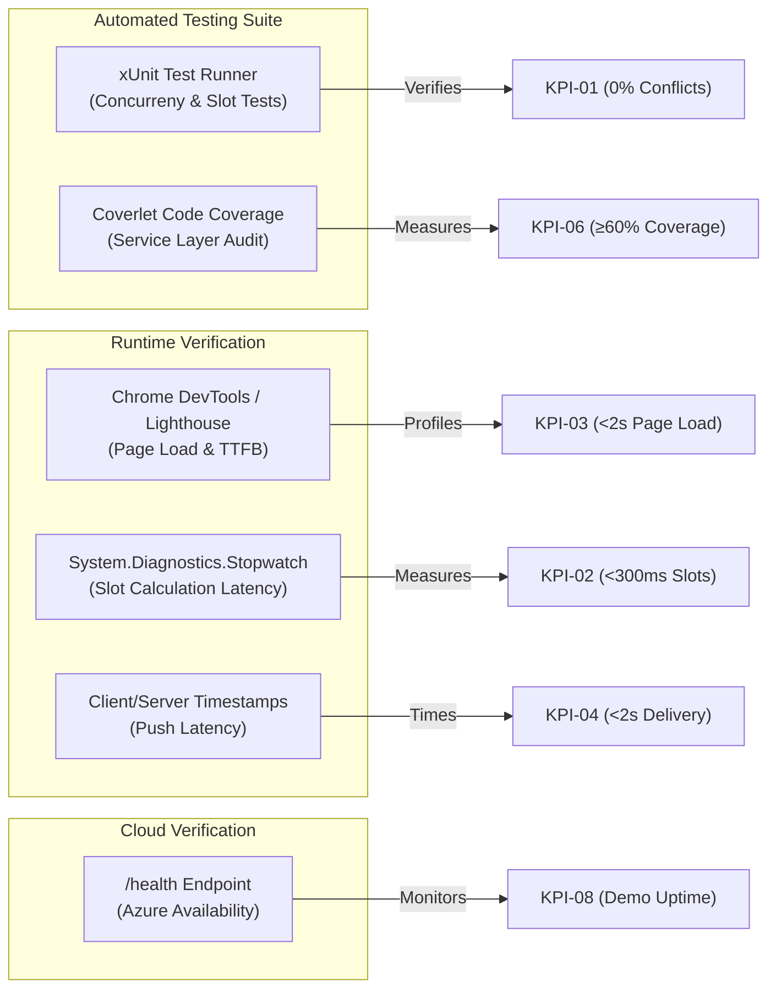

# Key Performance Indicators (KPIs): MediCare

## 1. Overview
This document defines the quantitative, measurable Key Performance Indicators (KPIs) used to evaluate the technical, operational, and engineering success of **MediCare**.

To ensure realistic benchmarking, all metrics are calibrated for execution on standard development machines and verified under **low-cost or free-tier cloud hosting environments** (e.g., Azure App Service B1/F1 and Azure SQL Database).

---

## 2. Engineering & Technical Performance KPIs

| Metric ID | Indicator / Objective | Target Value | Baseline / Threshold | Measurement Methodology & Verification Tool |
|---|---|:---:|:---:|---|
| **KPI-01** | **Double-Booking Incident Rate** | **0.0%** (Zero Tolerance) | > 0.0% is a critical failure | **Multi-Threaded Concurrency Test:** An automated xUnit integration test initiates 10 parallel HTTP POST / service requests simultaneously attempting to reserve the exact same 30-minute doctor slot. Exactly 1 request must succeed, and exactly 9 must receive conflict responses without database corruption. |
| **KPI-02** | **Slot Calculation Latency** | **< 300 ms** per doctor-month | Max acceptable: 600 ms | **Benchmarking / Stopwatch Telemetry:** Measured on `IAppointmentService.GetAvailableSlotsAsync(doctorId, month, year)`. Calculates free slots across working hours minus leaves and existing bookings. Profiled using .NET `System.Diagnostics.Stopwatch` across 1,000 synthetic test runs. |
| **KPI-03** | **Average Page Response Time** | **< 2.0 seconds** | Max acceptable: 3.5 seconds | **Browser Network Timing & Lighthouse:** Measured on primary server-rendered views (Doctor Directory with active search filters, Doctor Calendar view, and Patient Appointment History) hosted on Azure App Service over HTTPS under standard 4G network throttling. |
| **KPI-04** | **SignalR Notification Delivery Latency** | **< 2.0 seconds** | Max acceptable: 4.0 seconds | **Client Timestamp Telemetry:** Measured from the exact server timestamp when an appointment status changes to `Confirmed` or `Cancelled` until the client-side JavaScript toast notification handler executes in the recipient's browser. |
| **KPI-05** | **Booking Funnel Efficiency** | **≤ 4 User Steps** | Max acceptable: 6 steps | **User Journey Audit:** Count of discrete user interactions required for a patient to book an appointment: Step 1 (Search/Select Doctor) -> Step 2 (Select Date on Calendar) -> Step 3 (Click 30-min Slot) -> Step 4 (Confirm Booking). |
| **KPI-06** | **Core Service Unit Test Coverage** | **≥ 60.0%** | Min acceptable: 50.0% | **Coverlet / Visual Studio Code Coverage:** Code coverage percentage computed across the `MediCare.Services` assembly, with explicit 100% branch coverage required for the `SlotEngine` and `ConflictDetectionService`. |
| **KPI-07** | **MVP Delivery Completion Rate** | **100.0%** of defined MVP scope | Min acceptable: 90.0% | **Requirements Verification Audit:** Percentage of functional requirements categorized as `Must Have` (Auth, Directory, Conflict-Free Booking, Clinical Records, Prescriptions, SignalR, Admin Approval) completed and passing acceptance tests by 30 November 2026. |
| **KPI-08** | **System Availability During Evaluation** | **100.0%** uptime during defense | < 99.0% on demo day fails evaluation | **Azure Monitoring & Health Check:** Verification that the public Azure web URL responds with `HTTP 200 OK` on `/health` during the live graduation defense and evaluation sessions. |

---

## 3. Verification & Telemetry Architecture

---

## 4. Evaluation Reporting Protocol

Each KPI target is evaluated and recorded at milestone checkpoints:
1. **At Milestone 2 (6 Nov):** Review testability criteria in the Test Plan.
2. **At Milestone 3 (30 Nov):** Execute automated coverage and concurrency test runs; log formal metrics in the deployment report.
3. **At Milestone 4 (4 Dec):** Include finalized KPI verification graphs in the graduation defense presentation slides.
