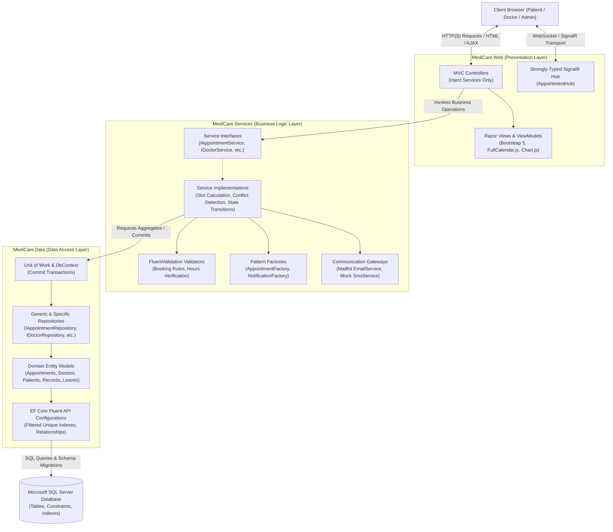

# Project Proposal: MediCare — Clinic Management & Appointment System

## 1. Project Overview
**MediCare** is a full-featured, enterprise-grade Clinic Management and Appointment System developed using **ASP.NET Core MVC** and **Entity Framework Core**. Designed as a graduation project for the **Digital Egypt Pioneers Initiative (DEPI)**, MediCare provides an integrated digital ecosystem for private outpatient clinics and polyclinics.

The platform streamlines healthcare administrative workflows by automating patient booking, eliminating schedule conflicts through deterministic concurrency controls, facilitating digital medical consultations and prescription printing, and providing real-time visibility into clinic operations for administrators.

---

## 2. Problem Statement
Outpatient clinics and medium-sized healthcare centers frequently suffer from operational inefficiencies caused by manual or disconnected scheduling workflows:
1. **Double-Booking & Schedule Clashes:** Reliance on manual appointment logs or naive web forms frequently causes overlapping reservations when multiple patients or receptionists schedule appointments simultaneously.
2. **Lack of Real-Time Coordination:** Schedule modifications, doctor emergency leaves, and appointment confirmations are communicated asynchronously, causing long clinic waiting times or unattended appointments (No-Shows).
3. **Fragmented Clinical Records:** Consultations, written prescriptions, and laboratory/imaging attachments remain separated across paper files, preventing historical tracking during follow-up visits.
4. **Administrative Opacity:** Clinic management lacks centralized visibility into appointment volumes, physician schedules, cancellation ratios, and consultation fee metrics.

MediCare solves these challenges through a centralized, concurrency-safe, multi-tenant capable architecture with real-time push communication.

---

## 3. Project Objectives
The primary architectural and functional objectives of MediCare are:
* **Zero-Conflict Scheduling Engine:** Implement a deterministic 30-minute slot allocation engine backed by database-level filtered unique constraints and transactional validation to guarantee zero double-bookings.
* **Role-Differentiated Access:** Provide dedicated operational portals for **Patients**, **Doctors**, and **Clinic Administrators** using secure ASP.NET Core Identity authentication.
* **Real-Time Notification Pipeline:** Integrate ASP.NET Core SignalR with database persistence to deliver instant appointment alerts to active browsers, backed by transactional email notifications via MailKit.
* **Comprehensive Clinical Records:** Enable physicians to record patient visit notes, upload diagnostic documents (images/PDFs), and generate standardized, print-friendly digital prescriptions.
* **Operational Reporting:** Deliver administrative visual analytics tracking monthly appointments, top specializations, and fee collection summaries using Chart.js.

---

## 4. System Scope

### 4.1 In-Scope Capabilities
* **Authentication & Identity:**
  * ASP.NET Core Identity with three distinct roles: `Admin`, `Doctor`, and `Patient`.
  * Specialized profile entities (`Doctor`, `Patient`) linked to `AspNetUsers` via `UserId` foreign key without column duplication.
* **Doctor Directory & Schedules:**
  * Public doctor directory searchable and filterable by Medical Specialization, Consultation Fee, and Available Day.
  * Doctor working hour configuration per day of the week.
  * Doctor leave/vacation management (`DoctorLeaves`) to prevent slot generation during physician absences.
* **Appointment Scheduling:**
  * Dynamic calculation of available 30-minute slots based on working hours, leaves, and booked appointments.
  * Interactive calendar view via `FullCalendar.js` with client-side slot selection.
  * Appointment lifecycle management with strict state machine validation: `Pending`, `Confirmed`, `Completed`, `Cancelled`, `Rejected`, `NoShow`.
  * Patient cancellation restricted to at least 2 hours prior to the scheduled start time.
  * Transition to `Completed` allowed only after the scheduled appointment time has elapsed.
  * Triple-layer double-booking prevention: service-level pre-check, database filtered unique index, and transactional `DbUpdateException` catch.
* **Clinical Records & Prescriptions:**
  * Medical visit record entry (Symptoms, Diagnosis, Visit Notes).
  * Secure single-file attachment per record (PDF or JPG/PNG image under `wwwroot/uploads`).
  * Digital prescription creation with dynamic medication items (Medication Name, Dosage, Frequency, Duration, Instructions).
  * CSS print-friendly prescription layout for physical dispensing.
* **Notifications & Messaging:**
  * Dual-layer notifications: persisted in the database, then pushed via a strongly-typed SignalR Hub (`IAppointmentNotificationClient`).
  * Asynchronous email dispatch using MailKit via `IEmailService`.
  * Mock SMS interface via `ISmsService` for architecture completeness.
* **Administration & Analytics:**
  * Doctor registration approval and profile activation workflow.
  * Specialization management (CRUD).
  * Dashboard analytics: monthly appointment counts, specialization distribution, and revenue/fee collection summaries.

### 4.2 Out-of-Scope Capabilities
To maintain project focus and ensure the highest engineering quality within the graduation timeframe, the following features are explicitly excluded:
* **Online Payment Gateways:** Real-time credit card processing (e.g., Stripe, Paymob) is excluded. Consultation fees and payment status (`Unpaid`, `Paid`) are tracked operationally within the system.
* **Direct Telemedicine / Doctor-Patient Chat:** Real-time two-way messaging or video conferencing is excluded.
* **AI-Assisted Diagnostic Engines:** Automated medical diagnosis or automated symptom checkers are excluded. All medical conclusions remain the sole responsibility of licensed physicians.

---

## 5. Technology Stack

| Layer / Responsibility | Technology Selected | Rationale |
|---|---|---|
| **Web Framework & UI** | ASP.NET Core MVC (.NET 8) | Robust, server-rendered architecture with native dependency injection and security features. |
| **Data Access & ORM** | Entity Framework Core 8 | Modern code-first ORM supporting migrations, LINQ queries, and transaction management. |
| **Relational Database** | Microsoft SQL Server | Enterprise RDBMS providing ACID compliance, filtered unique indexes, and referential integrity. |
| **Authentication & RBAC** | ASP.NET Core Identity | Proven framework for secure password hashing, cookie authentication, and role authorization. |
| **Real-Time WebSockets** | ASP.NET Core SignalR | High-performance, bi-directional real-time communication for instant browser alerts. |
| **Calendar UI** | FullCalendar.js 6 | Industry-standard JavaScript calendar component for schedule visualization. |
| **Data Visualization** | Chart.js | Lightweight HTML5 canvas charting library for responsive administrative analytics. |
| **Styling & Components** | Bootstrap 5 & jQuery | Responsive UI layout, modal dialogues, and AJAX-driven schedule interactions. |
| **Email Communication** | MailKit & MimeKit | Robust, RFC-compliant cross-platform SMTP client library. |
| **Business Validation** | FluentValidation | Fluent API for decoupling complex domain validation rules from presentation models. |
| **Testing Frameworks** | xUnit, Moq, FluentAssertions | De facto testing stack in modern .NET for isolated unit and integration testing. |
| **CI/CD Pipeline** | GitHub Actions | Automated build, unit test execution, and deployment verification on every push. |
| **Cloud Hosting** | Microsoft Azure App Service & Azure SQL | Managed cloud platform for reliable demonstration and evaluation. |

---

## 6. High-Level Software Architecture

MediCare implements a strict **3-Project N-Tier Architecture** enforcing clear separation of concerns. The Web presentation layer references the Services business logic layer, which in turn references the Data access layer. Controllers interact solely with service abstractions.

### Architectural Principles Enforced:
1. **Controller Encapsulation:** Controllers never inject `ApplicationDbContext` or repository interfaces directly; all database interaction is mediated through business services.
2. **Persistence Abstraction:** Data persistence and query execution are encapsulated within the Repository and Unit of Work patterns.
3. **Domain Integrity:** Scheduling invariants (such as lead-time cancellation windows and slot boundary checks) are enforced in `MediCare.Services` using FluentValidation rules.

---

## 7. Deliverables & Milestone Schedule

The project adheres to the official DEPI 2026 graduation timeline across four major milestone phases:

| Phase # | Phase Title | Deliverables Required | Official Deadline |
|---|---|---|---|
| **Phase 1** | **Project Planning & Requirements** | • Project Proposal Document • Project Plan (Gantt Chart & Resource Allocation) • Task Assignment & Roles (RACI Matrix) • Risk Assessment & Mitigation Plan • Engineering KPIs & Metrics • Literature Review & Competitive Analysis • Stakeholder Analysis & User Stories • Functional & Non-Functional Specifications | **16 Oct 2026** |
| **Phase 2** | **System Analysis & Design** | • System Architecture Specification • Use Case Diagrams & Narratives • Entity-Relationship Diagram (ERD) • Logical & Physical Database Schema • Data Flow Diagrams (Context & Level 1 DFD) • UML Sequence, Activity, State & Class Diagrams • UI Wireframes & Design Guidelines • Component & Deployment Diagrams • Internal API Specifications (Swagger/OpenAPI) | **6 Nov 2026** |
| **Phase 3** | **Implementation & Execution** | • Complete NTier C# Solution Source Code • EF Core Database Migrations & Initializer Seed Data • Unit & Integration Test Suites • Automated CI/CD GitHub Actions Pipeline • Live Cloud Deployment on Microsoft Azure • Project README & Configuration Guide | **30 Nov 2026** |
| **Phase 4** | **Testing, Reports & Final Presentation** | • Quality Assurance Test Plan & Test Cases • Defect Tracking & Bug Reports • Comprehensive End-User Manual • Final Technical Documentation Report • Graduation Project Presentation Slides (PPT/PDF) • Demonstration Video & Live System Defense | **4 Dec 2026** |
