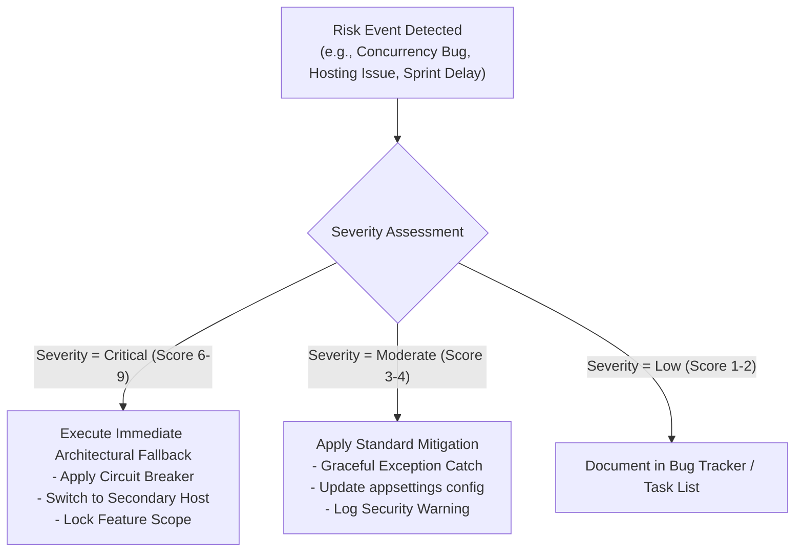

# Risk Assessment & Mitigation Plan: MediCare

## 1. Risk Management Framework
This document identifies, evaluates, and establishes mitigation controls for architectural, technical, security, and project management risks facing the MediCare development lifecycle.

Risks are rated using a standard qualitative matrix:
* **Likelihood:** Low (1), Medium (2), High (3)
* **Impact:** Low (1), Medium (2), High (3)
* **Risk Severity Level:**
  * **Critical (6–9):** Immediate structural controls required.
  * **Moderate (3–4):** Active monitoring and automated safeguards.
  * **Low (1–2):** Standard operational handling.

---

## 2. Risk Assessment Matrix

| Risk ID | Risk Description | Category | Likelihood | Impact | Severity | Mitigation Strategy & Architectural Controls |
|---|---|---|:---:|:---:|:---:|---|
| **RSK-01** | **Double-Booking via Concurrent Slot Requests** Two patients attempt to reserve the same 30-minute doctor slot within milliseconds of each other, leading to overlapping appointments. | Architecture / Data Integrity | Medium (2) | High (3) | **Critical (6)** | **Triple-Layer Concurrency Defense:** 1. **Database Constraint:** Apply a SQL Server **Filtered Unique Index** on `(DoctorId, AppointmentDate, StartTime)` with condition `WHERE Status NOT IN ('Cancelled', 'Rejected')`. 2. **Service Layer Check:** Pre-validate slot availability within `IAppointmentService.CreateAppointmentAsync` prior to persisting. 3. **Exception Handler:** Wrap commit in a try-catch block intercepting `DbUpdateException` to return a friendly user error: *"This slot has just been reserved by another patient."* |
| **RSK-02** | **Insecure Direct Object Reference (IDOR) on Clinical Data** A malicious or curious patient modifies the URL parameter (e.g., `/MedicalRecords/Details/45` or `/Prescriptions/Print/12`) to view another patient's confidential health data. | Security / Privacy | Medium (2) | High (3) | **Critical (6)** | **Strict Ownership Enforcement:** 1. Service-layer authorization check on every query: verify that `record.Patient.UserId == currentLoggedInUserId` or that the requesting user is the assigned `Doctor` or an authorized `Admin`. 2. If ownership verification fails, immediately abort the request, return `HTTP 403 Forbidden`, and write a security audit event to the application log. |
| **RSK-03** | **SignalR Real-Time Notification Loss** If a user experiences network disconnects, tab closure, or page reloads, transient WebSocket messages could be permanently lost. | Architecture / Reliability | High (3) | Medium (2) | **Critical (6)** | **Dual-Layer Persistence Pattern:** Never rely on SignalR as the sole system of record. Every notification is **first committed to the `Notifications` SQL table** with `IsRead = false`. The backend then invokes `AppointmentHub` to broadcast the event. When a user connects or reloads, the client initializes by pulling unread notifications from the database. |
| **RSK-04** | **Third-Party Email Deliverability & Port Blocking** External SMTP servers (e.g., SendGrid, Gmail) block outbound port 25/587 or reject unverified developer domain addresses during live evaluation. | Integration / Infrastructure | Medium (2) | Medium (2) | **Moderate (4)** | **Decoupled MailKit Provider with Fallback:** 1. Encapsulate all mailing logic behind `IEmailService` using MailKit over secure TLS (port 587 or 465). 2. Configure SMTP credentials dynamically via `appsettings.json`. 3. Use Mailtrap / local development SMTP for testing. 4. In the event of network blocking, catch SMTP exceptions gracefully without breaking the core appointment booking transaction. |
| **RSK-05** | **Implementation Schedule Overrun** Complex frontend calendar integration or design adjustments cause the solo developer to miss the 30 November code submission deadline. | Project Management | High (3) | High (3) | **Critical (9)** | **The 20-November Circuit-Breaker Rule:** 1. Enforce strict MVP prioritization (Priority 1: Booking & Conflicts -> Priority 2: Records & Prescriptions -> Priority 3: Real-Time Alerts -> Priority 4: Admin & Charts). 2. Hard cutoff on **20 November**: If core booking is not fully stable, freeze all optional features and redirect 100% of effort to stabilization, unit tests, and Azure deployment. |
| **RSK-06** | **Cloud Hosting Cost Overrun or Credit Expiration** Azure student credit runs out or free-tier resource limits (App Service compute or SQL DTUs) cause downtime during grading. | Infrastructure / Operations | Medium (2) | High (3) | **Critical (6)** | **Resource Capping & Fallback Hosting Plan:** 1. Deploy strictly to Azure App Service F1/B1 (Free/Basic) and Azure SQL Database Serverless / Basic tier. 2. Implement connection pooling and disable heavy background cron jobs. 3. Maintain an automated self-contained Dockerfile and standby deployment profile on MonsterASP.NET or SmarterASP.NET as an instant 1-hour failover. |
| **RSK-07** | **Sensitive Credential Leakage to Public GitHub** Database connection strings, SMTP passwords, or application secrets accidentally committed to the public Git repository. | Security / DevOps | Medium (2) | High (3) | **Critical (6)** | **Secret Separation Architecture:** 1. Exclude `appsettings.Development.json` containing real secrets via `.gitignore`. 2. Use the .NET **Secret Manager (`dotnet user-secrets`)** for all local development credentials. 3. Inject production credentials exclusively through Azure App Service **Application Settings (Environment Variables)**. 4. Implement a GitHub Actions workflow pre-commit linter to scan for raw connection strings. |
| **RSK-08** | **Documentation Drifting Behind Implementation** Code changes and schema alterations made during rapid sprints cause submitted Phase 1 and Phase 2 documents to become obsolete or contradictory. | Compliance / Academic Quality | High (3) | Medium (2) | **Critical (6)** | **Documentation-First Definition of Done (DoD):** 1. Every feature pull request must update the corresponding Markdown documentation in `/docs` before merging. 2. Keep architectural decisions versioned in Git alongside source code. 3. Dedicate the first 2 days of sprint intervals to synchronizing class structures and schema updates with the documented ERD and Class Diagrams. |

---

## 3. Risk Monitoring & Escalation Protocol

* **Weekly Review:** At the end of every sprint (Sunday evening), review active risks against the sprint deliverables.
* **Emergency Protocol:** If a blocker persists for more than 48 hours during Phase 3, trigger the fallback solution specified in the mitigation column immediately.
