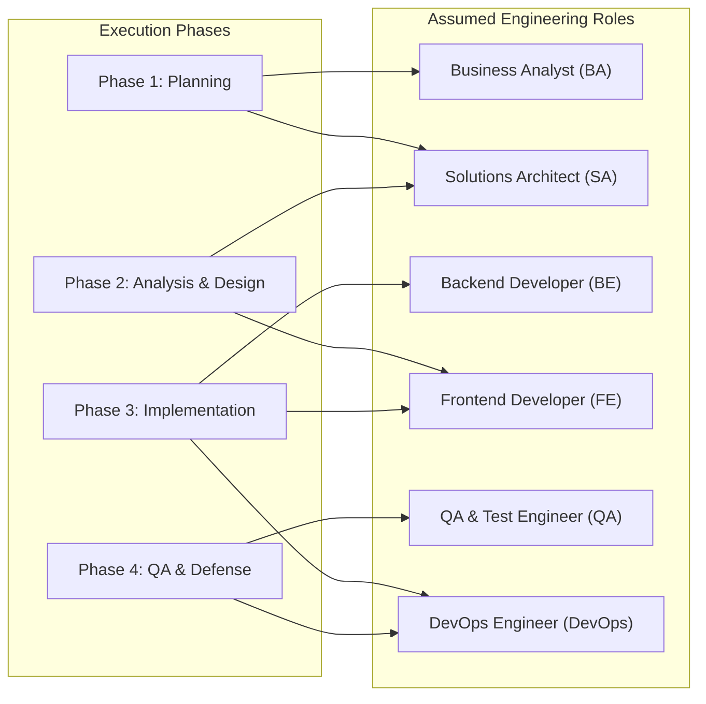

# Task Assignment & Roles: MediCare — Clinic Management & Appointment System

## 1. Project Team Structure
* **Author / Primary Engineer:** `[FILL IN MY NAME / TEAM MEMBERS]`
* **Project Nature:** Solo Full-Stack Engineering Capstone (DEPI .NET Full Stack Track)
* **Academic Supervisor / Instructor:** `[FILL IN SUPERVISOR / INSTRUCTOR NAME]`

Because this project is delivered as a solo capstone, the primary engineer assumes distinct engineering roles across each development phase to satisfy professional software engineering standards.

---

## 2. Engineering Role Distribution Across Project Phases



### Role Descriptions & Operational Responsibilities
1. **Business Analyst (BA):**
   * Conducts stakeholder interviews, gathers clinic functional requirements, formalizes user stories with Gherkin acceptance criteria, and performs market/literature reviews.
2. **Solutions Architect (SA):**
   * Designs the 3-Tier layered architecture, establishes domain boundaries, formulates database entity relationships (ERD), designs concurrency/conflict detection mechanisms, and creates UML models.
3. **Backend Developer (BE):**
   * Implements ASP.NET Core MVC controllers, `MediCare.Services` business logic, slot calculation engine, FluentValidation validators, EF Core configurations, and SignalR hub handlers.
4. **Frontend Developer (FE):**
   * Develops responsive Razor Views using Bootstrap 5, integrates `FullCalendar.js` for slot picking, builds Chart.js dashboards, and styles print-friendly prescription layouts.
5. **Quality Assurance (QA) Engineer:**
   * Authors test plans and test cases, implements automated xUnit unit/integration tests (including multi-threaded concurrency race condition tests), and tracks bug reports.
6. **DevOps Engineer:**
   * Configures GitHub repository branching rules, builds GitHub Actions CI/CD pipelines, manages environment secrets, provisions Azure App Service and Azure SQL resources, and executes database seeding.

---

## 3. RACI Responsibility Assignment Matrix

The RACI model defines individual involvement for each major deliverable:
* **R (Responsible):** The role that executes the task.
* **A (Accountable):** The individual with final ownership and approval authority.
* **C (Consulted):** The stakeholder providing input or feedback.
* **I (Informed):** The party kept updated on progress.

| Deliverable / Work Item | Business Analyst | Solutions Architect | Backend Dev | Frontend Dev | QA Engineer | DevOps Eng | Evaluator / Instructor |
|---|:---:|:---:|:---:|:---:|:---:|:---:|:---:|
| **Project Proposal & Scope Definition** | **R / A** | C | - | - | - | - | **I** |
| **Stakeholder Analysis & User Stories** | **R / A** | C | - | - | - | - | **I** |
| **Risk Assessment & Mitigation Matrix** | C | **R / A** | - | - | - | - | **I** |
| **Engineering KPIs Definition** | C | **R / A** | - | - | - | - | **I** |
| **Literature Review & Market Benchmark** | **R / A** | C | - | - | - | - | **I** |
| **Functional & Non-Functional Specs** | **R / A** | C | - | - | - | - | **I** |
| **3-Tier Architecture & Layer Boundaries** | - | **R / A** | C | - | - | - | **C / I** |
| **Entity-Relationship Diagram (ERD)** | - | **R / A** | C | - | - | - | **I** |
| **Database Schema & Filtered Unique Index** | - | **R / A** | C | - | - | - | **I** |
| **DFD (Context & Level 1) & UML Diagrams** | - | **R / A** | - | - | - | - | **I** |
| **UI Wireframes & Style Guidelines** | C | C | - | **R / A** | - | - | **I** |
| **OpenAPI / Swagger API Documentation** | - | C | **R / A** | C | - | - | **I** |
| **Solution Scaffolding & EF Core Migrations** | - | C | **R / A** | - | - | C | **I** |
| **ASP.NET Core Identity & Role Setup** | - | C | **R / A** | C | - | - | **I** |
| **Slot Calculation Engine & Concurrency** | - | C | **R / A** | - | C | - | **I** |
| **FullCalendar.js Scheduling Interface** | - | - | C | **R / A** | - | - | **I** |
| **SignalR Real-Time Notification Pipeline** | - | C | **R** | **R / A** | - | - | **I** |
| **Medical Records & Digital Prescriptions** | - | - | **R** | **R / A** | - | - | **I** |
| **Admin Dashboard & Chart.js Integration** | - | - | C | **R / A** | - | - | **I** |
| **MailKit Email Dispatch Service** | - | - | **R / A** | - | - | - | **I** |
| **Automated Unit & Concurrency Tests** | - | - | C | - | **R / A** | - | **I** |
| **GitHub Actions CI/CD Pipeline** | - | - | - | - | - | **R / A** | **I** |
| **Azure Cloud Hosting & SQL Deployment** | - | - | - | - | - | **R / A** | **I** |
| **User Manual & System Documentation** | C | C | C | C | - | **R / A** | **I** |
| **Graduation Presentation & System Defense** | **R** | **R** | **R** | **R** | **R** | **R / A** | **A (Grader)** |

---

## 4. Workload Balancing & Sprint Capacity Plan

To prevent burnout during the intensive 24-day implementation period (7 Nov – 30 Nov), workload distribution is balanced as follows:

```
[Sprint 1: 7-13 Nov]  ~30 Hours  -->  70% Backend (Identity, Repos) | 30% Frontend (Doctor Directory)
[Sprint 2: 14-20 Nov] ~35 Hours  -->  50% Backend (Slots, Concurrency) | 50% Frontend (FullCalendar, SignalR)
[Sprint 3: 21-27 Nov] ~30 Hours  -->  45% Backend (Records, MailKit) | 55% Frontend (Prescriptions, Print, Charts)
[Sprint 4: 28-30 Nov] ~15 Hours  -->  30% DevOps (Azure, CI/CD) | 70% QA & Docs (Seed Data, README)
```

Through this modular division of responsibilities, each deliverable receives dedicated focus while ensuring full accountability under a solo engineering structure.
