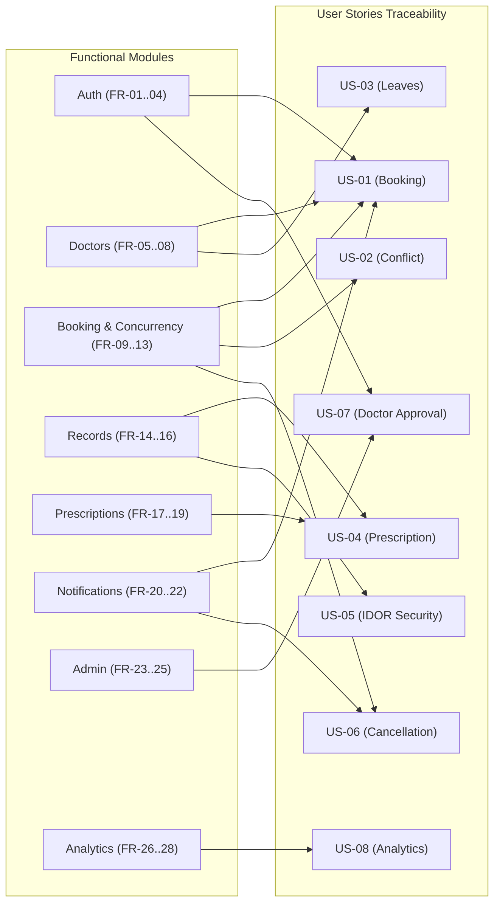

# Functional Requirements Specification: MediCare

## 1. Specification Overview
This document specifies the complete functional requirements for **MediCare — Clinic Management & Appointment System**. Requirements are grouped by functional module and prioritized using the standard **MoSCoW methodology**:
* **Must Have (M):** Mandatory core capabilities required for MVP completion.
* **Should Have (S):** Important features that enhance operational efficiency.
* **Could Have (C):** Desirable features implemented if sprint velocity allows.

Each requirement maps directly to the user stories established in `stakeholders-and-user-stories.md`.

---

## 2. Requirements Matrix by Functional Module

### Module 1: Authentication & User Management (Auth)
| Req ID | Requirement Description | Priority | Related User Story | Architectural Layer |
|---|---|:---:|:---:|---|
| **FR-01** | The system shall support user registration and authentication for three distinct roles: `Admin`, `Doctor`, and `Patient` using ASP.NET Core Identity. | **Must Have** | All Stories | `MediCare.Web` / `MediCare.Data` |
| **FR-02** | The system shall maintain distinct domain profile entities (`Doctor`, `Patient`) linked to the `AspNetUsers` table via a `UserId` foreign key without duplicating identity columns (Email, PasswordHash, PhoneNumber). | **Must Have** | US-01, US-07 | `MediCare.Data` |
| **FR-03** | The system shall enforce role-based access control (RBAC) across all MVC controllers using `[Authorize(Roles = "...")]` attributes. | **Must Have** | US-05, US-07 | `MediCare.Web` |
| **FR-04** | The system shall require newly registered doctor accounts to remain in an unapproved state (`IsApproved = false`) until verified by an Administrator. | **Must Have** | US-07 | `MediCare.Services` |

---

### Module 2: Doctor Schedule & Directory Management (Doctors)
| Req ID | Requirement Description | Priority | Related User Story | Architectural Layer |
|---|---|:---:|:---:|---|
| **FR-05** | The system shall provide a public Doctor Directory allowing patients to search and filter doctors by Medical Specialization, Consultation Fee range, and Available Days. | **Must Have** | US-01 | `MediCare.Web` / `MediCare.Services` |
| **FR-06** | The system shall allow approved doctors to define their weekly recurring working hours, specifying `DayOfWeek`, `StartTime`, and `EndTime`. | **Must Have** | US-01 | `MediCare.Services` / `MediCare.Data` |
| **FR-07** | The system shall maintain a `SlotDurationMinutes` property on each doctor entity (configured to default at 30 minutes). | **Must Have** | US-01, US-02 | `MediCare.Data` |
| **FR-08** | The system shall allow doctors to record vacation leaves or emergency absences in a `DoctorLeaves` table (`StartDate`, `EndDate`, `Reason`). | **Must Have** | US-03 | `MediCare.Services` / `MediCare.Data` |

---

### Module 3: Appointment Booking & Conflict Engine (Booking)
| Req ID | Requirement Description | Priority | Related User Story | Architectural Layer |
|---|---|:---:|:---:|---|
| **FR-09** | The system shall implement a dynamic **Slot Engine** that computes available 30-minute slots for any doctor on a given date by subtracting booked appointments and registered leaves from working hours. | **Must Have** | US-01, US-03 | `MediCare.Services` |
| **FR-10** | The system shall render doctor schedules and slot pickers interactively using `FullCalendar.js` on the patient booking interface. | **Must Have** | US-01 | `MediCare.Web` |
| **FR-11** | The system shall enforce double-booking prevention using a SQL Server **Filtered Unique Index** on `(DoctorId, AppointmentDate, StartTime)` where `Status NOT IN ('Cancelled', 'Rejected')`. | **Must Have** | US-02 | `MediCare.Data` |
| **FR-12** | The system shall support a formal Appointment State Machine with valid states: `Pending`, `Confirmed`, `Completed`, `Cancelled`, `Rejected`, `NoShow`. | **Must Have** | US-01, US-04, US-06 | `MediCare.Services` |
| **FR-13** | The system shall allow patients to cancel appointments only if the cancellation occurs more than 2 hours prior to the scheduled start time; late cancellations shall be rejected. | **Must Have** | US-06 | `MediCare.Services` |

---

### Module 4: Clinical Records Management (Records)
| Req ID | Requirement Description | Priority | Related User Story | Architectural Layer |
|---|---|:---:|:---:|---|
| **FR-14** | The system shall allow treating doctors to create a `MedicalRecord` for an appointment, documenting Patient Symptoms, Clinical Diagnosis, and Consultation Notes. | **Must Have** | US-04 | `MediCare.Services` / `MediCare.Data` |
| **FR-15** | The system shall support uploading a single diagnostic file attachment (JPG, PNG, or PDF up to 5 MB) per medical record, stored securely under `wwwroot/uploads/records`. | **Must Have** | US-04 | `MediCare.Web` / `MediCare.Services` |
| **FR-16** | The system shall allow patients to view their complete historical medical record timeline while strictly preventing access to records of other patients. | **Must Have** | US-05 | `MediCare.Web` / `MediCare.Services` |

---

### Module 5: Digital Prescriptions & Printing (Prescriptions)
| Req ID | Requirement Description | Priority | Related User Story | Architectural Layer |
|---|---|:---:|:---:|---|
| **FR-17** | The system shall enable doctors to generate an itemized digital prescription linked to a `MedicalRecord`, containing multiple `PrescriptionItems`. | **Must Have** | US-04 | `MediCare.Services` / `MediCare.Data` |
| **FR-18** | Each prescription item shall record `MedicationName`, `Dosage`, `Frequency`, `DurationDays`, and `Instructions`. | **Must Have** | US-04 | `MediCare.Data` |
| **FR-19** | The system shall provide a dedicated, print-optimized CSS view (`@media print`) rendering clinic header details, doctor credentials, patient summary, and medication line items for physical pharmacy dispensing. | **Must Have** | US-04 | `MediCare.Web` |

---

### Module 6: Real-Time Alerts & Communications (Notifications)
| Req ID | Requirement Description | Priority | Related User Story | Architectural Layer |
|---|---|:---:|:---:|---|
| **FR-20** | The system shall persist all notifications to the `Notifications` table (`UserId`, `Title`, `Message`, `CreatedAt`, `IsRead`) before attempting client delivery. | **Must Have** | US-01, US-06 | `MediCare.Services` / `MediCare.Data` |
| **FR-21** | The system shall push real-time appointment alerts to connected browsers via a strongly-typed ASP.NET Core SignalR hub (`AppointmentHub`). | **Must Have** | US-01, US-06 | `MediCare.Web` / `MediCare.Services` |
| **FR-22** | The system shall send transactional email notifications for appointment confirmations and cancellations using MailKit via an abstracted `IEmailService`. | **Must Have** | US-01, US-06, US-07 | `MediCare.Services` |

---

### Module 7: Clinic Administration (Admin)
| Req ID | Requirement Description | Priority | Related User Story | Architectural Layer |
|---|---|:---:|:---:|---|
| **FR-23** | The system shall allow administrators to approve or reject pending doctor account registrations. | **Must Have** | US-07 | `MediCare.Web` / `MediCare.Services` |
| **FR-24** | The system shall provide complete CRUD management for medical specializations (`Specializations` table). | **Must Have** | US-01 | `MediCare.Web` / `MediCare.Services` |
| **FR-25** | The system shall record `ConsultationFee` and track `PaymentStatus` (`Unpaid`, `Paid`) on each appointment record. | **Must Have** | US-08 | `MediCare.Data` |

---

### Module 8: Analytics & Reporting (Analytics)
| Req ID | Requirement Description | Priority | Related User Story | Architectural Layer |
|---|---|:---:|:---:|---|
| **FR-26** | The system shall display monthly appointment trends categorized by status (`Completed`, `Cancelled`, `NoShow`) using interactive Chart.js visualizations. | **Must Have** | US-08 | `MediCare.Web` / `MediCare.Services` |
| **FR-27** | The system shall display appointment distribution across medical specializations via a Chart.js doughnut chart. | **Must Have** | US-08 | `MediCare.Web` / `MediCare.Services` |
| **FR-28** | The system shall support exporting appointment summary reports to CSV format for external spreadsheet analysis. | **Should Have** | US-08 | `MediCare.Services` |

---

## 3. Traceability Summary

