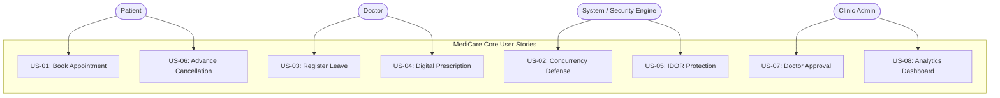

# Stakeholder Analysis & User Stories: MediCare

## 1. Stakeholder Analysis

The MediCare platform serves four primary stakeholder groups, each with distinct operational objectives, concerns, and functional expectations:

| Stakeholder Role | Role Description | Primary Operational Needs & Objectives | Core Pain Points Addressed |
|---|---|---|---|
| **Patient** | The healthcare consumer seeking outpatient medical consultation and historical treatment tracking. | • Search and filter qualified doctors by medical specialty, location, fee, and available days. • Reserve an appointment without queueing or telephone friction. • View upcoming schedule and cancel reservations in advance. • Access past visit records and print verified prescriptions. | • Unclear clinic schedules and overlapping bookings. • Long physical waiting times. • Loss of paper prescriptions and diagnostic records. |
| **Doctor** | The licensed medical practitioner delivering healthcare services and managing clinic time. | • Define weekly working hour schedules and block emergency vacation dates (`DoctorLeaves`). • View daily and weekly scheduled appointments on a clean calendar. • Confirm, reject, or mark patient attendance (`Completed` / `NoShow`). • Record clinical diagnosis, symptoms, and visit notes. • Issue itemized digital prescriptions with single-click print layouts. | • Schedule fragmentation and double-booking clashes. • Inability to block emergency off-days without manual phone cancellations. • Handwritten prescription errors and lack of visit history. |
| **Clinic Admin** | The administrative supervisor managing operational settings and monitoring clinic performance. | • Review and approve newly registered physician accounts. • Maintain the catalog of medical specializations. • Monitor aggregated clinic appointment statistics, top doctor performance, and fee summaries via visual charts. | • Inability to track overall clinic attendance and revenue. • Lack of access controls to prevent unverified physicians from practicing. |
| **DEPI Evaluator** | The academic and industry examination panel grading the capstone graduation project. | • Inspect technical architecture, design pattern fidelity (NTier, Repository, UoW, Factory), code quality, and database normalization. • Verify deterministic concurrency protection against double-booking. • Review documentation completeness, automated test coverage, and live cloud deployment on Azure. | • Incomplete project documentation. • Architecture violating layer boundaries. • Demonstrations failing due to race condition bugs. |

---

## 2. User Stories (Gherkin Given / When / Then Specification)

All user stories follow the standard Agile INVEST model and specify formal acceptance criteria using the Gherkin format.

---

### US-01: Book an Appointment via Interactive Calendar
* **As a** registered Patient,  
* **I want to** select an available 30-minute slot on a doctor's interactive calendar and confirm my reservation,  
* **So that** I secure a guaranteed consultation time without phone calls or clinic waiting.
* **Acceptance Criteria (Gherkin):**
  * **Given** I am logged into the system as a Patient and viewing a Doctor's booking page,
  * **When** I choose an available future date and select an unreserved 30-minute slot, then click "Confirm Booking",
  * **Then** the appointment is created in the database with status `Pending`,
  * **And** a real-time SignalR notification is delivered to the Doctor's dashboard,
  * **And** a confirmation email is queued via `IEmailService`,
  * **And** the selected slot immediately disappears from the available slot list.

---

### US-02: Simultaneous Booking Prevention (Concurrency Defense)
* **As a** MediCare System Engine,  
* **I want to** reject conflicting booking requests submitted for the exact same doctor and time slot,  
* **So that** two patients can never be scheduled for the same slot concurrently (Zero Double-Booking).
* **Acceptance Criteria (Gherkin):**
  * **Given** Patient A and Patient B are simultaneously viewing the same available 10:00 AM slot for Dr. Smith,
  * **When** Patient A and Patient B both submit a booking request within milliseconds of each other,
  * **Then** Patient A's reservation is accepted and committed,
  * **And** Patient B's transaction is intercepted by the service pre-check or the SQL Server filtered unique index,
  * **And** Patient B receives a clear user notification: *"This slot has just been reserved by another patient. Please select an alternative time."*
  * **And** the database contains exactly one active appointment for that slot.

---

### US-03: Doctor Registers a Vacation or Emergency Leave
* **As a** Doctor,  
* **I want to** record a single date or date range as an approved leave in the system,  
* **So that** the slot generation engine automatically suppresses booking slots during my absence.
* **Acceptance Criteria (Gherkin):**
  * **Given** I am authenticated as a Doctor on my schedule management portal,
  * **When** I submit a leave record specifying a start date, end date, and reason,
  * **Then** the leave is saved to the `DoctorLeaves` table,
  * **And** any slot generation requests for dates within that range return zero available slots,
  * **And** the interactive calendar renders those dates as blocked/unavailable.

---

### US-04: Prescription Written and Printed
* **As a** Doctor,  
* **I want to** write a digital prescription with medication line items and print it using a formatted clinic header,  
* **So that** the patient receives a legible, professional prescription that is permanently stored in their clinical history.
* **Acceptance Criteria (Gherkin):**
  * **Given** I am viewing an appointment currently in `Confirmed` status whose start time has elapsed,
  * **When** I enter the diagnosis and add prescription items (Medication Name, Dosage, Frequency, Instructions), then click "Save & Print",
  * **Then** the appointment status updates to `Completed`,
  * **And** the prescription and items are linked to the `MedicalRecord`,
  * **And** the browser opens the formatted CSS `@media print` layout displaying the clinic header, patient details, medications, and physician signature line.

---

### US-05: IDOR Protection on Clinical Records & Prescriptions
* **As a** System Security Layer,  
* **I want to** block unauthorized direct object reference requests to patient records and log the incident,  
* **So that** patient confidentiality is strictly preserved against URL tampering.
* **Acceptance Criteria (Gherkin):**
  * **Given** Patient A is authenticated with User ID = `usr_123` and Medical Record ID = `45`,
  * **When** Patient B (User ID = `usr_999`) attempts to access `/MedicalRecords/Details/45` directly via the URL,
  * **Then** the `IMedicalRecordService` authorization check detects that `record.Patient.UserId != currentUser.Id`,
  * **And** the application returns an `HTTP 403 Forbidden` response without leaking patient data,
  * **And** a security warning event is recorded in the application log with the offending user ID and target resource.

---

### US-06: Advance Appointment Cancellation by Patient
* **As a** Patient,  
* **I want to** cancel my scheduled appointment if I do so more than 2 hours before the start time,  
* **So that** the slot is returned to the doctor's available calendar for other patients.
* **Acceptance Criteria (Gherkin):**
  * **Given** I have a `Pending` or `Confirmed` appointment scheduled for 04:00 PM today,
  * **When** I click "Cancel Appointment" at 01:00 PM (3 hours in advance),
  * **Then** the appointment status transitions to `Cancelled`,
  * **And** the doctor receives an instant SignalR notification of the cancellation,
  * **And** the slot becomes immediately available for other patients to book,
  * **Given** another appointment scheduled for 04:00 PM today,
  * **When** I attempt to cancel at 02:30 PM (less than 2 hours in advance),
  * **Then** the cancellation is rejected with message: *"Appointments cannot be cancelled less than 2 hours before the scheduled time. Please contact the clinic directly."*

---

### US-07: Administrator Approves Doctor Account Registration
* **As a** Clinic Admin,  
* **I want to** review and approve newly registered doctor accounts before they appear in public listings,  
* **So that** only vetted and credentialed physicians can accept patient bookings.
* **Acceptance Criteria (Gherkin):**
  * **Given** a new doctor has completed registration and submitted their license details,
  * **When** I navigate to the Admin Doctor Approvals panel and click "Approve Doctor",
  * **Then** the doctor's `IsApproved` flag is updated to `true`,
  * **And** the doctor receives an approval email notification,
  * **And** the doctor's profile and schedule become visible in the public search directory.

---

### US-08: Administrator Monitors Clinic Analytics and Revenue Metrics
* **As a** Clinic Admin,  
* **I want to** view aggregated visual charts showing monthly appointments, specialty breakdowns, and fee collection summaries,  
* **So that** I can make data-driven decisions regarding clinic staffing and facility operations.
* **Acceptance Criteria (Gherkin):**
  * **Given** I am logged into the Admin Portal,
  * **When** I navigate to the Analytics Dashboard view,
  * **Then** Chart.js renders three interactive visual graphs:
    1. Monthly appointment volume categorized by status (`Completed`, `Cancelled`, `NoShow`),
    2. Distribution of appointments across medical specializations,
    3. Aggregate consultation fee summaries (Total Paid vs. Pending fees),
  * **And** all metrics accurately reflect the current database state without performance degradation.
