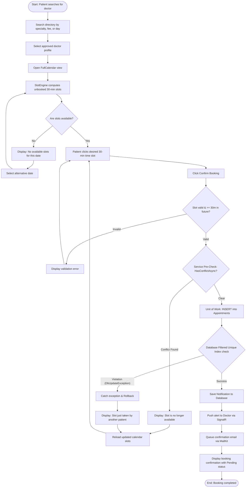
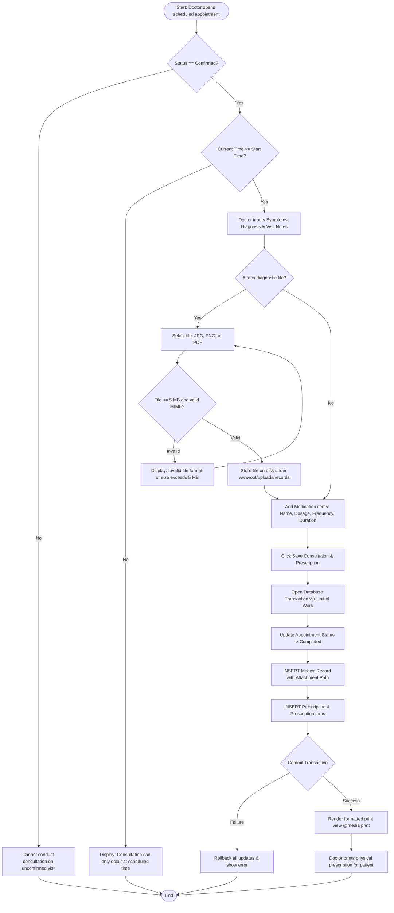
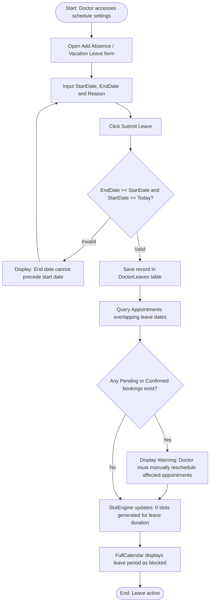

# UML Activity Diagrams: MediCare

This document models the procedural control flows of MediCare's primary business operations using UML Activity Diagrams.

---

## 1. Appointment Booking Workflow (Patient & Engine)

---

## 2. Clinical Encounter & Prescription Workflow (Doctor)

---

## 3. Doctor Vacation / Leave Handling Workflow

