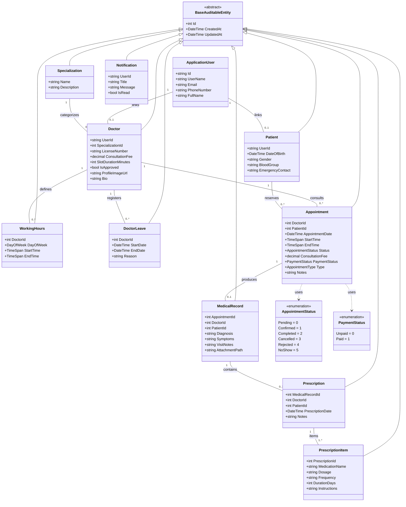
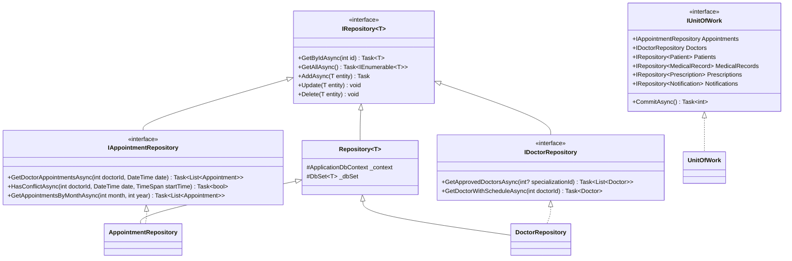
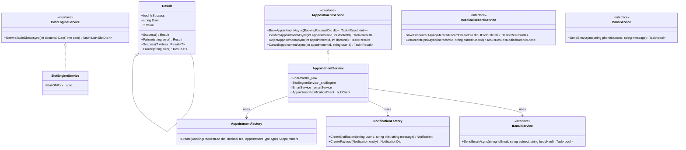
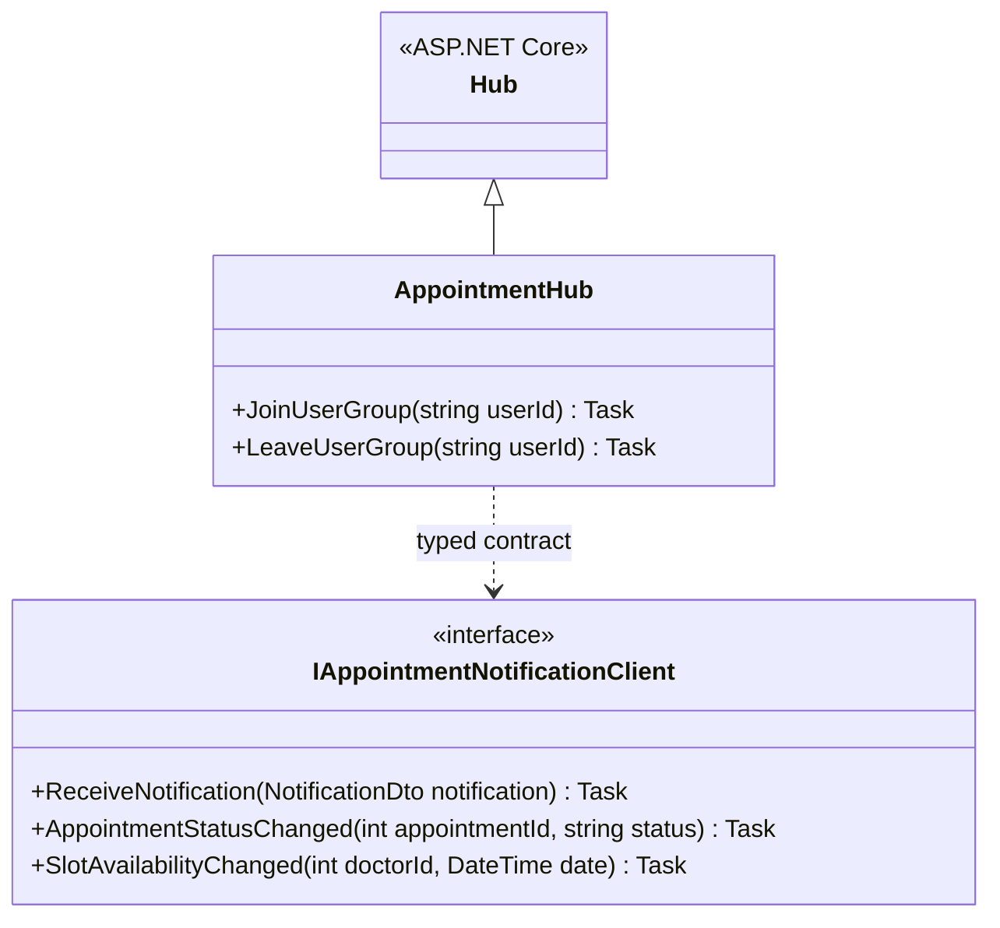

# UML Class Diagram: MediCare

This document details the object-oriented structure of MediCare across its three architectural layers (`MediCare.Data`, `MediCare.Services`, and `MediCare.Web`), illustrating entity hierarchies, repository abstractions, service contracts, design pattern factories, and real-time hub interfaces.

---

## 1. Domain Entities & Data Layer Classes (`MediCare.Data`)

---

## 2. Repositories & Unit of Work Abstractions (`MediCare.Data`)

---

## 3. Business Services, Pattern Factories & Results (`MediCare.Services`)

---

## 4. SignalR Real-Time Hub Architecture (`MediCare.Web`)

