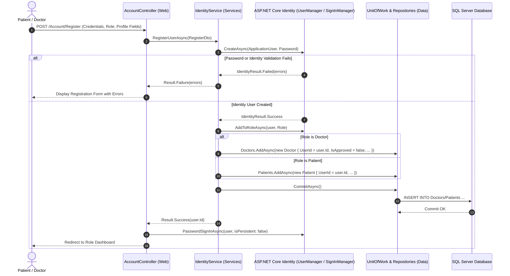
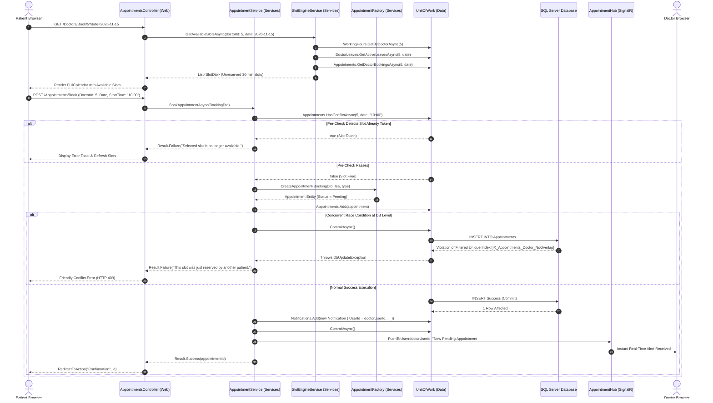
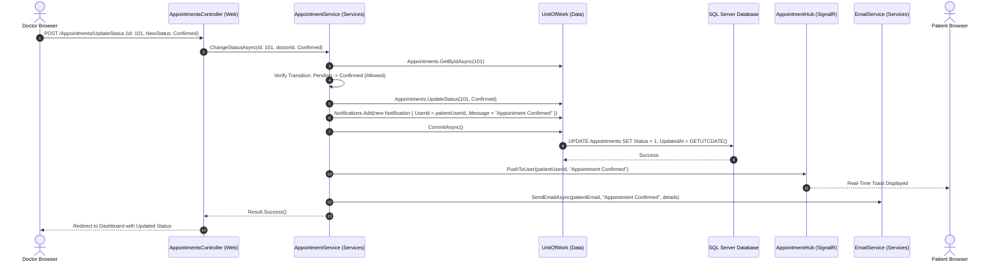
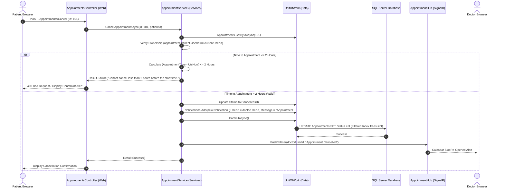
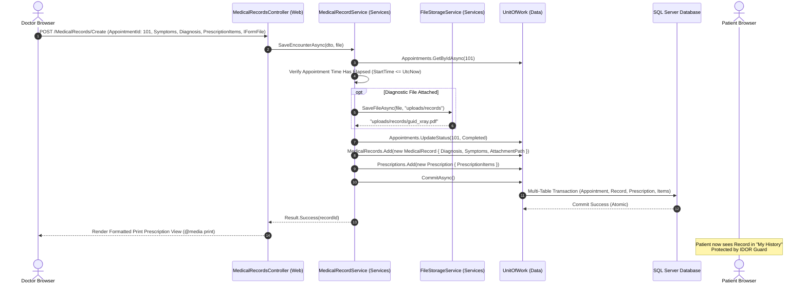
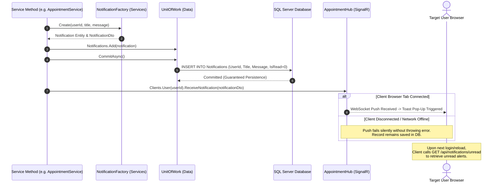
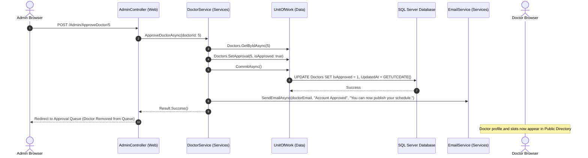

# UML Sequence Diagrams: MediCare

This document details the dynamic component interactions across key system workflows using UML Sequence Diagrams.

---

## 1. User Registration & Authentication Flow

---

## 2. Search Doctors & Book Appointment (with Conflict Handling)

---

## 3. Doctor Confirms or Rejects Appointment

---

## 4. Patient Advance Cancellation Workflow

---

## 5. Clinical Encounter, Diagnostic Upload & Prescription Issuance

---

## 6. Notification Save-Then-Push Pattern

---

## 7. Administrator Approves Doctor Account

