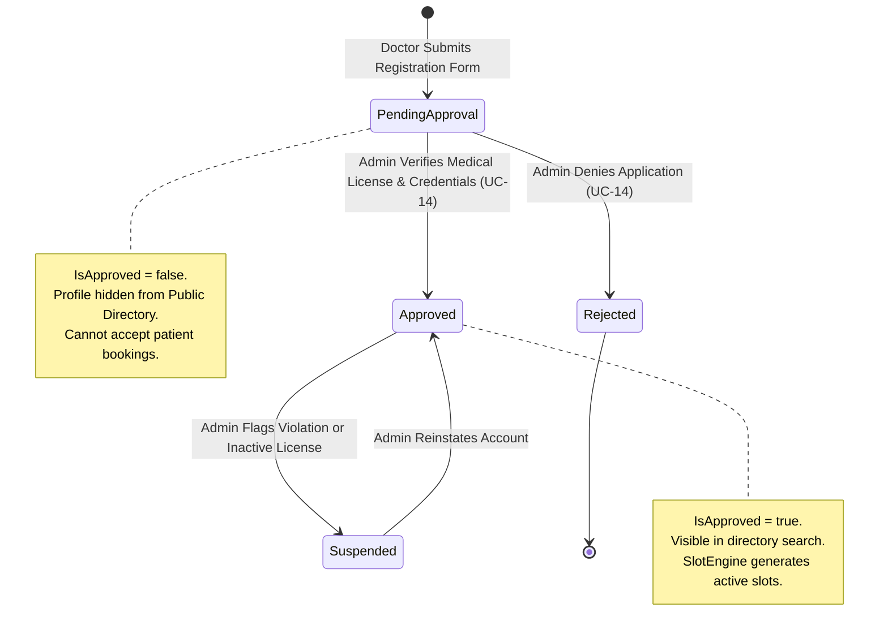

# State Machine Diagrams: MediCare

This document formalizes the finite state machines governing MediCare entity lifecycles: the **Appointment Lifecycle State Machine** and the **Doctor Account Approval State Machine**.

---

## 1. Appointment Lifecycle State Machine

The appointment lifecycle encompasses six discrete states. Four states are strictly terminal: once reached, no further transitions are permitted.

```mermaid
stateDiagram-v2
    [*] --> Pending: Patient Books Slot (UC-04)

    Pending --> Confirmed: Doctor / Admin Approves (UC-10)
    Pending --> Rejected: Doctor / Admin Declines (UC-10)
    Pending --> Cancelled: Patient Cancels > 2h Before (UC-05)

    Confirmed --> Completed: Doctor Finishes Consultation (UC-11)
    Confirmed --> Cancelled: Patient Cancels > 2h Before (UC-05)
    Confirmed --> NoShow: Patient Fails to Attend (UC-13)

    Completed --> [*]
    Cancelled --> [*]
    Rejected --> [*]
    NoShow --> [*]

    note right of Pending: Initial reservation; slot held on calendar
    note right of Cancelled: Terminal state; slot freed via Filtered Index
    note right of Completed: Terminal state; encounter recorded (UtcNow >= StartTime)
    note right of Rejected: Terminal state; slot freed via Filtered Index
    note right of NoShow: Terminal state; attendance marked as absent
```

---

## 2. Appointment State Transition Matrix & Guard Rules

| From State | To State | Triggering Actor | Guard Conditions & Business Invariants | Impact on Calendar Slot |
|---|---|---|---|---|
| *Initial* | **`Pending (0)`** | Patient | Slot is unreserved; booking request is valid; doctor is approved. | Slot is marked reserved; excluded from future slot queries. |
| **`Pending (0)`** | **`Confirmed (1)`** | Doctor / Admin | Doctor verifies availability and accepts the visit request. | Slot remains reserved. |
| **`Pending (0)`** | **`Rejected (4)`** | Doctor / Admin | Doctor declines visit request (e.g. invalid notes). | Slot is freed immediately by the Filtered Unique Index. |
| **`Pending (0)`** | **`Cancelled (3)`** | Patient | Current time is **> 2 hours** prior to `AppointmentDate + StartTime`. | Slot is freed immediately; available for re-booking. |
| **`Confirmed (1)`** | **`Cancelled (3)`** | Patient | Current time is **> 2 hours** prior to `AppointmentDate + StartTime`. | Slot is freed immediately; available for re-booking. |
| **`Confirmed (1)`** | **`Completed (2)`** | Doctor | Current time is **>= scheduled start time** (`UtcNow >= StartTime`); medical encounter recorded. | Permanent historical record; terminal state. |
| **`Confirmed (1)`** | **`NoShow (5)`** | Doctor / Admin | Patient did not attend clinic; scheduled appointment time has elapsed. | Permanent historical record; terminal state. |
| **`Completed (2)`** | *Any* | *None* | **TERMINAL STATE:** No transitions allowed. | Permanent record. |
| **`Cancelled (3)`** | *Any* | *None* | **TERMINAL STATE:** No transitions allowed. | Historical record. |
| **`Rejected (4)`** | *Any* | *None* | **TERMINAL STATE:** No transitions allowed. | Historical record. |
| **`NoShow (5)`** | *Any* | *None* | **TERMINAL STATE:** No transitions allowed. | Historical record. |

---

## 3. Doctor Account Approval State Machine

Physician registration enforces an administrative vetting workflow before doctor profiles and availability become publicly searchable.

### Doctor Approval Rules:
1. **`PendingApproval` (`IsApproved = 0`):** Doctor can log in, edit profile, and configure working hours, but cannot appear in the public doctor directory and cannot receive bookings.
2. **`Approved` (`IsApproved = 1`):** Doctor profile is published to the public search index and the calendar is activated for patient slot reservations.
3. **`Rejected`:** Account is locked; administrator email explains licensing or verification discrepancies.
