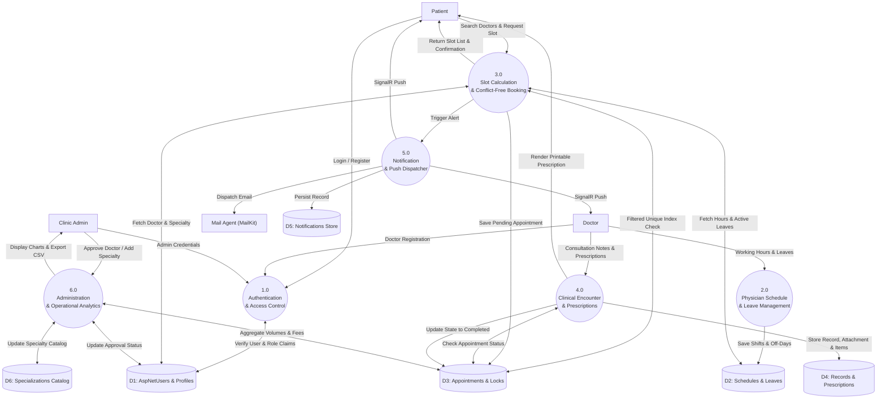

# Data Flow Diagrams (DFD): MediCare

## 1. Context-Level Data Flow Diagram (Level 0 DFD)

The Context Diagram defines the operational boundary of **MediCare**, treating the entire platform as a single process interacting with four external entities: Patient, Doctor, Clinic Admin, and the External Mail Delivery Agent.

```mermaid
flowchart TD
    %% External Entities
    Patient["Patient"]
    Doctor["Doctor"]
    Admin["Clinic Admin"]
    EmailAgent["External Mail Agent (SMTP / MailKit)"]

    %% Core System Process
    SystemProcess(("0.0<br/>MediCare System"))

    %% Patient Flows
    Patient -->|"Registration, Login Credentials"| SystemProcess
    Patient -->|"Doctor Search Filters (Specialty, Fee)"| SystemProcess
    Patient -->|"Slot Selection & Booking Request"| SystemProcess
    Patient -->|"Cancellation Request (> 2h)"| SystemProcess
    SystemProcess -->|"Available 30-min Slots, Calendar Feeds"| Patient
    SystemProcess -->|"Booking Confirmation & Receipt View"| Patient
    SystemProcess -->|"Past Medical Records & Printable Prescriptions"| Patient

    %% Doctor Flows
    Doctor -->|"Profile Details & License Number"| SystemProcess
    Doctor -->|"Weekly Working Hours & Absence Leaves"| SystemProcess
    Doctor -->|"Appointment Decision (Confirm / Reject)"| SystemProcess
    Doctor -->|"Clinical Notes, Diagnostic Uploads, Prescriptions"| SystemProcess
    Doctor -->|"Patient Attendance Mark (Completed / NoShow)"| SystemProcess
    SystemProcess -->|"Real-Time Slot Alerts (SignalR)"| Doctor
    SystemProcess -->|"Daily / Weekly Schedule Calendar"| Doctor
    SystemProcess -->|"Patient Medical History Summary"| Doctor

    %% Admin Flows
    Admin -->|"Doctor Approval / Rejection Decision"| SystemProcess
    Admin -->|"Specialization Catalog Modifications"| SystemProcess
    Admin -->|"Reporting Filter Queries (Date Ranges)"| SystemProcess
    SystemProcess -->|"Pending Doctor Verification Queue"| Admin
    SystemProcess -->|"Clinic Statistics & Chart.js Visuals"| Admin
    SystemProcess -->|"Exported CSV Financial Summaries"| Admin

    %% External Agent Flows
    SystemProcess -->|"Formatted MIME Email Messages"| EmailAgent
    EmailAgent -->|"Dispatch Receipts & Delivery Status"| SystemProcess
```



---

## 2. Level 1 Data Flow Diagram (Subsystem Decompositions)

The Level 1 DFD decomposes the system into six primary operational sub-processes interacting with six persistent data stores.



---

## 3. Level 2 Data Flow Diagram (Process 3.0: Booking Engine)

The Level 2 DFD decomposes **Process 3.0 (Slot Calculation & Conflict-Free Booking)** into five discrete stages illustrating how double-booking is eliminated at runtime.

```mermaid
flowchart TD
    %% Entities
    Patient["Patient"]

    %% Data Stores
    D1[("D1: Doctors & Status")]
    D2[("D2: WorkingHours & Leaves")]
    D3[("D3: Appointments Table")]
    D5[("D5: Notifications Table")]

    %% Level 2 Processes
    P3_1(("3.1<br/>Validate Doctor<br/>& Profile State"))
    P3_2(("3.2<br/>Compute Available<br/>30-Min Intervals"))
    P3_3(("3.3<br/>Service Pre-Check<br/>For Overlaps"))
    P3_4(("3.4<br/>Atomic Transaction<br/>& Index Lock"))
    P3_5(("3.5<br/>Publish Confirmation<br/>& Event Payload"))

    %% Data Flows
    Patient -->|"1. Select Doctor & Date"| P3_1
    P3_1 <-->|"Verify IsApproved == true"| D1
    P3_1 -->|"Valid Request"| P3_2

    P3_2 <-->|"Fetch Shifts & Exclude Leaves"| D2
    P3_2 <-->|"Fetch Existing Booked Slots"| D3
    P3_2 -->|"Display Filtered Slot Grid"| Patient

    Patient -->|"2. Submit Selected Slot"| P3_3
    P3_3 <-->|"Check Conflict (HasConflictAsync)"| D3
    
    alt Slot Taken at Service Layer
        P3_3 -->|"Slot Unavailable Error"| Patient
    else Slot Available
        P3_3 -->|"Pass to Persistence"| P3_4
        P3_4 -->|"INSERT with Filtered Unique Index"| D3
        
        alt Concurrency Collision (DbUpdateException)
            D3 --x|"Unique Violation"| P3_4
            P3_4 -->|"Rollback & Friendly Error"| Patient
        else Insert Success
            P3_4 -->|"Committed Appointment ID"| P3_5
            P3_5 -->|"Persist In-App Alert"| D5
            P3_5 -->|"Booking Confirmation View"| Patient
        end
    end
```
