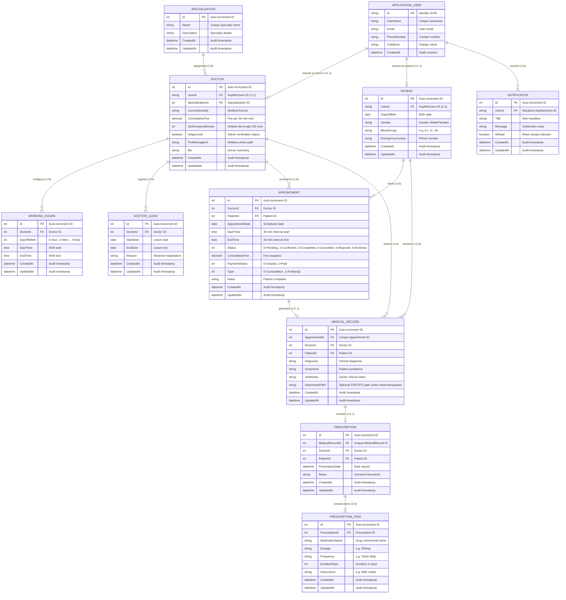

# Entity-Relationship Diagram (ERD): MediCare

## 1. Relational Data Architecture

The MediCare database is modeled as a normalized relational schema hosted on Microsoft SQL Server. It decouples identity concerns (`AspNetUsers`) from domain profile entities (`Doctors`, `Patients`), ensures referential integrity across the clinical lifecycle, and provides explicit tracking of physician working hours and leaves.

---

## 2. Mermaid Entity-Relationship Diagram

---

## 3. Structural Entity Cardinalities

1. **Identity to Profiles (1:1 optional):**
   * An `ApplicationUser` may be linked to at most one `Doctor` profile or one `Patient` profile via a unique foreign key (`UserId`).
2. **Specialization to Doctors (1:N):**
   * A `Specialization` categorizes multiple `Doctor` entities. A `Doctor` references exactly one primary `Specialization`.
3. **Doctor Schedules & Leaves (1:N):**
   * A `Doctor` maintains multiple weekly recurring `WorkingHours` entries and multiple date-bound `DoctorLeaves`.
4. **Appointments (M:N via Appointment Entity):**
   * An `Appointment` establishes a junction between `Doctor` and `Patient`, bound to a specific date and time slot.
5. **Clinical Encounter Chain (1:1 cascade):**
   * An `Appointment` can produce at most one `MedicalRecord` (created when moving to `Completed`).
   * A `MedicalRecord` can be linked to at most one `Prescription`.
   * A `Prescription` contains one or more `PrescriptionItems` (1:N mandatory).
6. **User Notifications (1:N):**
   * An `ApplicationUser` has zero or more persisted `Notification` records.
