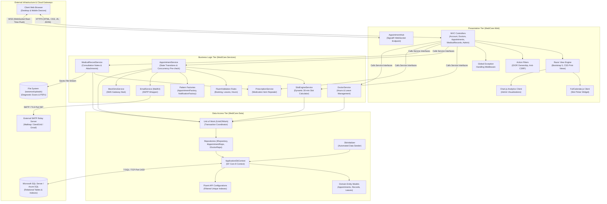
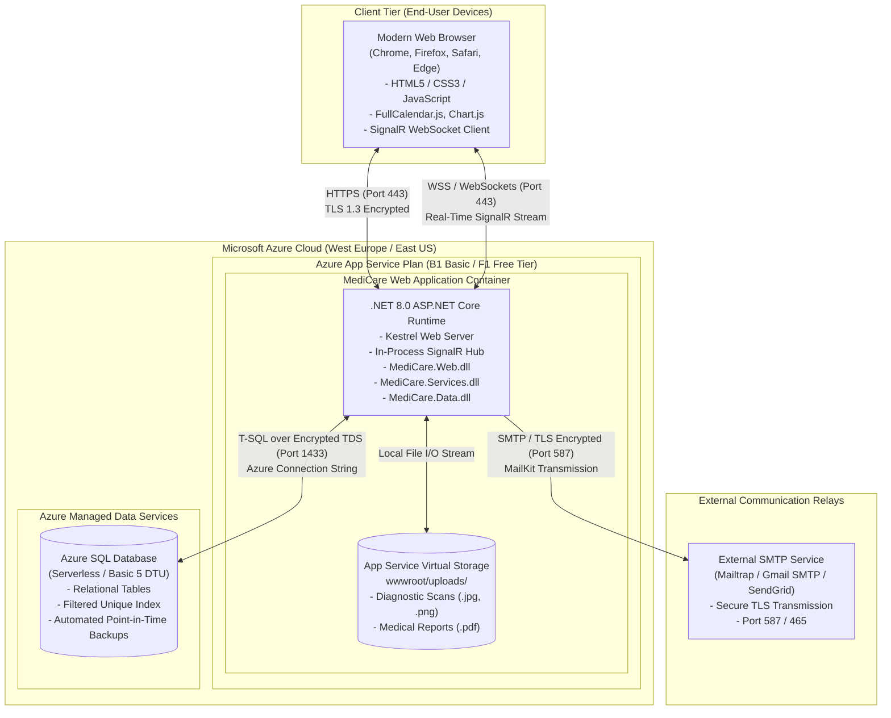

# Deployment & Component Diagrams: MediCare

This document specifies the structural composition of MediCare's software components and their physical distribution across runtime hardware and cloud environments.

---

## 1. High-Level Component Diagram

The Component Diagram details the internal modular structure of MediCare, the boundaries of its 3-tier projects, and their dependencies on external frameworks and third-party systems.

---

## 2. Cloud Deployment Diagram

The Deployment Diagram maps the physical runtime distribution of MediCare's software artifacts across client devices, Microsoft Azure cloud resources, and external services.

---

## 3. Network & Security Boundaries

1. **Client-to-Application Encryption:**  
   All HTTP traffic is automatically upgraded to **HTTPS (TLS 1.3)** via Azure App Service URL redirection. Cleartext HTTP requests on port 80 are permanently disabled.
2. **Database Isolation:**  
   Azure SQL Database enforces firewall rules restricting incoming connections exclusively to Azure App Service instances (`Allow Azure services and resources to access this server = YES`) and authorized administrator IP addresses. Port 1433 is shielded from the public internet.
3. **Application Secret Isolation:**  
   Database connection strings, SMTP passwords, and Identity security tokens are injected at runtime via Azure App Service **Application Settings (Environment Variables)** and are never written to physical disk or configuration files.
