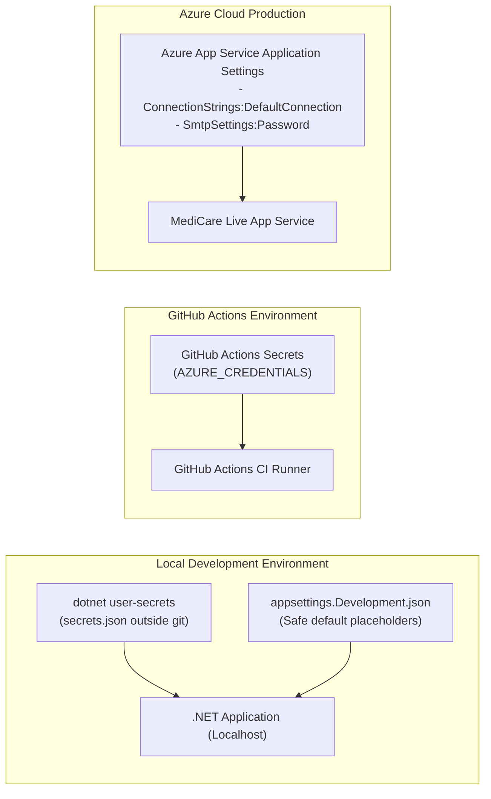

# Deployment & DevOps Strategy: MediCare

## 1. Environment Topology

The MediCare deployment lifecycle operates across three strictly segregated tiers:

| Environment | Hosting Target | Database Engine | Purpose & Configuration |
|---|---|---|---|
| **Local Development (Dev)** | Localhost (Kestrel / IIS Express) | SQL Server 2022 Express / LocalDB | Rapid feature development, automated unit test runs, and database schema prototyping. Secrets managed via `dotnet user-secrets`. |
| **Continuous Integration (CI)** | GitHub Actions Runner (Ubuntu / Windows) | In-Memory / LocalDB Container | Automated build compilation, linter analysis, and full test suite execution on every Pull Request. |
| **Production Cloud (Prod)** | Microsoft Azure App Service (B1 / F1) | Azure SQL Database (Serverless / Basic) | Live demonstration, evaluator review, and user acceptance testing. Configured via Azure Environment Variables. |

---

## 2. Configuration & Secret Management Pipeline

To prevent credential leakage to public repositories (**RSK-07**), secrets are managed through isolated channels:



### Operational Rules:
1. `appsettings.Development.json` is added to `.gitignore`. A sanitized `appsettings.Development.json.example` is checked into source control with blank passwords.
2. Production connection strings and SMTP credentials are configured directly in the Azure Portal under **Configuration -> Application settings**. The ASP.NET Core configuration builder transparently binds these environment variables at runtime over `appsettings.json`.

---

## 3. Continuous Integration & Delivery (CI/CD) Workflow

Continuous Integration is automated using **GitHub Actions**. Every pull request targeting the `develop` or `main` branch triggers an automated build and test pipeline.

### GitHub Actions Workflow Specification (`.github/workflows/ci.yml`):
```yaml
name: MediCare CI Pipeline

on:
  push:
    branches: [ main, develop ]
  pull_request:
    branches: [ main, develop ]

jobs:
  build-and-test:
    runs-on: ubuntu-latest
    steps:
    - name: Checkout Source Code
      uses: actions/checkout@v4

    - name: Setup .NET SDK
      uses: actions/setup-dotnet@v4
      with:
        dotnet-version: '8.0.x'

    - name: Restore NuGet Dependencies
      run: dotnet restore MediCare.sln

    - name: Build Solution (Release Configuration)
      run: dotnet build MediCare.sln --configuration Release --no-restore

    - name: Execute Automated xUnit Tests with Coverage
      run: dotnet test MediCare.sln --configuration Release --no-build --verbosity normal --collect:"XPlat Code Coverage"
```

---

## 4. Hosting Infrastructure & Fallback Hosting Plan

### 4.1 Primary Hosting Architecture: Microsoft Azure
* **Compute:** Azure App Service on Linux or Windows.
  * *Pricing Tier:* **Basic B1** (or **Free F1** tier [VERIFY: 60 CPU minutes/day limit on F1]).
  * *Features:* Custom domain support, free managed TLS/SSL certificate, deployment slots, and integrated diagnostic logging.
* **Database:** Azure SQL Database.
  * *Pricing Tier:* **General Purpose Serverless** with auto-pause enabled (or **Basic 5 DTU** tier [VERIFY: 2 GB storage cap on Basic]).
  * *Features:* ACID compliance, filtered unique index execution, and automated 7-day point-in-time recovery.

### 4.2 Fallback Hosting Plan (In Case of Cloud Credit Expiry)
> [!IMPORTANT]
> If Azure student credits expire or compute limits are throttled during graduation evaluation, the project includes an automated deployment fallback:
* **Fallback Host:** **MonsterASP.NET** or **SmarterASP.NET** [VERIFY: current free trial duration, typically 60 days].
* **Deployment Method:** Pre-configured Web Deploy profile or self-contained FTP publish from Visual Studio.
* **Database Fallback:** Remote shared MS SQL Server database instance hosted on the fallback provider, configured with the same schema and filtered unique index.

---

## 5. Database Migration & Automated Seeding Strategy

1. **Migration Application Strategy:**  
   To eliminate manual SQL script execution on cloud instances, database migrations are applied programmatically during application boot:
   ```csharp
   using (var scope = app.Services.CreateScope())
   {
       var dbContext = scope.ServiceProvider.GetRequiredService<ApplicationDbContext>();
       await dbContext.Database.MigrateAsync();
       await DbInitializer.SeedAsync(scope.ServiceProvider);
   }
   ```
2. **Idempotent Data Seeding:**  
   `DbInitializer.SeedAsync` checks if the `Specializations` table contains records. If empty, it seeds the Admin account, 5 specializations, 5 doctors, schedules, patients, 20+ historical visits, and 5 upcoming demonstration appointments. If records exist, seeding is skipped.
3. **Backup & Recovery:**  
   Azure SQL Database automatically maintains continuous point-in-time recovery (PITR) backups with a 7-day retention window.

---

## 6. Horizontal & Vertical Scalability Notes

* **Phase 1 & 2 Reality:** As a graduation project and single-clinic application, MediCare is engineered for **Vertical Scaling** (scale-up CPU/RAM on App Service and DTUs on Azure SQL).
* **SignalR WebSocket Considerations:** On a single App Service instance, SignalR operates in-process via local memory backplane. If the application is ever scaled out to multiple server instances in production:
  * An external backplane (e.g. **Azure SignalR Service** or **Redis Backplane**) must be enabled to synchronize WebSocket messages across instances.
  * Application Request Routing (ARR) sticky sessions must be enabled on the load balancer.
