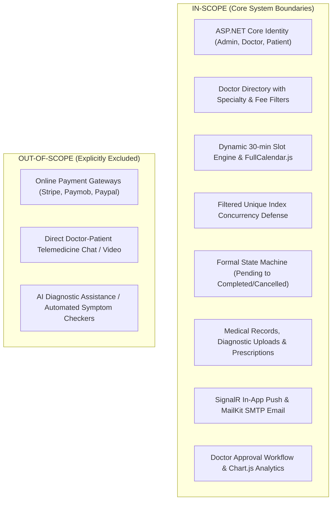

# Problem Statement & System Objectives: MediCare

## 1. Context & Operational Background
Outpatient healthcare in Egypt and the MENA region relies heavily on private single-doctor clinics and multi-specialty polyclinics. While clinical diagnostics require licensed physician expertise, administrative operations—such as schedule management, appointment reservations, patient check-ins, record maintenance, and prescription dispensing—are frequently conducted manually via telephone, paper ledgers, or fragmented messaging applications.

This manual paradigm creates systemic bottlenecks, errors, and clinical communication friction as patient volumes grow.

---

## 2. Problem Statement
The operational analysis of outpatient clinic workflows reveals five core failure points:

### 2.1 Concurrent Schedule Overlaps (Double-Booking)
In typical polyclinics, multiple receptionists and patients request appointments across shared operating hours. Naive booking systems lacking atomic synchronization permit race conditions where two reservations are confirmed for the exact same physical consultation slot. This leads to clinic overcrowding, patient dissatisfaction, and physician scheduling strain.

### 2.2 Lack of Dynamic Physician Absence Management
Physicians experience unforeseen emergencies, clinical conferences, and scheduled leaves. When a doctor is absent, clinics without automated schedule exception handling must manually identify, call, and reschedule dozens of affected patients. Patients frequently arrive at clinics only to discover the physician is unavailable.

### 2.3 Delayed Asynchronous Communication
Traditional appointment status updates (e.g., doctor running late, appointment confirmed, emergency cancellation) rely on telephone outreach or batch messaging. When cancellations occur on short notice (less than 2 hours before the visit), vacant slots remain unutilized because other seeking patients have no real-time visibility into opened slots.

### 2.4 Decoupled Clinical Records and Prescription Risks
In many outpatient facilities, appointment scheduling is isolated from clinical documentation. Once a patient enters the examination room, the doctor documents findings on separate paper charts. Written prescriptions introduce legibility hazards for retail pharmacists, lack structured dosage instructions, and are easily lost by patients, preventing longitudinal clinical history tracking during follow-ups.

### 2.5 Insecure Access to Confidential Health Information
Web-based clinical tools frequently suffer from Insecure Direct Object Reference (IDOR) vulnerabilities (OWASP Top 10), where predictable integer identifiers in URLs allow unauthorized parties to view or tamper with private medical consultations and prescriptions belonging to other patients.

---

## 3. System Objectives & Design Goals

To resolve these operational deficiencies, **MediCare** is designed around six core engineering objectives:

| Objective ID | Architectural Objective | Measurable Design Target | Related Requirements |
|---|---|---|---|
| **OBJ-01** | **Deterministic Concurrency Control** | Guarantee a **0.0% double-booking rate** by implementing a multi-layered concurrency architecture: application-layer pre-checks combined with a database-level filtered unique constraint. | FR-11, NFR-REL-01, KPI-01, US-02 |
| **OBJ-02** | **Dynamic Slot Generation Engine** | Compute unbooked 30-minute appointment slots dynamically from doctor weekly schedules while subtracting approved leaves and active bookings in **< 300 ms**. | FR-06, FR-08, FR-09, NFR-PERF-01, KPI-02 |
| **OBJ-03** | **Real-Time Notification Pipeline** | Dispatch instant state mutations (booking requests, doctor confirmations, cancellations) to connected browser sessions via **ASP.NET Core SignalR in < 2.0 s**, backed by SQL persistence. | FR-20, FR-21, NFR-PERF-03, NFR-REL-02, US-01 |
| **OBJ-04** | **Unified Clinical Record & Prescription Workflow** | Bridge scheduling and care delivery by binding appointments directly to clinical encounter notes, diagnostic file attachments (PDF/Images), and standardized digital prescriptions with CSS print formatting. | FR-14, FR-15, FR-17, FR-19, NFR-USE-03, US-04 |
| **OBJ-05** | **Zero-Trust Clinical Ownership (IDOR Defense)** | Implement strict authorization guards in the service layer ensuring patients access only their own medical records, returning `HTTP 403 Forbidden` and logging violations for tampering attempts. | FR-16, NFR-SEC-01, RSK-02, US-05 |
| **OBJ-06** | **Operational Administrative Intelligence** | Provide clinic supervisors with interactive Chart.js analytics tracking monthly volumes, status ratios (`Completed`, `Cancelled`, `NoShow`), specialty distributions, and fee collections. | FR-25, FR-26, FR-27, US-08 |

---

## 4. Architectural Constraints & System Boundaries

### 4.1 Technical Constraints
* **Platform & Framework:** Built on **ASP.NET Core MVC (.NET 8)** using C# 12, adhering to a 3-project layered architecture (`MediCare.Web` -> `MediCare.Services` -> `MediCare.Data`).
* **Relational Persistence:** Backed exclusively by **Microsoft SQL Server** via Entity Framework Core 8, utilizing migrations for schema versioning.
* **Hosting Ceiling:** Designed to execute reliably within resource-constrained cloud tiers (Azure App Service B1/F1 and Azure SQL Database Serverless/Basic).
* **Cross-Cutting Patterns:** Controllers inject services exclusively; data access is mediated through generic and specialized Repositories and a Unit of Work. Domain entities utilize `CreatedAt` and `UpdatedAt` audit timestamps only (no soft delete).

### 4.2 Explicit Scope Boundaries

