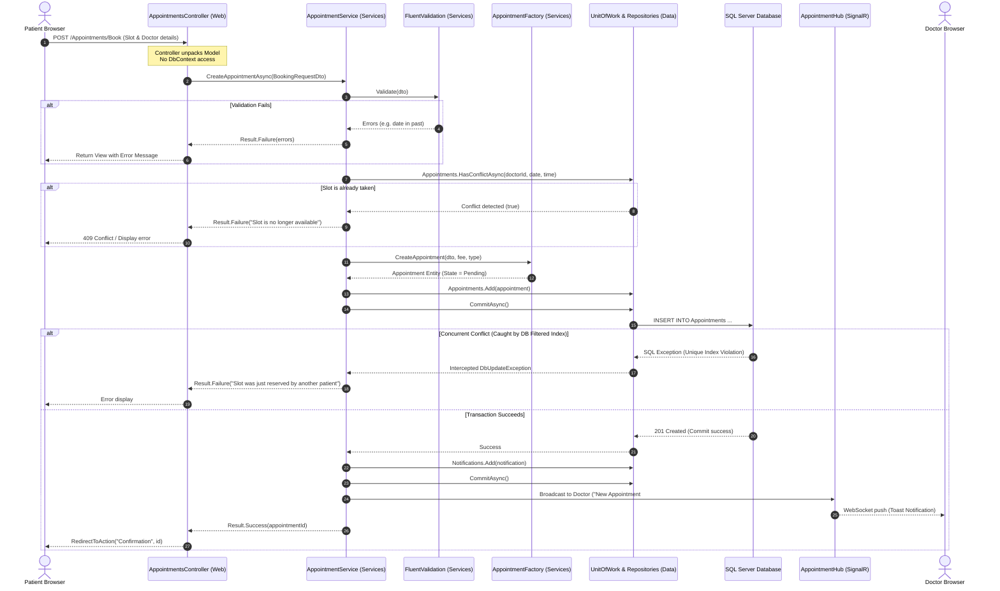

# Software Architecture Specification: MediCare

## 1. Architectural Style & Layering Principles

MediCare is engineered as a classic **3-Project N-Tier Layered Architecture** adhering to the dependency inversion principle. The layers are structured to ensure high maintainability, testability, and separation of concerns:

$$\text{MediCare.Web} \longrightarrow \text{MediCare.Services} \longrightarrow \text{MediCare.Data}$$

### Strict Dependency Rules:
1. **Unidirectional Dependency:** `MediCare.Web` depends on `MediCare.Services`. `MediCare.Services` depends on `MediCare.Data`.
2. **Persistence Encapsulation:** `MediCare.Web` **never** references `ApplicationDbContext` or repository interfaces. Controllers interact exclusively through service contracts (`IAppointmentService`, `IDoctorService`, etc.).
3. **Domain Ownership:** Data entity models, entity configurations, migrations, and database abstractions reside in `MediCare.Data`. Business validation, slot engines, transaction orchestrations, DTOs, and pattern factories reside in `MediCare.Services`.

---

## 2. Detailed Solution & Project Structure

```
MediCare/
├── src/
│   ├── MediCare.Web/                               # Presentation Layer (ASP.NET Core MVC)
│   │   ├── Controllers/                            # MVC Controllers (Inject Services only)
│   │   │   ├── AccountController.cs
│   │   │   ├── DoctorsController.cs
│   │   │   ├── AppointmentsController.cs
│   │   │   ├── MedicalRecordsController.cs
│   │   │   ├── PrescriptionsController.cs
│   │   │   ├── AdminController.cs
│   │   │   └── Api/                                # Internal AJAX API Controllers (Slots, Notifications)
│   │   │       ├── CalendarApiController.cs
│   │   │       └── NotificationsApiController.cs
│   │   ├── Hubs/                                   # Real-Time WebSocket Hubs
│   │   │   ├── AppointmentHub.cs                   # Strongly-typed SignalR Hub
│   │   │   └── IAppointmentNotificationClient.cs   # Client contract interface
│   │   ├── Views/                                  # Razor Views (.cshtml)
│   │   ├── ViewModels/                             # UI-specific presentation models
│   │   ├── Filters/                                # Action Filters (IDOR ownership, Anti-forgery)
│   │   ├── Middleware/                             # Global Exception Handling Middleware
│   │   ├── wwwroot/                                # Static assets (Bootstrap, FullCalendar, Chart.js, uploads)
│   │   ├── Program.cs                              # DI Container Composition Root & Middleware Pipeline
│   │   └── appsettings.json
│   │
│   ├── MediCare.Services/                          # Business Logic Layer (BLL)
│   │   ├── Interfaces/                             # Service Interfaces
│   │   │   ├── IAppointmentService.cs
│   │   │   ├── ISlotEngineService.cs
│   │   │   ├── IDoctorService.cs
│   │   │   ├── IMedicalRecordService.cs
│   │   │   ├── IPrescriptionService.cs
│   │   │   ├── INotificationService.cs
│   │   │   ├── IEmailService.cs                    # MailKit SMTP wrapper
│   │   │   └── ISmsService.cs                      # Mock SMS interface
│   │   ├── Implementations/                        # Business Logic Implementations
│   │   │   ├── AppointmentService.cs
│   │   │   ├── SlotEngineService.cs                # Dynamic 30-min slot generation
│   │   │   ├── DoctorService.cs
│   │   │   ├── MedicalRecordService.cs
│   │   │   ├── EmailService.cs                     # MailKit SMTP implementation
│   │   │   └── MockSmsService.cs
│   │   ├── Factories/                              # Design Pattern Factories
│   │   │   ├── AppointmentFactory.cs               # Instantiates appointments by type
│   │   │   └── NotificationFactory.cs              # Generates persisted & SignalR payloads
│   │   ├── Common/                                 # Common Results & Exceptions
│   │   │   └── Result.cs                           # Simple Result<T> pattern (Success/Error)
│   │   ├── DTOs/                                   # Service Request & Response Data Transfer Objects
│   │   │   ├── SlotDto.cs
│   │   │   ├── BookingRequestDto.cs
│   │   │   ├── PrescriptionCreateDto.cs
│   │   │   └── AnalyticsSummaryDto.cs
│   │   └── Validators/                             # FluentValidation Business Rules
│   │       ├── BookingRequestValidator.cs
│   │       ├── DoctorLeaveValidator.cs
│   │       └── WorkingHoursValidator.cs
│   │
│   └── MediCare.Data/                              # Data Access Layer (DAL)
│       ├── Context/
│       │   ├── ApplicationDbContext.cs             # EF Core DbContext & Identity Context
│       │   └── DbInitializer.cs                    # Database Seeder (Roles, Admin, Sample Data)
│       ├── Entities/                               # Domain Entities with Audit Timestamps
│       │   ├── BaseAuditableEntity.cs              # Contains CreatedAt and UpdatedAt
│       │   ├── ApplicationUser.cs                  # IdentityUser extension
│       │   ├── Doctor.cs
│       │   ├── Patient.cs
│       │   ├── Specialization.cs
│       │   ├── WorkingHours.cs
│       │   ├── DoctorLeave.cs
│       │   ├── Appointment.cs
│       │   ├── MedicalRecord.cs
│       │   ├── Prescription.cs
│       │   ├── PrescriptionItem.cs
│       │   └── Notification.cs
│       ├── Configurations/                         # EF Core Fluent API Configurations
│       │   ├── AppointmentConfiguration.cs         # Filtered Unique Index configuration
│       │   ├── DoctorConfiguration.cs
│       │   └── MedicalRecordConfiguration.cs
│       ├── Repositories/                           # Persistence Abstractions & Implementations
│       │   ├── IRepository.cs                      # Generic Repository Interface
│       │   ├── Repository.cs                       # Generic Repository Implementation
│       │   ├── IAppointmentRepository.cs           # Specialized Appointment queries
│       │   ├── AppointmentRepository.cs
│       │   ├── IDoctorRepository.cs                # Specialized Doctor queries
│       │   └── DoctorRepository.cs
│       ├── UnitOfWork/                             # Transaction Management Pattern
│       │   ├── IUnitOfWork.cs
│       │   └── UnitOfWork.cs
│       └── Migrations/                             # EF Core Code-First Migrations
```

---

## 3. End-to-End Request Flow Architecture



---

## 4. Design Patterns Implementation Catalog

### 4.1 Repository Pattern (Generic + Specialized)
* **Generic Repository (`IRepository<T>`):** Implements common CRUD operations (`GetByIdAsync`, `GetAllAsync`, `AddAsync`, `Update`, `Delete`).
* **Specialized Repositories:** For business-heavy domain entities, specialized interfaces extend the generic contract to avoid leaking complex LINQ queries:
  * `IAppointmentRepository`: Provides `GetDoctorAppointmentsByDateAsync`, `HasConflictAsync`, and `GetAppointmentsByMonthAsync`.
  * `IDoctorRepository`: Provides `GetDoctorsWithSpecializationAsync` and `GetDoctorWithScheduleAsync`.

### 4.2 Unit of Work Pattern (`IUnitOfWork`)
Encapsulates `ApplicationDbContext` within `MediCare.Data` and ensures atomic operations:
* Manages shared database transaction scopes across multiple repositories.
* Exposes `Task<int> CommitAsync()` to finalize updates in a single ACID transaction.

### 4.3 Factory Pattern (`AppointmentFactory` & `NotificationFactory`)
* **`AppointmentFactory`:** Encapsulates the instantiation logic for appointments. Based on appointment parameters (Standard Consultation vs. Follow-up), the factory assigns default buffer times, duration (defaulting to 30 minutes from `Doctor.SlotDurationMinutes`), consultation fees, and sets the initial state to `Pending`.
* **`NotificationFactory`:** Formulates both the database `Notification` entity (with `IsRead = false`) and the corresponding DTO pushed across the strongly-typed SignalR hub.

### 4.4 Result Pattern (`Result` & `Result<T>`)
Instead of throwing and catching expensive exceptions for anticipated operational failures (such as slot conflicts, past dates, or late cancellations), the business services return a simple, lightweight `Result` object:
```csharp
public class Result
{
    public bool IsSuccess { get; }
    public string Error { get; }
    public static Result Success() => new Result(true, null);
    public static Result Failure(string error) => new Result(false, error);
}

public class Result<T> : Result
{
    public T Value { get; }
    // Constructor and helper methods
}
```

---

## 5. Cross-Cutting Concerns

### 5.1 Business Validation (FluentValidation)
* All validation rules are isolated in `MediCare.Services/Validators`.
* Rules evaluate business invariants: appointment must be at least 30 minutes in the future, doctor end time must be after start time, leave end date must not precede start date, and patient cancellation must occur > 2 hours prior to scheduled start.

### 5.2 Security & IDOR Defense
* **Role-Based Authorization:** Applied using `[Authorize(Roles = "Admin,Doctor,Patient")]` on controllers and action methods.
* **IDOR (BOLA) Ownership Verification:** Every service method retrieving medical records or prescriptions executes an ownership filter:
  ```csharp
  if (record.Patient.UserId != currentUserId && !isDoctorOrAdmin)
  {
      _logger.LogWarning("Security violation: User {UserId} attempted unauthorized access to record {RecordId}", currentUserId, recordId);
      return Result<MedicalRecordDto>.Failure("Access Denied: You do not have permission to view this medical record.");
  }
  ```
* **Anti-CSRF Protection:** Configured globally using `[AutoValidateAntiforgeryToken]` in the MVC pipeline.

### 5.3 Global Exception Handling & Logging
* Handled via a dedicated ASP.NET Core middleware (`GlobalExceptionMiddleware`) that intercepts unhandled exceptions, logs detailed diagnostic events via `ILogger` / Serilog, and displays a user-friendly error view in production without leaking stack traces.

### 5.4 Auditing Framework
* All domain entities inherit from `BaseAuditableEntity`:
  ```csharp
  public abstract class BaseAuditableEntity
  {
      public int Id { get; set; }
      public DateTime CreatedAt { get; set; } = DateTime.UtcNow;
      public DateTime? UpdatedAt { get; set; }
  }
  ```
* `ApplicationDbContext.SaveChangesAsync()` automatically populates `UpdatedAt = DateTime.UtcNow` on entity state modification. Soft delete is explicitly excluded.
