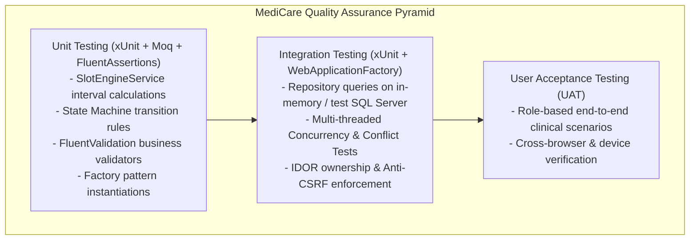

# Testing & Validation Plan: MediCare

## 1. Quality Assurance Strategy & Test Levels

MediCare employs a three-tier testing hierarchy to verify business logic, transactional consistency, security boundaries, and user workflows:



---

## 2. Test Tools & Frameworks

* **Test Runner & Engine:** **xUnit** (v2.9) — supports parameterized testing (`[Theory]`, `[InlineData]`) and parallel test execution.
* **Mocking Framework:** **Moq** — mocks external dependencies (`IEmailService`, `ISmsService`, `IAppointmentNotificationClient`, and Unit of Work interfaces).
* **Assertion Library:** **FluentAssertions** — provides clear, expressive, and self-documenting test assertions.
* **Integration Test Host:** **Microsoft.AspNetCore.Mvc.Testing** (`WebApplicationFactory<Program>`) — bootstraps the full HTTP pipeline in-memory for integration checks.
* **Code Coverage Analysis:** **Coverlet** — generates line and branch coverage reports during CI execution, targeting **≥ 60% coverage on `MediCare.Services`** (**KPI-06**).

---

## 3. High-Concurrency Conflict Test Design (KPI-01 Verification)

To verify the **0.0% Double-Booking Guarantee** (**KPI-01**, **NFR-REL-01**), an automated multi-threaded stress test will be executed:

```
[Test Setup]
1. Seed test database with Doctor #1 and Patient accounts #1 through #10.
2. Target: Tuesday, 2026-11-17 at 10:00:00 (Doctor Working Hours = 09:00 - 17:00).
3. Initialize 10 parallel Tasks simultaneously firing BookAppointmentAsync:
   - Parallel.For / Task.WhenAll across 10 threads.
   - Each thread submits a unique PatientId for Doctor #1 at 10:00:00.

[Expected Outcome & Assertions]
- Exactly ONE thread returns Result.Success (HTTP 200/201).
- Exactly NINE threads return Result.Failure (HTTP 409 Conflict).
- Querying the database reveals EXACTLY ONE appointment record with DoctorId = 1, Date = 2026-11-17, StartTime = 10:00:00.
- Database Filtered Unique Index [IX_Appointments_Doctor_NoOverlap] remains unbroken.
```

---

## 4. Requirements Traceability to Test Cases Matrix

The following matrix maps Phase 1 Functional Requirements (FR), Non-Functional Requirements (NFR), and User Stories (US) to planned Test Cases (TC). Detailed test execution scripts and step-by-step logs will be documented in Phase 4 (`docs/05-testing/`).

| Test Case ID | Test Category | Target Component / Workflow | Requirements Verified | User Story |
|---|---|---|---|---|
| **TC-01** | Unit | User Registration with valid credentials across 3 roles | FR-01, FR-02, NFR-SEC-05 | US-01, US-07 |
| **TC-02** | Unit | Unapproved doctor account blocked from public listings | FR-04, FR-23 | US-07 |
| **TC-03** | Unit | Doctor directory filter by specialty and fee range | FR-05 | US-01 |
| **TC-04** | Unit | SlotEngine computes 30-min slots from weekly hours | FR-06, FR-07, FR-09, NFR-PERF-01 | US-01 |
| **TC-05** | Unit | SlotEngine suppresses slots during approved `DoctorLeaves` | FR-08, FR-09 | US-03 |
| **TC-06** | Integration | Single-threaded booking flow transitions slot to `Pending (0)` | FR-10, FR-12 | US-01 |
| **TC-07** | Integration | **Multi-threaded 10-patient concurrency race condition test** | **FR-11, NFR-REL-01, KPI-01** | **US-02** |
| **TC-08** | Unit | State machine allows valid transition: `Pending (0)` -> `Confirmed (1)` | FR-12 | US-01 |
| **TC-09** | Unit | State machine blocks early completion: `Confirmed (1)` -> `Completed (2)` when `UtcNow < StartTime` | FR-12 | US-04 |
| **TC-10** | Unit | Patient cancellation allowed to `Cancelled (3)` when time to appointment > 2 hours | FR-13 | US-06 |
| **TC-11** | Unit | Patient cancellation rejected to `Cancelled (3)` when time to appointment ≤ 2 hours | FR-13 | US-06 |
| **TC-12** | Integration | Doctor writes visit record and items; updates appointment to `Completed (2)` | FR-14, FR-17, FR-18 | US-04 |
| **TC-13** | Integration | Diagnostic file upload validates MIME type and enforces ≤ 5 MB limit | FR-15, NFR-SEC-04 | US-04 |
| **TC-14** | Integration | **IDOR Security Guard: Patient A blocked from viewing Patient B record with HTTP 403** | **FR-16, NFR-SEC-01, RSK-02** | **US-05** |
| **TC-15** | UAT | Prescription view renders clean CSS `@media print` layout without navigation | FR-19, NFR-USE-03 | US-04 |
| **TC-16** | Integration | Notification persisted in SQL table before SignalR broadcast | FR-20, FR-21, NFR-REL-02, RSK-03 | US-01 |
| **TC-17** | Unit | MailKit `IEmailService` dispatches formatted confirmation email | FR-22 | US-01 |
| **TC-18** | Integration | Admin approval flips `IsApproved = true` and enables doctor bookings | FR-23 | US-07 |
| **TC-19** | Integration | Admin analytics queries aggregate monthly volumes and fee metrics | FR-25, FR-26, FR-27 | US-08 |
| **TC-20** | Integration | CSV export streams formatted appointment records | FR-28 | US-08 |
| **TC-21** | Integration | Anti-CSRF token verification on all POST state-changing requests | NFR-SEC-02 | All Stories |
| **TC-22** | Automation | Coverlet coverage audit verifies ≥ 60% code coverage on `MediCare.Services` | NFR-TST-01, KPI-06 | - |
| **TC-23** | Performance | SlotEngine response time benchmarks under 300 ms per doctor-month | NFR-PERF-01, KPI-02 | - |
| **TC-24** | UAT | Booking user journey verified in ≤ 4 discrete steps | NFR-USE-01, KPI-05 | US-01 |

---

## 5. User Acceptance Testing (UAT) Scenario Catalog

* **Scenario UAT-P (Patient Journey):** Register account -> Browse doctors by specialty -> Select Dr. Ahmed -> Pick 30-min slot on FullCalendar -> Confirm booking -> Receive SignalR toast -> Cancel appointment > 2h before.
* **Scenario UAT-D (Doctor Journey):** Register as Doctor -> Set weekly hours (09:00 - 17:00) -> Register conference leave -> Accept pending appointment -> Conduct consultation -> Upload lab report PDF -> Issue digital prescription -> Trigger print.
* **Scenario UAT-A (Admin Journey):** Login as Admin -> Open pending doctor queue -> Review credentials -> Click Approve -> Review Chart.js volume and revenue analytics -> Export CSV.
