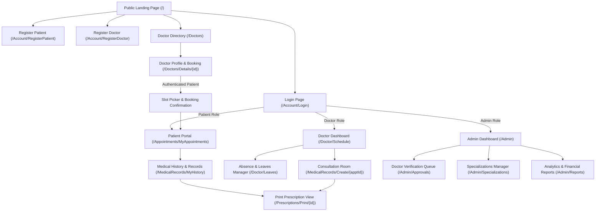

# UI/UX Wireframe Specifications: MediCare

This document provides a screen-by-screen functional specification for MediCare's user interface. It defines the page hierarchy, navigation flow, structural elements, interactive actions, validation feedback, and empty/error states to guide visual UI prototyping in Figma.

---

## 1. Site Map & Page Flow Diagram



---

## 2. Screen-by-Screen Specifications

---

### Screen 01: Doctor Directory (`/Doctors`)
* **Purpose:** Publicly search, filter, and discover verified physicians.
* **Access Role:** Public / Anonymous & Authenticated Users.
* **Layout Structure:**
  * **Top Header:** Global navigation bar with logo, directory link, and Login/Register buttons.
  * **Filter Sidebar / Top Bar:** Dropdown for Medical Specialization, range slider/input for Consultation Fee, day-of-week checkboxes (Sun–Thu).
  * **Main Content Area:** 3-column responsive card grid displaying doctor cards.
* **Card Elements:** Doctor photo thumbnail, Full Name, Specialization badge, Consultation fee (e.g. "300 EGP"), Available days summary, "Book Appointment" CTA button.
* **Empty State:** *"No doctors found matching your filter criteria. Try clearing your filters."*
* **Error State:** Alert banner displaying query errors.

```
+--------------------------------------------------------------------------+
|  MediCare LOGO     Home   Find Doctors   About         [Login] [Register] |
+--------------------------------------------------------------------------+
| Filter: [ Specialty: Cardiology v ]  [ Max Fee: 350 EGP ]  [ Day: Mon v ] |
+--------------------------------------------------------------------------+
| +---------------------+  +---------------------+  +---------------------+ |
| | [ Photo ]           |  | [ Photo ]           |  | [ Photo ]           | |
| | Dr. Ahmed Mahmoud   |  | Dr. Sara Ibrahim    |  | Dr. Tarek Nabil     | |
| | Specialty: Cardio   |  | Specialty: Derm     |  | Specialty: Ortho    | |
| | Fee: 300 EGP        |  | Fee: 250 EGP        |  | Fee: 350 EGP        | |
| | Days: Sun, Tue, Thu |  | Days: Mon, Wed      |  | Days: Sun, Mon, Wed | |
| | [ Book Appointment] |  | [ Book Appointment] |  | [ Book Appointment] | |
| +---------------------+  +---------------------+  +---------------------+ |
+--------------------------------------------------------------------------+
```

---

### Screen 02: Doctor Profile & Interactive Calendar (`/Doctors/Details/{id}`)
* **Purpose:** View doctor qualifications and select an available 30-minute slot for appointment reservation.
* **Access Role:** Patient (Authenticated to book) / Public (Browsing).
* **Main Elements:**
  * **Left Column:** Doctor bio, medical license number, clinic address, consultation fee, and active working hours list.
  * **Right Column:** Interactive `FullCalendar.js` widget set to month/week view.
  * **Slot Drawer / Panel:** When a calendar date is clicked, displays available 30-minute buttons (e.g. `[10:00 - 10:30]`, `[10:30 - 11:00]`).
  * **Booking Modal:** Pops up on slot selection displaying: Doctor name, selected date & time, fee summary, patient notes input field, and a "Confirm Reservation" button.
* **Validation & Alerts:**
  * If unauthenticated: "Please login as a patient to reserve a slot."
  * Conflict alert: "Slot has just been booked. Please pick another time."
* **Empty State:** If doctor has no slots or is on approved leave: *"Doctor is currently unavailable on this date."*

```
+--------------------------------------------------------------------------+
| [ Dr. Photo ]  Dr. Ahmed Mahmoud (Cardiology)                            |
| Fee: 300 EGP | Slot Length: 30 mins | License: MD-98432                  |
+---------------------------+----------------------------------------------+
| Working Hours:            |  FULLCALENDAR.JS WIDGET                      |
| - Sunday:   09:00 - 17:00 |  <  November 2026  >                         |
| - Tuesday:  09:00 - 17:00 |  Sun  Mon  Tue  Wed  Thu  Fri  Sat           |
| - Thursday: 09:00 - 17:00 |   1    2    3    4    5    6    7            |
|                           |   8    9   [10] 11   12   13   14            |
| Clinic Location:          |                                              |
| Building 4, Health Center |  Available Slots for Nov 10:                 |
| Cairo, Egypt              |  [ 09:00 AM ] [ 09:30 AM ] [ 10:00 AM ]      |
|                           |  [ 10:30 AM ] [ 11:00 AM ] [ 02:00 PM ]      |
+---------------------------+----------------------------------------------+
```

---

### Screen 03: Patient Portal — My Appointments (`/Appointments/MyAppointments`)
* **Purpose:** Allow patients to review upcoming and historical reservations, monitor confirmation status, and cancel upcoming visits.
* **Access Role:** Authenticated Patient.
* **Main Elements:**
  * **Upcoming Tab:** Table with columns: Date & Time, Doctor, Specialty, Status Badge (`Pending`, `Confirmed`), Fee, Actions (`[Cancel]`).
  * **Past Appointments Tab:** Table with columns: Date, Doctor, Diagnosis Summary, Actions (`[View Medical Record]`, `[Print Prescription]`).
* **Interactive Actions:**
  * Clicking `Cancel`: Checks `< 2 hours` restriction. If valid, presents confirmation modal and releases slot.
* **Empty State:** *"You have no scheduled appointments. Click 'Find Doctors' to book your visit."*

---

### Screen 04: Doctor Consultation & Prescription Issuance (`/MedicalRecords/Create/{apptId}`)
* **Purpose:** Provide attending physician with a unified digital chart to enter consultation findings, upload diagnostic documents, and prescribe medications.
* **Access Role:** Authenticated Doctor.
* **Main Elements:**
  * **Patient Summary Header:** Patient name, age, gender, blood group, emergency contact, visit time.
  * **Consultation Form:** Text areas for Symptoms, Diagnosis, and Clinical Notes.
  * **Diagnostic File Upload:** Drag-and-drop file selector (accepts JPG, PNG, PDF ≤ 5 MB).
  * **Dynamic Prescription Repeater:** Table with inputs to add multiple rows:
    * Columns: `Medication Name`, `Dosage`, `Frequency`, `Duration (Days)`, `Instructions`, and `[Remove]` button.
    * CTA: `[+ Add Medication]` button.
  * **Submission Bar:** `[Complete Visit & Generate Prescription]` button.
* **Validations:** Diagnosis is required; Medication Name and Dosage are required for every added prescription row; File size must be ≤ 5 MB.
* **Action Outcome:** Atomic transaction moves Appointment to `Completed`, saves record, and routes directly to the printable prescription view.

```
+--------------------------------------------------------------------------+
| Patient: Omar Khaled | Age: 34 | Gender: Male | Blood: A+ | Appt #101    |
+--------------------------------------------------------------------------+
| Clinical Diagnosis:*  [ Essential Hypertension                         ] |
| Symptoms Observed:    [ Headaches, elevated resting blood pressure     ] |
| Visit Notes:          [ Recommend dietary sodium restriction           ] |
| Diagnostic Upload:    [ Choose File: lab_report_nov.pdf (2.1 MB)     ] |
+--------------------------------------------------------------------------+
| DIGITAL PRESCRIPTION ITEMS                                               |
| Medication       Dosage    Frequency      Duration   Instructions        |
| 1. Concor        5 mg      Once daily     30 days    Morning before food |
| 2. Aspirin Prot  81 mg     Once daily     30 days    After lunch         |
| [+ Add Medication]                                                       |
+--------------------------------------------------------------------------+
|                       [ Complete Consultation & Print Prescription ]     |
+--------------------------------------------------------------------------+
```

---

### Screen 05: Standardized Prescription Print View (`/Prescriptions/Print/{id}`)
* **Purpose:** Clean, formatted medical document designed specifically for physical paper dispensing or saving as PDF.
* **Access Role:** Attending Doctor, Admin, or the Owning Patient (IDOR protected).
* **Main Elements:**
  * **Header:** Clinic branding ("MediCare Outpatient Clinic"), address, telephone.
  * **Doctor Metadata:** Doctor Full Name, Medical License Number, Specialization.
  * **Patient Metadata:** Patient Name, Age, Gender, Date of Issue.
  * **Prescription Body (Rx):** Numbered list of prescribed medications with dosage and frequency instructions.
  * **Footer:** Doctor signature box, clinic stamp placeholder, and disclaimer: *"Dispense only by licensed pharmacist."*
* **CSS Formatting:** Utilizes `@media print` to suppress all navigational headers, buttons, borders, and footer links during printing.

---

### Screen 06: Admin Analytics Dashboard (`/Admin/Reports`)
* **Purpose:** High-level operational and revenue intelligence for clinic management.
* **Access Role:** Authenticated Clinic Administrator.
* **Main Elements:**
  * **Top Metrics Ribbon:** Total Appointments, Active Doctors, Completed Visits Ratio, Total Revenue Collected (EGP).
  * **Chart 1 (Bar Chart):** Monthly Appointment Volumes by Status (`Completed`, `Cancelled`, `NoShow`).
  * **Chart 2 (Doughnut Chart):** Distribution of Patient Visits across Medical Specializations.
  * **Chart 3 (Financial Summary):** Monthly Consultation Fees Collected vs. Pending.
  * **Export Actions:** `[Export Report (CSV)]` button.
* **Empty State:** Charts render empty state illustrations if no appointment data exists in selected date ranges.
