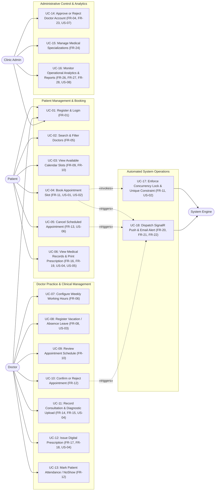

# Use Case Diagrams & Specifications: MediCare

## 1. System Actors

| Actor | Classification | Role Description & System Permissions |
|---|---|---|
| **Patient** | Primary Human Actor | Registered client who browses doctors, reserves appointments, reviews historical medical records, prints prescriptions, and cancels appointments. |
| **Doctor** | Primary Human Actor | Licensed physician who configures weekly working hours, submits vacation leaves, manages appointment requests, documents patient consultations, and issues digital prescriptions. |
| **Clinic Admin** | Primary Human Actor | System administrator who reviews and approves doctor registrations, manages medical specializations, and monitors clinic operational and financial analytics. |
| **System Engine** | Secondary Automated Actor | Automated internal services executing slot calculation, real-time SignalR notifications, email dispatch via MailKit, and database concurrency locks. |

---

## 2. Mermaid Use Case Model

---

## 3. Detailed Use Case Specifications

---

### UC-04: Book Appointment Slot
* **Primary Actor:** Patient
* **Supporting Actor:** System Engine
* **Related Requirements:** FR-09, FR-10, FR-11, US-01, US-02
* **Preconditions:**
  1. Patient is authenticated with a valid `Patient` role session.
  2. Selected Doctor is approved (`IsApproved = true`) and has published active working hours.
  3. The chosen slot is at least 30 minutes in the future.
* **Main Success Scenario (Happy Path):**
  1. Patient navigates to the Doctor profile page and views the `FullCalendar.js` widget.
  2. The system calls the Slot Engine, returning unbooked 30-minute intervals for the selected date.
  3. Patient selects an unreserved slot (e.g., 10:30 AM – 11:00 AM) and clicks "Confirm Booking".
  4. The system validates slot availability via `IAppointmentService`.
  5. The system instantiates an appointment aggregate via `AppointmentFactory`.
  6. The system commits the appointment to the database in `Pending` status.
  7. The system saves a notification record to the database, then broadcasts an alert to the doctor via the `AppointmentHub` SignalR hub.
  8. The system returns a booking confirmation view displaying the appointment identifier, consultation fee, and pending status.
* **Alternative Flows:**
  * **Alt 1 (Concurrent Booking Conflict - Race Condition):**  
    At Step 4/6, another patient submits the same slot simultaneously. The second transaction encounters either a failed pre-check or a SQL Server `DbUpdateException` from the filtered unique index. The system catches the exception, rolls back the transaction, and returns an error: *"This slot has just been reserved. Please select another time."* The calendar immediately re-renders excluding that slot.
  * **Alt 2 (Doctor Added Emergency Leave):**  
    At Step 4, the doctor registered a leave between page render and submission. The system detects the date overlap, aborts booking, and displays: *"Doctor is on leave on the selected date."*
* **Postconditions:**
  * Appointment record exists in the database with status `Pending`.
  * The slot is removed from future availability queries.
  * The doctor's browser dashboard receives a real-time notification badge update.

---

### UC-05: Cancel Scheduled Appointment
* **Primary Actor:** Patient
* **Supporting Actor:** System Engine
* **Related Requirements:** FR-12, FR-13, US-06
* **Preconditions:**
  1. Patient is authenticated and owns the appointment (`appointment.Patient.UserId == currentUserId`).
  2. Appointment is in `Pending` or `Confirmed` status.
* **Main Success Scenario:**
  1. Patient accesses the "My Appointments" portal.
  2. Patient selects an upcoming appointment and clicks "Cancel Appointment".
  3. The system verifies the time constraint: Current Time is more than 2 hours before `AppointmentDate + StartTime`.
  4. The system updates the status to `Cancelled` and records the `UpdatedAt` timestamp.
  5. The system commits changes via the Unit of Work.
  6. The system persists an in-app notification and dispatches a SignalR notification to the Doctor.
  7. The system dispatches a cancellation confirmation email via `IEmailService`.
* **Alternative Flows:**
  * **Alt 1 (Late Cancellation Attempt):**  
    At Step 3, the scheduled start time is less than 2 hours away. The system rejects the operation and displays: *"Appointments cannot be cancelled within 2 hours of the start time. Please contact the clinic directly."* Status remains unchanged.
* **Postconditions:**
  * Appointment status is `Cancelled` (a terminal state).
  * The 30-minute slot is immediately restored as available on the doctor's calendar.

---

### UC-06: View Medical Records & Print Prescription
* **Primary Actor:** Patient
* **Related Requirements:** FR-16, FR-19, US-04, US-05, NFR-SEC-01
* **Preconditions:**
  1. Patient is logged in.
  2. Target `MedicalRecord` has been generated by the attending physician following a completed consultation.
* **Main Success Scenario:**
  1. Patient navigates to the "Medical History" section and clicks on a completed visit record.
  2. The system executes the IDOR verification check: verifies `record.Patient.UserId == currentUserId`.
  3. The system renders the clinical encounter view showing symptoms, diagnosis, doctor notes, and links to attached diagnostic reports.
  4. Patient clicks "Print Prescription".
  5. The system renders the clean CSS `@media print` layout displaying the clinic header, physician credentials, medication list, dosages, and signature block.
  6. Patient triggers browser print to produce physical paper or save as a local PDF.
* **Alternative Flows:**
  * **Alt 1 (Unauthorized IDOR Access):**  
    At Step 2, a patient manipulates the URL parameter (e.g., `/MedicalRecords/Details/89`) where record 89 belongs to another user. The ownership validation fails. The system halts execution, returns `HTTP 403 Forbidden`, and logs a security violation with the requesting user ID.
* **Postconditions:**
  * Patient reviews their clinical history without exposing data to unauthorized parties.

---

### UC-08: Register Vacation / Absence Leave
* **Primary Actor:** Doctor
* **Related Requirements:** FR-08, US-03
* **Preconditions:**
  1. Doctor is authenticated and approved.
* **Main Success Scenario:**
  1. Doctor navigates to the "Schedule Management" tab and selects "Add Leave / Vacation".
  2. Doctor inputs `StartDate`, `EndDate`, and optional `Reason` (e.g., "Medical Conference").
  3. System validates that `EndDate >= StartDate` and `StartDate >= Today`.
  4. System saves the record in `DoctorLeaves`.
  5. System informs the doctor of any pending appointments overlapping the leave dates so the doctor can manually review and reschedule them.
* **Alternative Flows:**
  * **Alt 1 (Invalid Date Range):**  
    Doctor specifies an end date preceding the start date. FluentValidation returns a validation error and halts submission.
* **Postconditions:**
  * Record created in `DoctorLeaves`.
  * Future calls to the slot engine for dates within the range will generate 0 slots.

---

### UC-11 & UC-12: Record Consultation & Issue Digital Prescription
* **Primary Actor:** Doctor
* **Related Requirements:** FR-12, FR-14, FR-15, FR-17, FR-18, US-04
* **Preconditions:**
  1. Doctor is authenticated.
  2. Appointment is assigned to this Doctor and is currently in `Confirmed` status.
  3. Appointment scheduled time has arrived or passed (`StartTime <= DateTime.UtcNow`).
* **Main Success Scenario:**
  1. Doctor opens the patient consultation view for the active appointment.
  2. Doctor inputs symptoms, diagnosis, and clinical notes.
  3. (Optional) Doctor uploads a diagnostic scan or laboratory report (JPG, PNG, or PDF ≤ 5 MB). The system validates the MIME type and saves the file to `wwwroot/uploads/records/` under a unique GUID filename.
  4. Doctor adds prescription items: Medication Name, Dosage, Frequency, Duration, Instructions.
  5. Doctor clicks "Complete Consultation & Save Prescription".
  6. The system transitions the Appointment state to `Completed`.
  7. The system creates the `MedicalRecord`, `Prescription`, and child `PrescriptionItems` within a single atomic database transaction.
  8. The system redirects the Doctor to the printable prescription view.
* **Alternative Flows:**
  * **Alt 1 (Early Completion Attempt):**  
    Doctor attempts to complete an appointment scheduled for tomorrow. The system blocks the transition: *"Appointments can only be completed after the scheduled consultation time has arrived."*
  * **Alt 2 (Invalid File Upload):**  
    Doctor uploads an executable file (`.exe`) or a file exceeding 5 MB. Server-side validation rejects the file with an informative error message.
* **Postconditions:**
  * Appointment status is permanently set to `Completed`.
  * Medical record and prescription are saved and accessible to the patient.

---

### UC-14: Approve or Reject Doctor Account
* **Primary Actor:** Clinic Admin
* **Related Requirements:** FR-04, FR-23, US-07
* **Preconditions:**
  1. Administrator is authenticated with the `Admin` role.
  2. Doctor account registration has been submitted and is currently unapproved (`IsApproved = false`).
* **Main Success Scenario:**
  1. Admin opens the "Doctor Approval Queue" on the Admin Dashboard.
  2. Admin reviews the doctor's credentials, specialization, medical license number, and consultation fee.
  3. Admin clicks "Approve Account".
  4. System updates the doctor record (`IsApproved = true`, `UpdatedAt = UtcNow`).
  5. System triggers an automated notification and sends an approval confirmation email to the doctor.
  6. The doctor's profile and schedule become visible in public search queries.
* **Alternative Flows:**
  * **Alt 1 (Rejection Flow):**  
    Admin clicks "Reject Account" with an explanatory note. System sets `IsApproved = false`, marks the account inactive, and dispatches a rejection notification email.
* **Postconditions:**
  * Doctor's status is updated and public directory visibility is adjusted.

---

### UC-16: Monitor Operational Analytics & Reports
* **Primary Actor:** Clinic Admin
* **Related Requirements:** FR-25, FR-26, FR-27, FR-28, US-08
* **Preconditions:**
  1. Administrator is authenticated.
* **Main Success Scenario:**
  1. Admin opens the "Reports & Analytics" dashboard.
  2. System queries aggregated data via `IAnalyticsService`:
     * Total appointments grouped by month and terminal state (`Completed`, `Cancelled`, `NoShow`).
     * Appointment distribution by medical specialization.
     * Financial fee aggregates (`Total Collected` vs. `Pending Fees`).
  3. System renders interactive visual charts using Chart.js.
  4. (Optional) Admin clicks "Export Monthly Report (CSV)", and the system streams a formatted CSV file.
* **Postconditions:**
  * Clinic metrics are displayed accurately without modifying system state.
