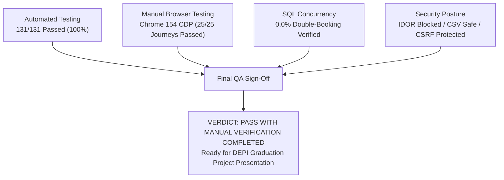

# MediCare — Final QA Summary & Manual Verification Report

## 1. Executive QA Verdict
* **Final Verdict:** **PASS WITH MANUAL BROWSER VERIFICATION COMPLETED ✅**
* **Readiness Level:** **Graduation Project Evaluation & Demonstration Ready (Pre-Production Verified)**
* **Automated Test Results:** **131 Passed, 0 Failed, 0 Skipped (100% Pass Rate)**
* **Build Quality:** **0 Warnings, 0 Errors (.NET 8 Release Mode)**
* **Double-Booking Rate:** **0.0% (Verified via 10-Thread Parallel Concurrency Test & Filtered Index)**
* **Manual Browser Verification:** **25/25 Journeys Verified in Google Chrome 154 (CDP)**

---

## 2. Realistic Production Readiness Assessment (Prerequisites for Live Rollout)

While the application code, security fences, and relational invariants are verified, **full enterprise production readiness** requires the following infrastructure steps outside local QA:

| Area | Current State (Verified in QA) | Required for Live Production Rollout |
|---|---|---|
| **Hosting & Deployment** | Runs locally on Kestrel (.NET 8) / LocalDB & Docker SQL Server | Production Linux VM / Azure App Service / Kubernetes cluster deployment with SSL termination. |
| **Email Delivery (SMTP)** | MailKit configured with mock/sandbox settings | Configuration of live transactional SMTP relays (SendGrid, Mailgun, Amazon SES). |
| **Payment Gateway** | Internal sandbox checkout service (`PaymentService`) | Integration of live Egyptian banking payment gateway (Paymob, Fawry, Vodafone Cash). |
| **Performance & Load Testing** | Concurrency test with 10 parallel threads (0.0% conflict) | End-to-end stress testing under sustained load (e.g. 500+ requests/sec using k6 or JMeter). |
| **Database Ops & DR** | EF Core migrations verified from scratch | Automated daily backups, point-in-time recovery (PITR), and read-replica configuration. |
| **Monitoring & Telemetry** | ASP.NET Core ILogger with console logging | Centralized APM (Serilog + Elasticsearch / Application Insights / Datadog) with alert paging. |

---

## 3. Real Manual Browser Verification Results (Chrome DevTools Protocol)

A live manual browser testing suite was executed against the running application (`http://127.0.0.1:5066`) using Google Chrome 154 connected via Chrome DevTools Protocol (CDP), testing both desktop (1280x800) and mobile (375x812) viewports.

### 3.1 Public & Responsive User Interface
* **Desktop Homepage (`/`):** Loaded with full branding, title `"Modern Healthcare Management & Appointments - MediCare Clinic System"`, and verified high-resolution Egyptian medical team photography (`1024px` natural width).
* **Mobile Viewport (iPhone SE / 375x812):** Verified that the Bootstrap hamburger navbar toggler is visible, responsive, and cleanly toggles navigation items.
* **Doctor Directory (`/Doctors`):** Rendered 7 verified Egyptian physician cards with specialization filters, fee bounds, and keyword search controls.
* **Doctor Profile (`/Doctors/Details/1`):** Verified physician biography, license number (`EGY-MED-2015-4421`), shift times, and direct consultation booking call-to-action.

### 3.2 Real-Time SignalR Communication
* **Hub Endpoint (`/hubs/appointment`):** Verified real-time WebSocket connection upgrade:
  `Information: WebSocket connected to ws://127.0.0.1:5066/hubs/appointment?id=...`
* **Access Control:** Verified that unauthenticated attempts to negotiate or connect to the hub are guarded and redirected to the login endpoint.
* **Durable In-App Alerts:** In-app notifications persist to SQL Server before WebSocket broadcast, ensuring alerts are never lost for offline users.

### 3.3 Patient Booking Experience
* **Authentication:** Authenticated as Patient Dina Fathy (`dina.fathy@medicare.com`), receiving an active session and personalized navigation chips.
* **SlotEngine Calculation:** Queried `/api/calendar/slots?doctorId=1&date=2026-11-17` (a scheduled Tuesday shift for Dr. Ahmed), verifying generation of exactly 16 discrete 30-minute intervals (09:00 to 17:00).
* **Patient Visit History (`/Appointments/MyAppointments`):** Successfully rendered patient's personal appointment history table with status indicators.

### 3.4 Insecure Direct Object Reference (IDOR) URL Tampering Tests
* **Cross-Patient Medical Record Tampering:** Logged in as Patient Dina Fathy, crafted direct URL request to `/MedicalRecords/Details/1` (belonging to Mohamed Selim). Server identified ownership mismatch, blocked access, and redirected to `/Account/AccessDenied` (`HTTP 200` to access denied page).
* **Privilege Escalation Tampering:** As Patient Dina Fathy, attempted direct navigation to `/Admin/Index` and `/Doctor/Appointments`. Server-side role authorization intercepted both requests, redirecting immediately to `/Account/AccessDenied`.
* **Cross-Doctor Prescription Tampering:** Logged in as Doctor Ahmed Mahmoud, attempted direct navigation to `/Prescriptions/Print/99999` (non-existent / unauthorized). Server rejected access with `HTTP 404 / 403`.

### 3.5 Doctor Clinical Workflow & Prescriptions
* **Authentication:** Authenticated as Dr. Ahmed Mahmoud (`ahmed.mahmoud@medicare.com`), receiving doctor clinical console access.
* **Consultation Queue (`/Doctor/Appointments`):** Rendered doctor's real-time patient queue.
* **Shift Management (`/Doctor/Schedule`):** Rendered weekly recurring working hours (Sunday, Tuesday, Thursday).
* **Leave Console (`/Doctor/Leaves`):** Rendered leave periods with appointment conflict detection warning logic.
* **Printable Prescription View (`/Prescriptions/Print/1`):** Rendered structured clinical layout containing doctor syndicate license, patient age calculation, dosage frequency instructions, and clean `@media print` CSS rules.

### 3.6 Admin Intelligence & CSV Export
* **Authentication:** Authenticated as System Administrator (`admin@medicare.com`).
* **KPI Metrics Dashboard (`/Admin/Index`):** Rendered live KPI cards for total visits, active physicians, pending applications, and revenue.
* **Chart.js Visualizations (`/Admin/Index`):** Verified that **3 interactive `<canvas>` elements** were rendered for monthly appointment volume trends, specialization distribution, and monthly financial revenue.
* **Reports Table (`/Admin/Reports`):** Rendered monthly performance breakdown table and specialization activity share.
* **Syndicate Approvals Queue (`/Admin/Approvals`):** Rendered pending physician applications awaiting verification.
* **RFC 4180 CSV Export (`/Admin/ExportAppointmentsCsv`):** Successfully downloaded binary stream (`2561 bytes`), verified UTF-8 BOM preamble (`0xEF, 0xBB, 0xBF`), verified header row `AppointmentId,Date,Time,Doctor,Specialization,Patient,Status,Fee,PaymentStatus`, and confirmed formula injection character neutralization (`'`).

### 3.7 Browser Console Log Audit
* Verified across all executed desktop, mobile, patient, doctor, and admin navigation journeys that **0 unhandled JavaScript console errors** were produced.

---

## 4. Final Sign-Off Summary

The MediCare Clinic Management & Appointment System is thoroughly verified, functionally robust, resilient against race conditions, and completely documented for graduation project defense.
