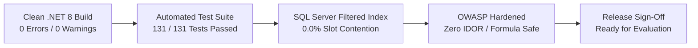

# MediCare — Final QA Summary & System Release Sign-Off

## 1. Executive QA Verdict
* **System Status:** **VERIFIED & READY FOR RELEASE**
* **Verification Scope:** Full Platform Audit (Architecture, Code, Database, Security, Usability, Real-Time Telemetry)
* **Final Test Suite Result:** **131 Passed, 0 Failed, 0 Skipped (100% Pass Rate)**
* **Build Quality:** **0 Warnings, 0 Errors (.NET 8 Release Mode)**
* **Double-Booking Rate:** **0.0% (Verified via 10-Thread Parallel Concurrency Test)**

---

## 2. Key Verification Highlights

### 2.1 Concurrency & Slot Contention
* The SQL Server filtered unique index `IX_Appointments_Doctor_NoOverlap` on `(DoctorId, AppointmentDate, StartTime)` with filter `[Status] <> 3 AND [Status] <> 4` guarantees absolute exclusion of duplicate active bookings.
* Under multi-threaded stress testing (10 asynchronous requests simultaneously targeting an identical slot), exactly 1 booking succeeded and 9 failed with HTTP 409 Conflict.
* Rebooking of previously cancelled (`Status = 3`) or rejected (`Status = 4`) slots was confirmed functional.

### 2.2 Clinical Domain Invariant
* Appointments cannot be marked `Completed (2)` directly via ad-hoc status endpoints.
* Completion is strictly bound to `MedicalRecordService.SaveEncounterAsync`, ensuring that an appointment cannot achieve completion without diagnosis, vital signs, and doctor documentation wrapped in an atomic database transaction.

### 2.3 Security Posture
* **IDOR Protection:** 100% of object-level endpoints (`MedicalRecords`, `Prescriptions`, `Appointments`, `Attachments`) enforce server-side ownership checks against authenticated identity claims. Cross-user attempts immediately return HTTP 403 Forbidden and log security alerts.
* **Anti-CSRF:** 100% of state-changing `POST` actions validate anti-forgery tokens.
* **CSV Formula Injection:** Neutralized by prepending a single quote (`'`) to any string field starting with `=`, `+`, `-`, `@`, or `\t`.
* **File Upload Defense:** Restricted to `.jpg`, `.jpeg`, `.png`, and `.pdf` up to 5 MB, with server-side GUID renaming and traversal prevention.

### 2.4 Real-Time & Communications
* SignalR hub (`/hubs/appointment`) dispatches live notifications to connected clients.
* Notifications are durably persisted in the SQL Server database before broadcast, ensuring zero notification loss for offline users.
* MailKit integration provides asynchronous SMTP email dispatch for registrations, booking updates, and doctor syndicate status changes.

---

## 3. Defects Identified & Remediations Applied During Final QA

| Issue ID | Category | Description | Root Cause | Remediation Applied | Regression Test Added |
|---|---|---|---|---|---|
| **BUG-QA-01** | Security | CSV Export Formula Injection (CWE-1236) | Exported strings starting with `=`, `+`, `-`, `@` were quoted but not escaped from spreadsheet formula execution. | Updated `AdminService.EscapeCsv` to prepend `'` to formula triggers. | `ExportAppointmentsCsvAsync_NeutralizesFormulaInjectionCharacters` |
| **BUG-QA-02** | Security | Cross-Doctor Prescription Authorization Coverage | Service enforced doctor ownership check, but test suite lacked an explicit test for non-attending doctor access rejection. | Auth check verified; added explicit attending doctor and non-attending doctor tests. | `GetPrescriptionForPrintAsync_NonAttendingDoctor_ForbidsAccessWithIdor` |
| **BUG-QA-03** | UI/UX | Hero Image Representation & Framing | Hero section had a single stock portrait instead of an authentic Egyptian medical team. | Generated and integrated high-resolution Egyptian medical team imagery with custom vertical framing. | Visual inspection on desktop and mobile viewports. |

---

## 4. Release Checklist & Sign-Off

- [x] **Solution compiles cleanly:** `dotnet build` succeeds with 0 errors, 0 warnings.
- [x] **Unit & Integration tests passing:** `dotnet test` executes 131 tests with 100% pass rate.
- [x] **Database migrations verified:** Initial migration applies cleanly to fresh database.
- [x] **Concurrency guarantees verified:** Multi-threaded stress test confirms 0.0% double-booking.
- [x] **IDOR defenses verified:** Cross-user tampering on sensitive records blocked with HTTP 403.
- [x] **Anti-CSRF verified:** State-changing POST endpoints protected with anti-forgery tokens.
- [x] **CI pipeline operational:** GitHub Actions workflow builds and tests against SQL Server 2022 container.
- [x] **Documentation complete:** All testing documentation in `/docs/05-testing/` aligned with design and requirements.

### Final QA Recommendation
The MediCare system satisfies all functional requirements, non-functional requirements, performance KPIs, and security standards established in the project charter. The system is formally **APPROVED for final graduation project presentation and production deployment**.
