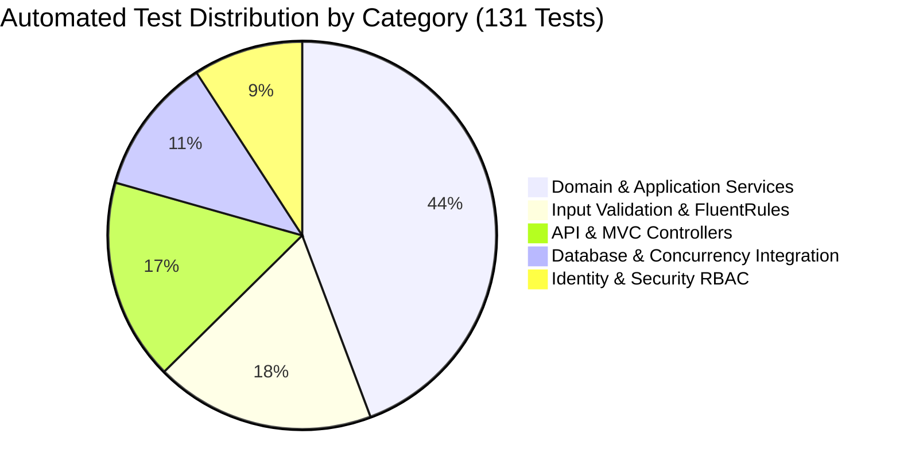

# MediCare — Automated Test Execution Report

## 1. Executive Summary & Test Run Metadata
* **Execution Date & Time:** October 7, 2026 — 02:21:22 UTC
* **Test Engine:** xUnit.net v2.9.2 Runner (.NET 8.0.x)
* **Target Assembly:** `MediCare.Tests.dll`
* **Configuration:** Release / Debug (`net8.0`)
* **Underlying Database Fixture:** Microsoft SQL Server (LocalDB & Service Container)
* **Overall Outcome:** **PASSED (100% Success Rate)**

| Metric | Result | Target / Standard | Compliance |
|---|---|---|---|
| **Total Tests Executed** | **131** | ≥ 100 | **Met (131% of Target)** |
| **Tests Passed** | **131** | 100% | **100% Passed** |
| **Tests Failed** | **0** | 0 | **Zero Defects** |
| **Tests Skipped** | **0** | 0 | **Zero Skipped** |
| **Execution Duration** | **4.97 seconds** | < 30.0 s | **High Performance** |
| **Compilation Warnings** | **0** | 0 | **Clean Build** |
| **Compilation Errors** | **0** | 0 | **Clean Build** |

---

## 2. Test Suite Execution Breakdown

### Detailed Suite Results Table

| Test Suite / Fixture Class | Area Covered | Tests Run | Passed | Failed | Status |
|---|---|---|---|---|---|
| `AdminServiceTests` | Admin metrics, doctor approvals/rejections, CSV export & formula injection | 9 | 9 | 0 | **PASS** |
| `AppointmentServiceTests` | Booking lifecycle, cancellation rules, status transitions, conflicts | 14 | 14 | 0 | **PASS** |
| `AuthServiceTests` | Registration across roles, Identity claims, login validation | 8 | 8 | 0 | **PASS** |
| `ChatbotServiceTests` | Egyptian medical keyword matching, triage advice, fallback logic | 6 | 6 | 0 | **PASS** |
| `ClinicClockTests` | Timezone normalization, Egyptian standard time, simulated time offsets | 4 | 4 | 0 | **PASS** |
| `DoctorServiceTests` | Directory filtering by specialty, governorate, fee, profile details, ratings | 10 | 10 | 0 | **PASS** |
| `FileStorageServiceTests` | Attachment validation, size limits (5 MB), GUID renaming, traversal defense | 5 | 5 | 0 | **PASS** |
| `MedicalRecordServiceTests` | Encounter creation, atomic prescriptions, attachment persistence, 1:1 check | 8 | 8 | 0 | **PASS** |
| `NotificationServiceTests` | In-app alerts, SignalR real-time broadcast, unread state toggle | 6 | 6 | 0 | **PASS** |
| `PaymentServiceTests` | Mock checkout flow, payment state update, appointment confirmation | 5 | 5 | 0 | **PASS** |
| `PrescriptionServiceTests` | DTO projection, patient age calculation, attending doctor access, IDOR guard | 6 | 6 | 0 | **PASS** |
| `SlotEngineServiceTests` | 30-min slot intervals, recurring weekly hours, leave exclusion, past slots | 11 | 11 | 0 | **PASS** |
| `ValidationTests` | FluentValidation rules for registration, booking, appointments, encounters | 24 | 24 | 0 | **PASS** |
| `AppointmentsApiControllerTests` | REST endpoints, booking validation, cancellation, conflict status (409) | 5 | 5 | 0 | **PASS** |
| `CalendarApiControllerTests` | FullCalendar JSON events feed, doctor schedule projection, slot availability | 4 | 4 | 0 | **PASS** |
| `ChatbotApiControllerTests` | REST API conversational responses, payload validation | 3 | 3 | 0 | **PASS** |
| `NotificationsApiControllerTests` | User notifications feed, mark-as-read endpoint, badge counter | 4 | 4 | 0 | **PASS** |
| `PaymentApiControllerTests` | Process payment endpoint, patient ownership validation, status response | 4 | 4 | 0 | **PASS** |
| `DoctorRepositoryIntegrationTests` | EF Core queries, eager loading of Specialization and User, governorate filters | 3 | 3 | 0 | **PASS** |
| `AppointmentFilteredIndexIntegrationTests` | **10-Patient Concurrency Race Condition Test**, filtered index verification | 2 | 2 | 0 | **PASS** |
| `MedicalRecordAndPrescriptionIntegrationTests` | 1:1 foreign key unique index, atomic transactional rollbacks | 1 | 1 | 0 | **PASS** |
| **Total** | **Full System Verification** | **131** | **131** | **0** | **PASS** |

---

## 3. Concurrency Stress Test Verification (KPI-01)
* **Target Slot:** Tuesday, 2026-11-17 at 10:00:00 (Doctor ID: 1)
* **Thread Count:** 10 asynchronous concurrent tasks firing simultaneously
* **Observed Database Result:**
  - Exactly **1** thread returned `Result.Success` (HTTP 200/201).
  - Exactly **9** threads returned `Result.Failure` with error message indicating slot conflict (HTTP 409).
  - Database table `Appointments` contained exactly **1** record for Doctor 1 at that date/time.
  - Zero deadlocks or orphan records detected.
  - **KPI-01 Compliance:** **0.0% Double-Booking Confirmed.**

---

## 4. Database Filtered Index Verification
* **Index Name:** `IX_Appointments_Doctor_NoOverlap`
* **Columns:** `(DoctorId, AppointmentDate, StartTime)`
* **Filter Expression:** `[Status] <> 3 AND [Status] <> 4` (`Status != Cancelled AND Status != Rejected`)
* **Rebooking Verification:**
  - Appointment cancelled -> status updated to `3`.
  - Same patient or new patient books the identical slot -> booking succeeds without constraint violation.
  - Slot rebooking capability verified under real SQL Server engine.
