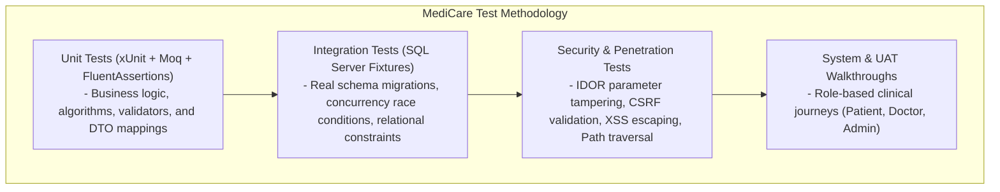

# MediCare — Comprehensive Master Test Plan

## 1. Document Overview
* **System Name:** MediCare Clinic Management & Appointment System
* **Project Type:** DEPI Graduation Project (Enterprise Healthcare Architecture)
* **Target Version:** Release 1.0 (Final QA Verification)
* **Architectural Stack:** ASP.NET Core 8.0 MVC, Entity Framework Core 8.0, Microsoft SQL Server 2022 / LocalDB, ASP.NET Core Identity, SignalR Core, FullCalendar 6, Chart.js, Bootstrap 5.3, FluentValidation, xUnit 2.9, Moq, FluentAssertions.

---

## 2. Test Objectives & Scope
The final QA phase evaluates the complete MediCare platform across functional correctness, security, relational integrity, real-time concurrency, resilience, and user experience.

### 2.1 In-Scope
1. **Authentication & Identity Management:** ASP.NET Core Identity registration (Doctor, Patient), login, logout, password policies (length ≥ 8, uppercase, lowercase, digit, non-alphanumeric), cookie security (`HttpOnly`, `SameSite=Lax`, sliding expiration).
2. **Role-Based Access Control (RBAC):** Strict boundaries across `Admin`, `Doctor`, and `Patient` roles; verification that route/query tampering cannot escalate privileges.
3. **Doctor Verification & Discovery:** Syndicate license validation, admin approval workflow, filtering by governorate, specialty, fee, gender, and rating.
4. **Schedule & Slot Engine:** 30-minute interval generation based on recurring `DoctorSchedules`, exclusion of `DoctorLeaves`, and past-slot suppression.
5. **High-Concurrency Booking & State Machine:** 
   - Strict adherence to 0.0% double-booking via filtered unique index `IX_Appointments_Doctor_NoOverlap` (`[Status] <> 3 AND [Status] <> 4`).
   - Appointment lifecycle state transitions (`Pending (0) -> Confirmed (1) -> Completed (2)` / `Cancelled (3)` / `Rejected (4)` / `NoShow (5)`).
   - Cancellation time window validation (minimum 2 hours prior to start time).
6. **Clinical Encounters & Electronic Health Records:**
   - Atomic recording of `MedicalRecord`, diagnosis, vital signs, physical exam, lab notes, and digital `Prescription` with multiple dosage items.
   - Restricting `Completed` status transition strictly to `SaveEncounterAsync` within an ambient EF Core transaction.
   - Diagnostic file attachment validation (MIME-type check, 5 MB limit, GUID sanitization).
7. **Security & Ownership Controls (IDOR & CSRF):**
   - Object-level ownership validation for appointments, medical records, prescriptions, and file downloads.
   - Anti-CSRF token enforcement on all state-changing `POST` endpoints.
   - Formula injection (CSV injection) mitigation in admin export.
8. **Real-Time SignalR & Communication Services:** Real-time push notifications (`IRealtimeNotifier`), asynchronous email dispatch (`MailKitEmailService`), and mocked SMS dispatch (`MockSmsService`).
9. **Analytics & Financial Auditing:** Admin metrics, monthly trends, specialization breakdown, and RFC 4180 CSV export with UTF-8 BOM preamble.

### 2.2 Out-of-Scope
- Direct live bank debit card processing gateways (mocked sandbox payment flow via `PaymentService` is used).
- Cloud production Kubernetes orchestration (verified locally and in GitHub Actions CI container).

---

## 3. Test Methodology & Hierarchy

---

## 4. Test Environment Specification
* **Operating Systems:** Windows 11 Enterprise (Local Development), Ubuntu 22.04 LTS (GitHub Actions CI).
* **Runtime:** .NET 8.0 SDK (8.0.x LTS).
* **Database Engine:**
  - Local: Microsoft SQL Server LocalDB (`Server=(localdb)\mssqllocaldb;Database=MediCareDb`).
  - Integration CI: Microsoft SQL Server 2022 Linux Container (`mcr.microsoft.com/mssql/server:2022-latest` on port 1433).
* **Browsers Tested:** Google Chrome 128+, Mozilla Firefox 130+, Microsoft Edge 128+, Mobile Safari (iOS viewport simulation).

---

## 5. Pass / Fail Criteria
* **Build Verification:** 0 Compilation Errors, 0 Build Warnings in `Release` configuration.
* **Automated Test Suite:** 100% Pass Rate across all 131 test cases (0 Failures, 0 Skipped).
* **Concurrency Assertion:** Exactly 1 booking succeeds and 9 fail with HTTP 409 Conflict under 10 concurrent requests for the identical slot.
* **Security Assertion:** Zero unhandled IDOR access vectors; any cross-patient or cross-doctor access attempts must return HTTP 403 Forbidden or redirect to AccessDenied.
* **Regression Standard:** Any identified flaw must be covered by a permanent unit or integration test before closure.
