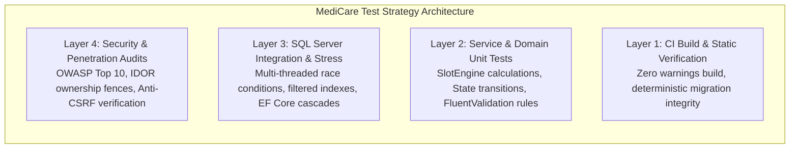

# MediCare — Quality Assurance & Testing Strategy

## 1. Architectural Testing Strategy
The MediCare Quality Assurance strategy follows an enterprise test automation pyramid designed for mission-critical healthcare systems. Because healthcare data requires absolute privacy and clinic operations require zero slot contention, testing is partitioned into deterministic layers:

---

## 2. Test Layer Breakdown

### Layer 1: Unit Testing (Isolation)
* **Framework:** xUnit 2.9, Moq 4.20, FluentAssertions 6.12.
* **Scope:**
  - `SlotEngineService`: Slot division (30 min), handling clinic opening/closing bounds, midday break periods, overlapping leave intervals, and past date filtering.
  - `AppointmentService`: Valid transitions according to the appointment lifecycle state machine; cancellation time thresholds (2-hour window).
  - `MedicalRecordService`: Validation of encounter DTOs, attachment size constraints, file extension allow-listing.
  - `PrescriptionService`: Patient age computation, item list formatting, print layout DTO preparation.
  - `AuthService` & `Validators`: Registration password complexity, Syrian/Egyptian syndicate license formats, national ID patterns, and unique email constraints.

### Layer 2: Real Database Integration Testing
* **Engine:** Real Microsoft SQL Server 2022 instance (LocalDB / Docker container).
* **Guarantees Tested:**
  - **Relational Filtered Indexes:** `IX_Appointments_Doctor_NoOverlap` on `(DoctorId, AppointmentDate, StartTime)` where `[Status] <> 3 AND [Status] <> 4`.
  - **Cascade Delete Prevention:** Restrictive delete behavior on critical medical records and patient entities.
  - **1:1 MedicalRecord to Appointment Invariant:** Unique foreign key constraint ensuring an appointment cannot have duplicate clinical encounters.
  - **Concurrency Stress:** Multi-threaded parallel execution testing database-level lock contention and duplicate key rejection.

### Layer 3: Security & Ownership Audits (OWASP Compliance)
* **Insecure Direct Object References (IDOR):**
  - Verification that every controller action resolving an entity by primary key checks identity claims against entity ownership.
  - Verification that attempting to access another user's prescription, medical record, or appointment immediately logs a security incident and returns HTTP 403 Forbidden.
* **Cross-Site Request Forgery (CSRF):**
  - Verification that all state-changing endpoints (`POST`, `PUT`, `DELETE`) require and validate anti-forgery tokens (`[ValidateAntiForgeryToken]`).
* **CSV Formula Injection (CWE-1236):**
  - Neutralization of spreadsheet formula injection characters (`=`, `+`, `-`, `@`, `\t`) by prepending a single quote before generating CSV reports.
* **Unrestricted File Uploads (CWE-434):**
  - Restriction of diagnostic attachments to `.jpg`, `.jpeg`, `.png`, `.pdf` with an upper bound of 5 MB and server-side GUID file renaming.

### Layer 4: Continuous Integration Automation (GitHub Actions)
* Every pull request and push to `main`, `develop`, or `feature/*` branches executes the automated pipeline in `.github/workflows/ci.yml`.
* Automated spins up a temporary Microsoft SQL Server 2022 service container, builds the solution in `Release` configuration, executes unit tests, waits for the database port, and runs all integration tests.

---

## 3. Defect Management & Resolution Workflow
1. **Defect Detection:** Observed through automated test failure, static analysis, or manual exploration.
2. **Reproduction:** Scripted into an isolated, failing xUnit regression test.
3. **Remediation:** Surgical fix applied directly to the affected service or controller without expanding requirements.
4. **Verification:** Rerun the targeted test to confirm resolution.
5. **Full Suite Regression:** Rerun all 131 tests across the entire solution to guarantee no side effects.
6. **Git Traceability:** Atomic conventional commit (`fix: ...` or `test: ...`) on the dedicated QA branch.
