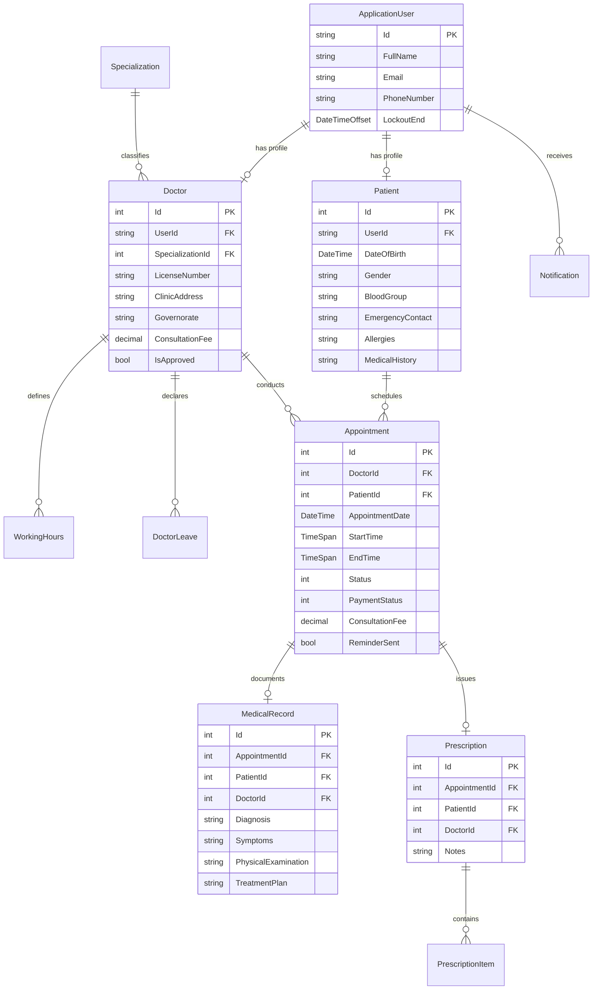

# MediCare — Comprehensive Technical Architecture & Engineering Documentation

## 1. Architectural Architecture & Design Principles

MediCare is engineered following a clean **Three-Tier Layered Architecture** with strict directional dependency enforcement and separation of concerns:

```
┌─────────────────────────────────────────────────────────────┐
│                      MediCare.Web                           │
│   (ASP.NET Core 8 MVC, Razor Views, REST APIs, SignalR Hub) │
└──────────────────────────────┬──────────────────────────────┘
                               │ references
                               ▼
┌─────────────────────────────────────────────────────────────┐
│                    MediCare.Services                        │
│   (Business Logic, Domain Services, DTOs, FluentValidation, │
│    Background Workers, IClinicClock, Notification Adapters) │
└──────────────────────────────┬──────────────────────────────┘
                               │ references
                               ▼
┌─────────────────────────────────────────────────────────────┐
│                      MediCare.Data                          │
│   (EF Core 8, DbContext, Relational Entities, Migrations,   │
│    Generic & Specialized Repositories, Unit of Work, Seed)  │
└─────────────────────────────────────────────────────────────┘
```

### Architectural Principles:
1. **Separation of Concerns**: Controllers handle HTTP requests and return ViewModels or DTOs. Business logic resides strictly within domain services. Database operations execute via Repository and Unit of Work abstractions.
2. **Result Pattern**: Services return strongly typed `Result` and `Result<T>` envelopes containing success state, error messages, and payload, avoiding uncontrolled exception throwing for domain logic.
3. **Wall-Clock Local Time Anchoring**: MediCare implements `IClinicClock`, resolving `Africa/Cairo` (Egypt Standard Time) with automatic Daylight Saving Time handling to guarantee consistent appointment slot calculations.
4. **Defense in Depth**: Security controls operate across presentation (anti-forgery tokens, role attributes), service (ownership verification, DTO validation), and data layers (filtered unique constraints, foreign keys).

---

## 2. Relational Database Schema & Entity Relationships

The data model is managed via EF Core Code-First migrations with SQL Server.



### 2.1 Filtered Unique Index for Active Slot Protection
To prevent double bookings at the database engine level, EF Core applies a filtered unique index in `ApplicationDbContext`:

```csharp
modelBuilder.Entity<Appointment>()
    .HasIndex(a => new { a.DoctorId, a.AppointmentDate, a.StartTime })
    .IsUnique()
    .HasFilter("[Status] IN (1, 2)"); // Status: 1 = Pending, 2 = Confirmed
```
- **Guaranteed Isolation**: Even if two concurrent booking requests pass memory validation simultaneously, SQL Server strictly rejects the second transaction with a unique constraint violation (`DbUpdateException`).
- **Reuse of Cancelled Slots**: Because the index only filters on active statuses (`Pending`, `Confirmed`), rejected (`3`), cancelled (`4`), or no-show (`5`) slots automatically free the time slot for subsequent bookings.

---

## 3. Concurrency Control & Atomic Operations

### 3.1 Slot Booking Concurrency Flow
1. **Memory Pre-Flight**: Service checks `IAppointmentRepository` for existing active bookings.
2. **Transaction Insertion**: `_uow.Appointments.AddAsync(appointment)`.
3. **Database Commit**: `_uow.CommitAsync()`.
4. **Conflict Handling**: If two requests hit the same slot concurrently, the filtered index throws `DbUpdateException`. The service intercepts this, rolls back cleanly, and returns `Result.Failure("This appointment slot was just reserved by another patient.")`.

### 3.2 Atomic Appointment Rescheduling
Rescheduling is executed atomically in `AppointmentService.RescheduleAppointmentAsync`:
- Enforces a minimum **2-hour lead time** prior to the original appointment.
- Verifies target date is within a **30-day forward window**.
- Validates the doctor's weekly **Working Hours** and checks against declared **Doctor Leaves**.
- Validates that the patient has no overlapping appointments at that target time.
- Verifies doctor slot availability and updates `AppointmentDate`, `StartTime`, `EndTime`, resetting `ReminderSent = false`.
- Dispatches notifications to both patient and doctor.

---

## 4. Security Architecture & Threat Mitigations

| Security Domain | Mitigation Strategy | Technical Implementation |
|:---|:---|:---|
| **Authentication** | ASP.NET Core Identity with PBKDF2 hashing | Password complexity rules, lockout management via `UserManager`. |
| **Authorization & RBAC** | Declarative Role & Claim Attributes | `[Authorize(Roles = "Admin")]`, `[Authorize(Roles = "Doctor")]`, `[Authorize(Roles = "Patient")]`. |
| **CSRF / XSRF** | Synchronizer Token Pattern | `[ValidateAntiForgeryToken]` enforced on all POST, PUT, DELETE actions. |
| **Broken Object Level Auth (IDOR)** | Ownership Verification | Services extract `currentUserId` from trusted ClaimsPrincipal and enforce `patient.UserId == currentUserId` before any data mutation or viewing. |
| **CSV Formula Injection (CWE-1236)** | Preamble Quoting | Sanitization function intercepts cells starting with `=`, `+`, `-`, `@`, `\t` and prepends a single quote (`'`). |
| **Input Validation** | Strict DTO Validation | FluentValidation rules applied before business processing. |

---

## 5. Background Services & Notification Infrastructure

### 5.1 Automated 24-Hour Reminder Background Worker
- **Component**: `AppointmentReminderBackgroundService : BackgroundService`.
- **Hosting**: Registered as a hosted background service via `services.AddHostedService<AppointmentReminderBackgroundService>()`.
- **Lifecycle**: Executes periodically every 15 minutes, creating a discrete `IServiceScope` to safely consume scoped dependencies (`IUnitOfWork`, `IClinicClock`, `IEmailService`, `ISmsService`, `INotificationService`).
- **Target Selection**: Evaluates appointments where `!ReminderSent` and `Status IN (Pending, Confirmed)` occurring between `[ClinicClock.Now + 23h, ClinicClock.Now + 25h]`.
- **Multi-Channel Dispatch**:
  1. **Email Notification** (HTML formatted appointment details, clinic location, doctor name).
  2. **SMS Dispatch** (Concise appointment reminder text).
  3. **In-App Notification** (SignalR push alert).
- **Atomic Flag Commit**: Marks `appointment.ReminderSent = true` and commits to database.

### 5.2 External Provider Adapters
- **Twilio SMS**: `TwilioSmsService` dispatches SMS via Twilio REST API with Basic Auth credentials; includes automatic simulation mode when credentials are not configured.
- **SendGrid Email**: `SendGridEmailService` dispatches emails via SendGrid v3 JSON API with Bearer token authentication.
- **MailKit SMTP**: `MailKitEmailService` delivers transactional emails via TLS/STARTTLS SMTP servers.

---

## 6. Multi-Format Reporting Subsystem

MediCare generates reports in three formats without heavy external third-party dependencies:

1. **CSV Export (`/Admin/ExportAppointmentsCsv`)**: Generates UTF-8 encoded text with Byte Order Mark (BOM) for seamless opening in Microsoft Excel and LibreOffice, sanitized against CSV formula injection.
2. **Native Excel Workbook (`/Admin/ExportAppointmentsExcel`)**: Generates true OpenXML `.xlsx` zip packages containing styled headers, workbook relations, and typed numeric/date cell values using `System.IO.Compression.ZipArchive`.
3. **PDF Document (`/Admin/ExportAppointmentsPdf`)**: Generates standard Adobe PDF-1.4 documents containing clinic branding headers, executive summary metrics, and formatted appointment data tables with alternating row shading.

---

## 7. Testing Strategy & Verification Evidence

The test suite consists of **157 automated tests** with 100% pass rate:

- **Unit Tests**: Moq-driven unit tests verifying business validation, slot generation, appointment rescheduling, patient profile management, CSV formula injection mitigation, and reminder processing.
- **Integration Tests**: Executed against Microsoft SQL Server LocalDB with real EF Core migrations, validating schema constraints, filtered unique indexes, and concurrent booking race conditions.

```
Total Test Count: 157
Passed:           157 (100%)
Failed:           0
Skipped:          0
Build Warnings:   0
Build Errors:     0
```

---

## 8. Deployment & Environment Configuration

### Key Settings (`appsettings.json`):
```json
{
  "ConnectionStrings": {
    "DefaultConnection": "Server=(localdb)\\mssqllocaldb;Database=MediCareDb;Trusted_Connection=True;MultipleActiveResultSets=true"
  },
  "SmtpSettings": {
    "Host": "smtp.gmail.com",
    "Port": 587,
    "SenderEmail": "noreply@medicare.local",
    "SenderName": "MediCare Clinic",
    "EnableSsl": true
  },
  "TwilioSettings": {
    "Enabled": false,
    "AccountSid": "",
    "AuthToken": "",
    "FromPhoneNumber": "+10000000000"
  },
  "SendGridSettings": {
    "Enabled": false,
    "ApiKey": "",
    "SenderEmail": "noreply@medicare.local",
    "SenderName": "MediCare Clinic"
  }
}
```
Production deployments support environment variable overrides (`ConnectionStrings__DefaultConnection`, `SmtpSettings__Password`, etc.) compatible with Azure App Service, Docker, and IIS.
