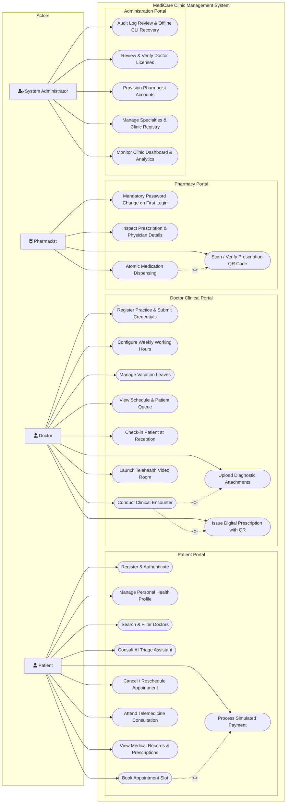

# Chapter 5: System Design

This chapter presents the architectural and behavioral design models of the **MediCare** clinic management and appointment system. The design models are derived strictly from the verified C# ASP.NET Core source code, Entity Framework Core mappings, database configurations, and business service implementations.

---

## 5.1 Use Case Diagram & Specification

The system accommodates four distinct primary actors whose responsibilities and workflows correspond to specialized portals within the web application:
1. **Patient**: Registers an account, explores medical specialties and doctors, consults an automated triage guidance assistant, reserves time slots with conflict prevention, processes simulated payments, and accesses electronic records and digital prescriptions.
2. **Doctor**: Submits practice credentials for licensing review, configures recurring weekly working schedules and vacation leaves, manages the daily appointment queue, registers patient arrival at reception, conducts clinical encounters, uploads diagnostic attachments, and issues cryptographically verifiable electronic prescriptions.
3. **Pharmacist**: Authenticates under mandatory initial password replacement, scans or enters a 128-bit prescription verification token, reviews medication items, and executes atomic, one-time medication dispensing protected against race conditions.
4. **System Administrator**: Conducts credential vetting for physician registrations, provisions pharmacist accounts, tracks system audit logs, and monitors clinic operational metrics, with emergency CLI access for credential recovery directly on the server host.

---

### Figure 5.1: MediCare System Use Case Diagram

**Caption (Figure 5.1):** MediCare Use Case Diagram depicting interactions across Patient, Doctor, Pharmacist, and System Administrator actors within the web application boundaries.

**Plain-Language Explanation:**  
This diagram models how the four distinct roles interact with the system modules. Patients manage appointments, payments, and medical history. Doctors manage clinical encounters, schedules, and electronic prescriptions. Pharmacists scan prescription QR tokens and dispense medications once. Administrators verify medical licenses and provision staff accounts.

**How to Explain This in the Discussion:**  
> *"The system establishes role-based separation of concerns across four primary actors. Rather than a generic monolithic user model, each actor has a distinct workflow reflecting clinic operations: the patient books conflict-free slots, the doctor conducts the clinical encounter and issues a signed electronic prescription, the pharmacist validates the token to dispense medication atomically, and the administrator audits and approves provider credentials."*

---

### Detailed Use Case Specifications

The tables below specify the core operational use cases of the MediCare platform.

#### Table 5.1: Use Case Description — UC-P5: Book Appointment Slot
| Field | Details |
| :--- | :--- |
| **Use Case ID** | **UC-P5** |
| **Use Case Name** | Book Appointment Slot |
| **Primary Actor** | Registered Patient |
| **Preconditions** | 1. Patient is authenticated with a valid session. 2. Selected doctor is approved (`IsApproved == true`) and has active weekly schedule slots. |
| **Main Success Scenario** | 1. Patient selects a doctor, date, and appointment type (Consultation, Follow-Up, or Telemedicine). 2. System validates that the date is between tomorrow and 30 days in advance (`Date <= Today + 30d`). 3. System computes available non-overlapping time slots based on the doctor's `WorkingHours`, subtracting approved `DoctorLeaves` and existing bookings (`Status != Cancelled && Status != Rejected`). 4. Patient selects an open slot and submits the booking form. 5. System verifies in a database transaction that the slot remains unreserved. 6. System creates an `Appointment` record with `Status = Confirmed`, sets `PaymentStatus = Unpaid`, and displays payment options. |
| **Alternative / Error Flows** | **4a. Slot Concurrency Conflict:** Another patient booked the same slot milliseconds earlier. System catches filtered unique index violation (`IX_Appointments_Doctor_NoOverlap`), aborts transaction, returns an error message, and prompts the patient to pick another slot. **2a. Date Exceeds Booking Horizon:** Patient requests a date beyond 30 days. System displays validation error: *"Appointments cannot be booked more than 30 days in advance."* |
| **Postconditions** | 1. A new `Appointment` record is persisted in the database. 2. Slot is locked against double-booking. 3. Automated background reminder job schedules notification 24 hours prior to appointment time. |

---

#### Table 5.2: Use Case Description — UC-D6 & UC-D8: Conduct Clinical Encounter & Issue Prescription
| Field | Details |
| :--- | :--- |
| **Use Case ID** | **UC-D6 & UC-D8** |
| **Use Case Name** | Conduct Clinical Encounter and Issue Digital Prescription |
| **Primary Actor** | Treating Doctor |
| **Preconditions** | 1. Doctor is authenticated. 2. Appointment belongs to the logged-in doctor (`Appointment.DoctorId == currentDoctor.Id`). 3. Appointment is confirmed or arrived at reception (`Status == Confirmed`). |
| **Main Success Scenario** | 1. Doctor opens the clinical encounter workspace for the patient's appointment. 2. Doctor records vital signs, primary diagnosis, symptoms, and clinical examination notes. 3. (Optional) Doctor attaches diagnostic lab results or imaging files (validated against allowed MIME magic bytes). 4. Doctor adds prescription items specifying medication name, dosage, frequency, and duration in days. 5. Doctor submits the completed clinical encounter form. 6. System creates a `MedicalRecord` linked to the `Appointment`. 7. System generates an associated `Prescription` record with a cryptographically secure random 128-bit verification token (`Convert.ToHexString(RandomNumberGenerator.GetBytes(16))`). 8. System renders a local, server-side QR code representing the secure verification URL. 9. System updates appointment `Status = Completed`. |
| **Alternative / Error Flows** | **2a. IDOR / Ownership Breach:** A doctor attempts to open an encounter for another doctor's patient. System returns `403 Forbidden` and logs a security alert with user details. **3a. Invalid File Upload:** Doctor attaches an executable or spoofed file. System inspects file header magic bytes, rejects the file, and displays an invalid format warning. |
| **Postconditions** | 1. `MedicalRecord` and `Prescription` records are permanently stored. 2. Prescription verification token is indexed uniquely in the database (`IX_Prescriptions_VerificationToken`). 3. Patient can immediately view and print the prescription QR code from their portal. |

---

#### Table 5.3: Use Case Description — UC-Ph4: Atomic Medication Dispensing
| Field | Details |
| :--- | :--- |
| **Use Case ID** | **UC-Ph4** |
| **Use Case Name** | Verify and Dispense Prescription |
| **Primary Actor** | Authenticated Pharmacist |
| **Preconditions** | 1. Pharmacist has logged in (and completed mandatory initial password change if new account). 2. Prescription exists and has a valid verification token. |
| **Main Success Scenario** | 1. Pharmacist scans patient's prescription QR code or enters the verification token in the pharmacy portal. 2. System looks up prescription using token index `IX_Prescriptions_VerificationToken` (without requiring public login). 3. System displays patient name, prescribing doctor credentials, medication items, dosages, and current dispensation status (`IsDispensed`). 4. Pharmacist reviews items, prepares medication, enters optional pharmacy notes, and clicks *"Confirm Dispense"*. 5. System verifies `IsDispensed == false`, sets `IsDispensed = true`, records `DispensedAt = DateTime.UtcNow` and `DispensedByUserId = currentUserId`. 6. System commits the update with optimistic concurrency verification. 7. System displays success confirmation and permanently locks the prescription against re-dispensing. |
| **Alternative / Error Flows** | **4a. Prescription Already Dispensed:** System displays a prominent warning badge: *"Prescription was already dispensed on [Date] by Pharmacist [Name]. Re-dispensing is prohibited."* The dispense button is disabled. **5a. Concurrent Dispensing Race Condition:** Two pharmacists attempt to dispense identical token simultaneously. EF Core concurrency token detects conflict (`DbUpdateConcurrencyException`), rolls back the second transaction, and displays an alert. |
| **Postconditions** | 1. Prescription status is permanently marked as dispensed. 2. Audit metadata (`DispensedAt`, `DispensedByUserId`, `PharmacyNotes`) is stored for regulatory compliance. |

---

#### Table 5.4: Use Case Description — UC-A2: Doctor Credential Review & Licensing Approval
| Field | Details |
| :--- | :--- |
| **Use Case ID** | **UC-A2** |
| **Use Case Name** | Review and Approve Doctor Registration |
| **Primary Actor** | System Administrator |
| **Preconditions** | 1. Administrator is authenticated (`Role == "Admin"`). 2. New doctor has registered with pending approval status (`IsApproved == false`). |
| **Main Success Scenario** | 1. Administrator navigates to the Doctor Approvals dashboard. 2. System displays list of pending doctors including full legal name, medical license number, specialization, consultation fee, and biography. 3. Administrator reviews credentials against official syndicate standards and selects *"Approve"*. 4. System sets `Doctor.IsApproved = true` and updates `UpdatedAt = DateTime.UtcNow`. 5. System dispatches an email notification confirming profile activation. 6. Doctor immediately becomes visible in public search and patient booking filters. |
| **Alternative / Error Flows** | **3a. Administrator Rejects Registration:** Administrator clicks *"Reject"* and enters rejection reason. System removes the unapproved doctor record, purges the orphaned `ApplicationUser` login account, and logs the administrative rejection event. |
| **Postconditions** | 1. Doctor status is updated in the database. 2. Audit entry is recorded in application logs. |

---

### Instructions for Rendering Diagram 5.1
The Mermaid source code is preserved in `docs/academic/diagrams/5.1-use-case.mmd`.
- **Online rendering:** Copy the source into [Mermaid Live Editor](https://mermaid.live) and export as PNG (2000px width) or SVG.
- **Local CLI rendering:** Run `npx @mermaid-js/mermaid-cli -i docs/academic/diagrams/5.1-use-case.mmd -o docs/academic/diagrams/5.1-use-case.png -w 1600`
- **VS Code:** Install the *Markdown Preview Mermaid Support* extension to preview inline.
