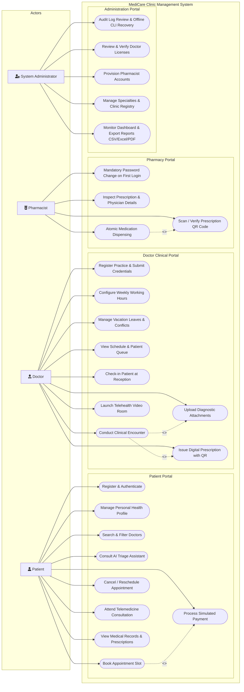
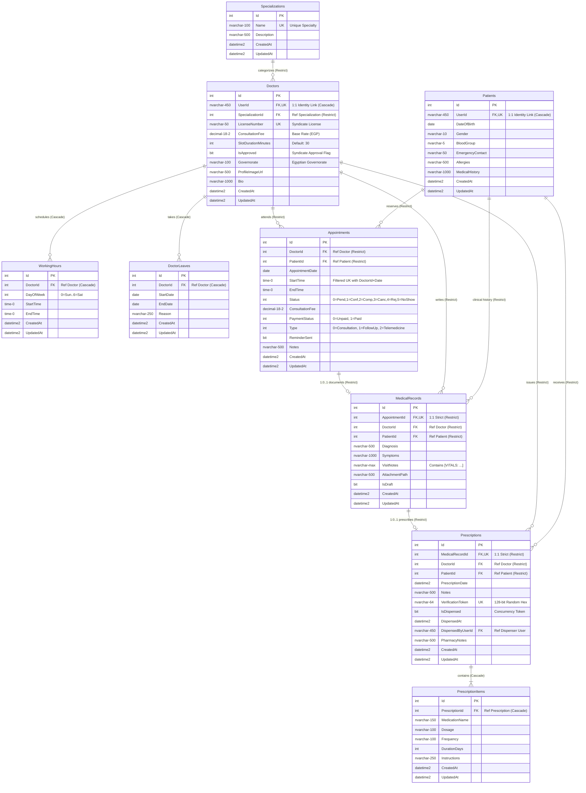
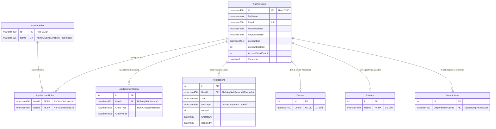

# Chapter 5: System Design

This chapter presents the architectural and behavioral design models of the **MediCare** clinic management and appointment system. The design models are derived strictly from the verified C# ASP.NET Core source code, Entity Framework Core mappings, database configurations, and business service implementations.

---

## 5.0 Architectural Realities & Code Audit Notes (Notes & Uncertainties)

To maintain absolute academic transparency, the following technical facts summarize the persistence boundaries verified against `ApplicationDbContextModelSnapshot.cs` and the production C# service layer:

1. **Healthcare Insurance Filter & Pagination Mechanics:**  
   In `DoctorService.cs` (`GetDoctorsAsync`), the database query `_uow.Doctors.GetDoctorsAsync` executes SQL pagination first based on `page` and `pageSize`, retrieving the paged doctor records. The insurance filter (`filter.AcceptsInsuranceOnly == true`) is subsequently applied **in memory on the returned subset** (`dtos = dtos.Where(x => x.AcceptsInsurance).ToList()`). As a consequence, pages may return fewer items than `pageSize` when insurance filtering is active, while `totalCount` reflects the pre-insurance database count.
2. **Consultation Fee & Receipt Reproduction:**  
   The `Appointments.ConsultationFee` column preserves the doctor's base rate at booking time. When a patient applies a discount promo code (`DEPI2026` or `MEDICARE50`), `PaymentService.ProcessCheckoutAsync` computes `finalAmount` in memory and updates `Appointment.PaymentStatus = Paid` without overwriting `ConsultationFee`. The transaction reference (`TXN-{Timestamp}-{AppointmentId}`) and applied discount amount are communicated via email and persisted inside the body of a `Notification` entity. When retrieving a historical receipt days later via `GetReceiptAsync`, the receipt reconstructs `AmountPaid = appointment.ConsultationFee` (the full fee), and derives the transaction reference timestamp from `appointment.UpdatedAt ?? appointment.CreatedAt`. If the appointment record is subsequently updated by clinical staff, this derived timestamp would shift unless read from the original notification.
3. **Appointment Status Enumeration Alignment:**  
   The integer status codes in SQL Server correspond strictly to the `AppointmentStatus` C# enum: `0 = Pending`, `1 = Confirmed`, `2 = Completed`, `3 = Cancelled`, `4 = Rejected`, and `5 = NoShow`. The database filtered unique index `IX_Appointments_Doctor_NoOverlap` uses the predicate `[Status] <> 3 AND [Status] <> 4`, accurately exempting cancelled and rejected slots from double-booking constraints.
4. **Conflict Detection & Overlap Enforcement Mechanics:**  
   Conflict detection is partitioned across database constraints and service-layer algorithms:
   * **Database Layer:** The filtered unique index enforces that for a given `DoctorId` and `AppointmentDate`, no two active appointments can share the identical `StartTime`.
   * **Service Layer Pre-Check:** `AppointmentService.cs` invokes `HasConflictAsync(doctorId, date, startTime)`, which calls the repository method defaulting to a 30-minute window (`startTime` to `startTime.Add(30m)`). An active appointment is flagged as conflicting if `existing.StartTime < newEndTime && existing.EndTime > newStartTime`.
   * **Grid Alignment:** `AppointmentService.cs` verifies mathematical alignment with the doctor's shift: `(StartTime - ShiftStartTime) % SlotDuration == 0`.
   * **Edge Case Analysis:** If a doctor modifies `SlotDurationMinutes` (e.g., from 30 minutes to 45 minutes) after patient bookings already exist, the database unique index on `StartTime` alone cannot prevent an overlap (e.g., a new 09:45 slot overlapping with an existing 09:30–10:00 booking). The service-layer interval check (`HasConflictAsync`) detects this partial overlap provided the check encompasses the full duration; however, because the 3-parameter overload defaults to 30 minutes, interval verification for durations exceeding 30 minutes relies on grid re-computation.
5. **Clinical Vital Signs Storage:**  
   The `MedicalRecords` table does not possess separate numeric columns for vital signs. Instead, `MedicalRecordService.cs` serializes recorded parameters into a structured tag (`[VITALS: BP:... | HR:... | Temp:... | Glucose:... | Weight:...]`) prepended to the `VisitNotes` text column, and deserializes this string via regular expressions when rendering clinical encounter views.
6. **Queue & Reception Check-in Computation:**  
   The `Appointments` table contains no `QueueNumber` or `CheckedInAt` columns. The queue number is an ordinal position calculated dynamically at query time in `AppointmentService.cs` based on the chronological sequence of active appointments for that doctor on that day. The reception check-in action in `AppointmentsController` performs doctor ownership validation and surfaces a temporary confirmation notification without modifying database state.
7. **Doctor Clinic Location & Map Resolution:**  
   The `Doctors` database table persists `Governorate`, but contains no columns for clinic address or geographical coordinates (Latitude/Longitude). The interactive Leaflet clinic map resolves coordinates on the client side using a static JavaScript dictionary of Egypt's 27 governorate geographic centers.
8. **Patient Ratings & Reviews:**  
   There is no `Reviews` or `Ratings` database table. Numerical ratings (4.7–5.0) and sample reviews displayed on doctor profile cards are deterministically synthesized in memory. The review submission form in the doctor profile view triggers a client-side JavaScript alert and does not write to the database.
9. **Telemedicine Video Rooms:**  
   The video consultation meeting link is not stored in the database. It is an expression-bodied computed property in C# (`AppointmentDTOs.cs`) dynamically generated as `https://meet.jit.si/MediCare-Appt-{Id}-D{DoctorId}`.

### 5.0.1 Known Discrepancies & Technical Issues Discovered During Code Audit

The following four technical defects were discovered in the production codebase during this architectural audit. In strict accordance with academic integrity guidelines, these are documented factually below without unauthorized code modification:

* **Issue A: Non-Persisted Discount in Payment Receipts (Display Divergence)**  
  `PaymentService.ProcessCheckoutAsync` computes `finalAmount = Math.Max(0m, originalFee - discountAmount)` and marks `appointment.PaymentStatus = PaymentStatus.Paid`, but does not save `finalAmount`, `discountAmount`, or the promo code into database columns. When a receipt is retrieved subsequently via `GetReceiptAsync`, it reconstructs `AmountPaid = appointment.ConsultationFee` (the full fee). Consequently, if a patient pays using a promotional discount (such as `DEPI2026` or `MEDICARE50`), any subsequent receipt lookup displays the undiscounted base price.
* **Issue B: Mutation of Derived Transaction Reference Timestamp**  
  `GetReceiptAsync` derives the transaction reference string as `TXN-{paidDate:yyyyMMddHHmmss}-{appointment.Id:D4}`, where `paidDate = appointment.UpdatedAt ?? appointment.CreatedAt`. If an appointment is subsequently updated (e.g., when marked confirmed, checked-in, or completed by the physician), EF Core updates `UpdatedAt`. As a result, the receipt transaction reference derived by `GetReceiptAsync` drifts to a later timestamp instead of reflecting the actual historical payment execution time.
* **Issue C: Post-Pagination Insurance Filtering Inconsistency**  
  In `DoctorService.GetDoctorsAsync`, the SQL query executes database pagination (`page`, `pageSize`) prior to evaluating insurance status. Because `filter.AcceptsInsuranceOnly` is evaluated in memory downstream via LINQ-to-Objects on the retrieved page (`dtos = dtos.Where(x => x.AcceptsInsurance).ToList()`), the number of returned doctors per page can fall below `pageSize`, while the returned `totalCount` reflects the unfiltered total doctor count.
* **Issue D: Booking Conflict Pre-Check Uses Hardcoded 30-Minute Interval**  
  In `AppointmentService.BookAppointmentAsync` (line 111):
  ```csharp
  bool slotConflict = await _uow.Appointments.HasConflictAsync(dto.DoctorId, dto.AppointmentDate, dto.StartTime);
  ```
  The service invokes the 3-parameter overload of `HasConflictAsync`, which internally assumes a fixed 30-minute duration (`startTime.Add(TimeSpan.FromMinutes(30))`). For doctors configured with a `SlotDurationMinutes` of 45 or 60 minutes, the booking pre-check fails to evaluate the latter 15 to 30 minutes of the slot. In contrast, `RescheduleAppointmentAsync` (lines 414–442) explicitly calculates `expectedEnd = dto.NewStartTime.Add(slotSpan)` and evaluates the entire interval.

---

## 5.1 Use Case Diagram & Specification

The system accommodates four distinct primary actors whose responsibilities and workflows correspond to specialized portals within the web application:
1. **Patient**: Registers an account, manages health profile data, explores medical specialties, consults an automated triage guidance assistant, books appointment slots with conflict prevention, processes simulated payments, and accesses electronic medical records and prescriptions.
2. **Doctor**: Submits practice credentials for licensing review, configures recurring weekly working schedules, manages vacation leaves with conflict detection, tracks daily queues, checks in patients at reception, conducts clinical encounters, uploads diagnostic attachments, and issues electronic prescriptions.
3. **Pharmacist**: Authenticates under mandatory initial password replacement, scans or enters a 128-bit prescription verification token, reviews medication items, and executes atomic, one-time medication dispensing protected by optimistic concurrency tokens.
4. **System Administrator**: Conducts credential vetting for physician registrations, provisions pharmacist accounts, tracks audit logs, exports analytics reports (CSV, Excel, PDF), and uses emergency offline CLI commands for account recovery on the server host.

---

### Figure 5.1: MediCare System Use Case Diagram



**Caption (Figure 5.1):** MediCare Use Case Diagram depicting interactions across Patient, Doctor, Pharmacist, and System Administrator actors within the web application boundaries.

**Plain-Language Explanation:**  
This diagram models how the four distinct roles interact with the system modules. Patients manage appointments, payments, and medical history. Doctors manage clinical encounters, schedules, and electronic prescriptions. Pharmacists scan prescription QR tokens and dispense medications once. Administrators verify medical licenses, provision staff accounts, and export analytics reports.

**How to Explain This in the Discussion:**  
> *"The system establishes role-based separation of concerns across four primary actors. Rather than a generic monolithic user model, each actor has a distinct workflow reflecting clinic operations: the patient books conflict-free slots, the doctor conducts the clinical encounter and issues a signed electronic prescription, the pharmacist validates the token to dispense medication atomically, and the administrator audits, approves provider credentials, and exports operational reports."*

---

### Detailed Use Case Specifications

The tables below specify the core operational use cases of the MediCare platform.

#### Table 5.1: Use Case Description — UC-P5: Book Appointment Slot
| Field | Details |
| :--- | :--- |
| **Use Case ID** | **UC-P5** |
| **Use Case Name** | Book Appointment Slot |
| **Primary Actor** | Registered Patient |
| **Preconditions** | 1. Patient is authenticated with a valid session.<br>2. Selected doctor is approved (`IsApproved == true`) and has active weekly schedule slots. |
| **Main Success Scenario** | 1. Patient selects a doctor, date, and appointment type (Consultation, Follow-Up, or Telemedicine).<br>2. System validates that the date is between tomorrow and 30 days in advance (`Date <= Today + 30d`).<br>3. System computes available non-overlapping time slots based on the doctor's `WorkingHours`, subtracting approved `DoctorLeaves` and existing bookings (`Status != Cancelled && Status != Rejected`).<br>4. Patient selects an open slot and submits the booking form.<br>5. System verifies in a database transaction that the slot remains unreserved.<br>6. System creates an `Appointment` record with `Status = Confirmed`, sets `PaymentStatus = Unpaid`, and displays payment options. |
| **Alternative / Error Flows** | **4a. Slot Concurrency Conflict:** Another patient booked the same slot milliseconds earlier.<br>System catches filtered unique index violation (`IX_Appointments_Doctor_NoOverlap`), aborts transaction, returns an error message, and prompts the patient to pick another slot.<br>**2a. Date Exceeds Booking Horizon:** Patient requests a date beyond 30 days.<br>System displays validation error: *"Appointments cannot be booked more than 30 days in advance."* |
| **Postconditions** | 1. A new `Appointment` record is persisted in the database.<br>2. Slot is locked against double-booking.<br>3. Automated background reminder job schedules notification 24 hours prior to appointment time. |

---

#### Table 5.2: Use Case Description — UC-D6 & UC-D8: Conduct Clinical Encounter & Issue Prescription
| Field | Details |
| :--- | :--- |
| **Use Case ID** | **UC-D6 & UC-D8** |
| **Use Case Name** | Conduct Clinical Encounter and Issue Digital Prescription |
| **Primary Actor** | Treating Doctor |
| **Preconditions** | 1. Doctor is authenticated.<br>2. Appointment belongs to the logged-in doctor (`Appointment.DoctorId == currentDoctor.Id`).<br>3. Appointment is confirmed or arrived at reception (`Status == Confirmed`). |
| **Main Success Scenario** | 1. Doctor opens the clinical encounter workspace for the patient's appointment.<br>2. Doctor records vital signs, primary diagnosis, symptoms, and clinical examination notes.<br>3. (Optional) Doctor attaches diagnostic lab results or imaging files (validated against allowed MIME magic bytes).<br>4. Doctor adds prescription items specifying medication name, dosage, frequency, and duration in days.<br>5. Doctor submits the completed clinical encounter form.<br>6. System creates a `MedicalRecord` linked to the `Appointment`.<br>7. System generates an associated `Prescription` record with a cryptographically secure random 128-bit verification token (`Convert.ToHexString(RandomNumberGenerator.GetBytes(16))`).<br>8. System renders a local, server-side QR code representing the secure verification URL.<br>9. System updates appointment `Status = Completed`. |
| **Alternative / Error Flows** | **2a. IDOR / Ownership Breach:** A doctor attempts to open an encounter for another doctor's patient.<br>System returns `403 Forbidden` and logs a security alert with user details.<br>**3a. Invalid File Upload:** Doctor attaches an executable or spoofed file.<br>System inspects file header magic bytes, rejects the file, and displays an invalid format warning. |
| **Postconditions** | 1. `MedicalRecord` and `Prescription` records are permanently stored.<br>2. Prescription verification token is indexed uniquely in the database (`IX_Prescriptions_VerificationToken`).<br>3. Patient can immediately view and print the prescription QR code from their portal. |

---

#### Table 5.3: Use Case Description — UC-Ph4: Atomic Medication Dispensing
| Field | Details |
| :--- | :--- |
| **Use Case ID** | **UC-Ph4** |
| **Use Case Name** | Verify and Dispense Prescription |
| **Primary Actor** | Authenticated Pharmacist |
| **Preconditions** | 1. Pharmacist has logged in (and completed mandatory initial password change if new account).<br>2. Prescription exists and has a valid verification token. |
| **Main Success Scenario** | 1. Pharmacist scans patient's prescription QR code or enters the verification token in the pharmacy portal.<br>2. System looks up prescription using token index `IX_Prescriptions_VerificationToken` (without requiring public login).<br>3. System displays patient name, prescribing doctor credentials, medication items, dosages, and current dispensation status (`IsDispensed`).<br>4. Pharmacist reviews items, prepares medication, enters optional pharmacy notes, and clicks *"Confirm Dispense"*.<br>5. System verifies `IsDispensed == false`, sets `IsDispensed = true`, records `DispensedAt = DateTime.UtcNow` and `DispensedByUserId = currentUserId`.<br>6. System commits the update with optimistic concurrency verification.<br>7. System displays success confirmation and permanently locks the prescription against re-dispensing. |
| **Alternative / Error Flows** | **4a. Prescription Already Dispensed:**<br>System displays a prominent warning badge: *"Prescription was already dispensed on [Date] by Pharmacist [Name]. Re-dispensing is prohibited."* The dispense button is disabled.<br>**5a. Concurrent Dispensing Race Condition:** Two pharmacists attempt to dispense identical token simultaneously.<br>EF Core concurrency token detects conflict (`DbUpdateConcurrencyException`), rolls back the second transaction, and displays an alert. |
| **Postconditions** | 1. Prescription status is permanently marked as dispensed.<br>2. Audit metadata (`DispensedAt`, `DispensedByUserId`, `PharmacyNotes`) is stored for regulatory compliance. |

---

#### Table 5.4: Use Case Description — UC-A2 & UC-A5: Doctor Credential Review & Analytics Export
| Field | Details |
| :--- | :--- |
| **Use Case ID** | **UC-A2 & UC-A5** |
| **Use Case Name** | Review Doctor Registration and Export Clinic Analytics |
| **Primary Actor** | System Administrator |
| **Preconditions** | 1. Administrator is authenticated (`Role == "Admin"`). |
| **Main Success Scenario** | 1. Administrator reviews pending doctor licensing applications and approves credentials, triggering doctor activation and welcoming notification.<br>2. Administrator navigates to the Analytics & Reports workspace.<br>3. Administrator reviews KPIs: total appointments, revenue, confirmed/cancelled rates, and specialty distribution.<br>4. Administrator triggers on-demand data export in CSV, Excel (.xlsx), or PDF formats.<br>5. System generates data streams server-side and downloads the formatted document directly to the client browser. |
| **Alternative / Error Flows** | **1a. Licensing Application Rejection:** Administrator enters rejection feedback.<br>System removes the unapproved doctor record and purges the associated unconfirmed identity user account to eliminate orphaned records. |
| **Postconditions** | 1. Doctor status is updated in the database.<br>2. Export file is generated and transmitted with audit logging. |

---

## 5.3 Entity-Relationship Diagrams (ERD)

The database schema is partitioned into two specialized structural diagrams to ensure readability while preserving referential precision:
1. **Clinical Core ERD (Figure 5.3a):** Covers the 10 domain tables governing appointments, patient encounters, schedules, and electronic prescriptions.
2. **Identity & Security ERD (Figure 5.3b):** Covers the core ASP.NET Identity tables, security claims (including `MustChangePassword`), role memberships, and user notifications.

All domain tables inherit audit fields (`Id int PK`, `CreatedAt datetime2`, `UpdatedAt datetime2 NULL`) from `BaseAuditableEntity`, which is omitted as an entity because it is an abstract base class.

---

### Figure 5.3a: MediCare Clinical Core ERD



**Caption (Figure 5.3a):** MediCare Clinical Core ERD modeling 9 clinical domain entities, referential integrity constraints, and operational hierarchies.

**Plain-Language Explanation:**  
This diagram illustrates the core healthcare entities. Specializations categorize physicians, who configure working schedules and leave periods. Appointments represent scheduled bookings between a doctor and patient. A clinical encounter produces a 1-to-1 medical record, which can generate a 1-to-1 digital prescription containing multiple individual medication items.

---

### Figure 5.3b: MediCare Identity & Security ERD



**Caption (Figure 5.3b):** MediCare Identity & Authorization ERD modeling user authentication, role assignments, security claims (including mandatory initial password replacement), and system notifications.  
*(Note: Tables `AspNetUserLogins`, `AspNetRoleClaims`, and `AspNetUserTokens` exist in the database snapshot but are omitted from Figure 5.3b to maintain diagram clarity and visual focus).*

**Plain-Language Explanation:**  
This diagram models user security and authorization. `AspNetUsers` authenticates all roles and links 1-to-1 to either a doctor or patient record. Security claims enforce constraints such as the mandatory pharmacist first-login password change. In-app notifications are linked directly to user accounts, storing operational updates and payment transaction receipts.

---

### Relational Cardinality & Referential Integrity Reference Table

> **Referential Deletion Interlock Note:** While `AspNetUsers` ⟷ `Doctors` is configured with `Cascade` deletion, `Doctors` ⟷ `Appointments` enforces `Restrict`. Consequently, attempting to delete a Doctor's user account is **intentionally blocked** by the database engine if any historical or active appointments exist for that physician. This is an intentional medical audit safeguard ensuring physician identities cannot be purged while patient clinical records remain.

| Parent Entity | Child Entity | Foreign Key Column | Cardinality | Delete Behavior | Rationale / Architectural Guard |
| :--- | :--- | :--- | :---: | :---: | :--- |
| `AspNetUsers` | `Doctors` | `UserId` | 1 ⟷ 0..1 | **Cascade** | Deleting a user identity removes their physician profile. Enforced via unique index `IX_Doctors_UserId`. |
| `AspNetUsers` | `Patients` | `UserId` | 1 ⟷ 0..1 | **Cascade** | Deleting a user identity removes their patient profile. Enforced via unique index `IX_Patients_UserId`. |
| `AspNetUsers` | `Notifications` | `UserId` | 1 ⟷ 0..* | **Cascade** | Notifications are owned entirely by the target user. |
| `AspNetUsers` | `Prescriptions` | `DispensedByUserId` | 0..1 ⟷ 0..* | **Restrict** | Dispensing pharmacist account deletion is prevented if attached to historical pharmacy records. |
| `Specializations`| `Doctors` | `SpecializationId` | 1 ⟷ 0..* | **Restrict** | Prevents accidental deletion of a clinical specialty with registered active physicians. |
| `Doctors` | `WorkingHours` | `DoctorId` | 1 ⟷ 0..* | **Cascade** | Doctor working schedule shifts belong exclusively to the physician profile. |
| `Doctors` | `DoctorLeaves` | `DoctorId` | 1 ⟷ 0..* | **Cascade** | Vacation periods belong exclusively to the physician profile. |
| `Doctors` | `Appointments` | `DoctorId` | 1 ⟷ 0..* | **Restrict** | Prevents deletion of a doctor with active or historical patient bookings. |
| `Patients` | `Appointments` | `PatientId` | 1 ⟷ 0..* | **Restrict** | Prevents deletion of a patient record that contains clinical appointment history. |
| `Appointments` | `MedicalRecords` | `AppointmentId` | 1 ⟷ 0..1 | **Restrict** | Strict 1-to-1 consultation encounter mapping enforced by unique index `IX_MedicalRecords_AppointmentId`. |
| `Doctors` | `MedicalRecords` | `DoctorId` | 1 ⟷ 0..* | **Restrict** | Preserves treating physician identity in clinical audit records. |
| `Patients` | `MedicalRecords` | `PatientId` | 1 ⟷ 0..* | **Restrict** | Preserves patient medical history against accidental cascading deletion. |
| `MedicalRecords`| `Prescriptions` | `MedicalRecordId` | 1 ⟷ 0..1 | **Restrict** | Strict 1-to-1 relationship enforced by unique index `IX_Prescriptions_MedicalRecordId`. |
| `Doctors` | `Prescriptions` | `DoctorId` | 1 ⟷ 0..* | **Restrict** | Preserves prescribing physician identity for medical licensing accountability. |
| `Patients` | `Prescriptions` | `PatientId` | 1 ⟷ 0..* | **Restrict** | Preserves patient prescription records. |
| `Prescriptions` | `PrescriptionItems`| `PrescriptionId` | 1 ⟷ 1..* | **Cascade** | Individual medication line items belong exclusively to their parent prescription. |

---

### Database Unique Indexes & Concurrency Tokens Table

| Table Name | Index / Column Name | Type | Predicate / Condition | Purpose |
| :--- | :--- | :---: | :--- | :--- |
| `Appointments` | `IX_Appointments_Doctor_NoOverlap` | Filtered Unique Index | `[Status] <> 3 AND [Status] <> 4` on `(DoctorId, AppointmentDate, StartTime)` | Concurrency guard preventing two active bookings from reserving the identical doctor start time simultaneously. |
| `Prescriptions` | `IX_Prescriptions_VerificationToken` | Unique Index | Unfiltered on `VerificationToken` | Ensures global uniqueness of the cryptographically random 128-bit hex token used for QR code verification. |
| `Prescriptions` | `IsDispensed` | Concurrency Token | EF Core optimistic concurrency token (`IsConcurrencyToken()`) | Detects concurrent double-dispensing race conditions by competing pharmacists. |
| `MedicalRecords`| `IX_MedicalRecords_AppointmentId` | Unique Index | Unfiltered on `AppointmentId` | Mathematically enforces that each appointment can have at most one clinical consultation encounter record. |
| `Prescriptions` | `IX_Prescriptions_MedicalRecordId` | Unique Index | Unfiltered on `MedicalRecordId` | Mathematically enforces that each clinical record can have at most one digital prescription. |
| `Doctors` | `IX_Doctors_UserId` | Unique Index | Unfiltered on `UserId` | Enforces 1-to-1 cardinality between an Identity User account and a Doctor profile. |
| `Patients` | `IX_Patients_UserId` | Unique Index | Unfiltered on `UserId` | Enforces 1-to-1 cardinality between an Identity User account and a Patient profile. |
| `Doctors` | `IX_Doctors_LicenseNumber` | Unique Index | Unfiltered on `LicenseNumber` | Prevents duplicate medical syndicate registration numbers across physicians. |
| `Specializations`| `IX_Specializations_Name` | Unique Index | Unfiltered on `Name` | Prevents duplicate medical specialty names. |
| `Notifications` | `IX_Notifications_UserId_IsRead` | Composite Index | Non-unique index on `(UserId, IsRead)` | Optimizes user notification badge polling queries. |

---

**How to Explain This in the Discussion:**  
> *"Our relational design enforces medical-grade data integrity through strict foreign key delete behaviors and database engine constraints. Clinical consultations and prescriptions are protected by `Restrict` delete rules and unique foreign key indexes, preventing accidental cascading data loss. Concurrency risks are mitigated through two distinct layers: filtered unique database indexes prevent booking collision race conditions at the database level, while an optimistic concurrency token on the prescription table prevents double-dispensation attacks in high-throughput pharmacy environments."*

---

### Instructions for Rendering Diagrams 5.3a & 5.3b
The Mermaid source codes are preserved in:
- `docs/academic/diagrams/5.3a-erd-clinical.mmd`
- `docs/academic/diagrams/5.3b-erd-identity.mmd`
- **Online rendering:** Copy the source into [Mermaid Live Editor](https://mermaid.live) and export as PNG (2400px width) or SVG.
- **Local CLI rendering:** Run `npx @mermaid-js/mermaid-cli -i docs/academic/diagrams/5.3a-erd-clinical.mmd -o docs/academic/diagrams/5.3a-erd-clinical.png -w 2000`

---

## 5.4 Relational Schema & Physical Data Dictionary

This section specifies the physical relational schema definitions for all 17 database tables persisted in SQL Server LocalDB and generated by Entity Framework Core migrations.

---

### 5.4.1 Domain Table Schemas (Outpatient Clinic Operations)

#### Table 5.6: `Specializations` Table Schema
| Column Name | SQL Data Type | Nullable | Keys & Indexes | Default Value | Description / Constraint |
| :--- | :--- | :---: | :---: | :---: | :--- |
| `Id` | `int` | No | **PK**, Identity(1,1) | — | Unique auto-incrementing identifier for the specialty. |
| `Name` | `nvarchar(100)` | No | **UK** (`IX_Specializations_Name`) | — | Unique clinical specialty name (e.g., Cardiology). |
| `Description` | `nvarchar(500)` | Yes | — | `NULL` | Clinical scope and description of medical practice. |
| `CreatedAt` | `datetime2` | No | — | `GETUTCDATE()` | Entity creation timestamp in UTC. |
| `UpdatedAt` | `datetime2` | Yes | — | `NULL` | Timestamp of last modification in UTC. |

---

#### Table 5.7: `Doctors` Table Schema
| Column Name | SQL Data Type | Nullable | Keys & Indexes | Default Value | Description / Constraint |
| :--- | :--- | :---: | :---: | :---: | :--- |
| `Id` | `int` | No | **PK**, Identity(1,1) | — | Unique auto-incrementing identifier for the doctor. |
| `UserId` | `nvarchar(450)` | No | **FK, UK** (`IX_Doctors_UserId`) | — | 1:1 foreign key referencing `AspNetUsers(Id)` (`ON DELETE CASCADE`). |
| `SpecializationId`| `int` | No | **FK** | — | Foreign key referencing `Specializations(Id)` (`ON DELETE RESTRICT`). |
| `LicenseNumber` | `nvarchar(50)` | No | **UK** (`IX_Doctors_LicenseNumber`)| — | Unique Egyptian Medical Syndicate registration number. |
| `ConsultationFee` | `decimal(18,2)`| No | — | — | Base consultation rate charged per visit (in EGP). |
| `SlotDurationMinutes`| `int` | No | — | `30` | Duration allocated per consultation slot (15, 30, 45, 60 min). |
| `IsApproved` | `bit` | No | — | `0` (false) | Administrative credential approval status (0 = Pending, 1 = Approved). |
| `Governorate` | `nvarchar(100)`| No | — | `'Cairo'` | Egyptian governorate where the physician clinic operates. |
| `ProfileImageUrl` | `nvarchar(500)`| Yes | — | `NULL` | Relative web URL to doctor's profile avatar. |
| `Bio` | `nvarchar(1000)`| Yes | — | `NULL` | Professional biography, credentials, and detailed clinic address. |
| `CreatedAt` | `datetime2` | No | — | `GETUTCDATE()` | Entity creation timestamp in UTC. |
| `UpdatedAt` | `datetime2` | Yes | — | `NULL` | Timestamp of last modification in UTC. |

---

#### Table 5.8: `Patients` Table Schema
| Column Name | SQL Data Type | Nullable | Keys & Indexes | Default Value | Description / Constraint |
| :--- | :--- | :---: | :---: | :---: | :--- |
| `Id` | `int` | No | **PK**, Identity(1,1) | — | Unique auto-incrementing identifier for the patient. |
| `UserId` | `nvarchar(450)` | No | **FK, UK** (`IX_Patients_UserId`) | — | 1:1 foreign key referencing `AspNetUsers(Id)` (`ON DELETE CASCADE`). |
| `DateOfBirth` | `date` | No | — | — | Date of birth (used for chronological age calculation). |
| `Gender` | `nvarchar(10)` | No | — | — | Patient gender (`Male` or `Female`). |
| `BloodGroup` | `nvarchar(5)` | Yes | — | `NULL` | ABO/Rh blood classification (e.g., `A+`, `O-`, `B+`). |
| `EmergencyContact`| `nvarchar(50)` | Yes | — | `NULL` | Contact phone number of designated emergency proxy. |
| `Allergies` | `nvarchar(500)`| Yes | — | `NULL` | Documented adverse drug reactions or food allergies. |
| `MedicalHistory` | `nvarchar(1000)`| Yes | — | `NULL` | Chronic conditions, surgical history, and family predispositions. |
| `CreatedAt` | `datetime2` | No | — | `GETUTCDATE()` | Entity creation timestamp in UTC. |
| `UpdatedAt` | `datetime2` | Yes | — | `NULL` | Timestamp of last modification in UTC. |

---

#### Table 5.9: `WorkingHours` Table Schema
| Column Name | SQL Data Type | Nullable | Keys & Indexes | Default Value | Description / Constraint |
| :--- | :--- | :---: | :---: | :---: | :--- |
| `Id` | `int` | No | **PK**, Identity(1,1) | — | Unique auto-incrementing shift identifier. |
| `DoctorId` | `int` | No | **FK, IX** (`IX_WorkingHours_Doctor_Day`)| — | Foreign key referencing `Doctors(Id)` (`ON DELETE CASCADE`). |
| `DayOfWeek` | `int` | No | **IX** (`IX_WorkingHours_Doctor_Day`)| — | Weekly recurrence: `0 = Sunday` through `6 = Saturday`. |
| `StartTime` | `time(0)` | No | — | — | Clinic opening time for this day (precision: whole seconds). |
| `EndTime` | `time(0)` | No | — | — | Clinic closing time for this day (precision: whole seconds). |
| `CreatedAt` | `datetime2` | No | — | `GETUTCDATE()` | Entity creation timestamp in UTC. |
| `UpdatedAt` | `datetime2` | Yes | — | `NULL` | Timestamp of last modification in UTC. |

---

#### Table 5.10: `DoctorLeaves` Table Schema
| Column Name | SQL Data Type | Nullable | Keys & Indexes | Default Value | Description / Constraint |
| :--- | :--- | :---: | :---: | :---: | :--- |
| `Id` | `int` | No | **PK**, Identity(1,1) | — | Unique auto-incrementing leave record identifier. |
| `DoctorId` | `int` | No | **FK, IX** (`IX_DoctorLeaves_Doctor_Dates`)| — | Foreign key referencing `Doctors(Id)` (`ON DELETE CASCADE`). |
| `StartDate` | `date` | No | **IX** (`IX_DoctorLeaves_Doctor_Dates`)| — | Starting calendar date of physician leave period (inclusive). |
| `EndDate` | `date` | No | **IX** (`IX_DoctorLeaves_Doctor_Dates`)| — | Ending calendar date of physician leave period (inclusive). |
| `Reason` | `nvarchar(250)`| Yes | — | `NULL` | Optional rationale (e.g., Annual Leave, Medical Conference). |
| `CreatedAt` | `datetime2` | No | — | `GETUTCDATE()` | Entity creation timestamp in UTC. |
| `UpdatedAt` | `datetime2` | Yes | — | `NULL` | Timestamp of last modification in UTC. |

---

#### Table 5.11: `Appointments` Table Schema
| Column Name | SQL Data Type | Nullable | Keys & Indexes | Default Value | Description / Constraint |
| :--- | :--- | :---: | :---: | :---: | :--- |
| `Id` | `int` | No | **PK**, Identity(1,1) | — | Unique auto-incrementing appointment identifier. |
| `DoctorId` | `int` | No | **FK, IX** (`IX_Appointments_Doctor_NoOverlap`)| — | Foreign key referencing `Doctors(Id)` (`ON DELETE RESTRICT`). |
| `PatientId` | `int` | No | **FK, IX** (`IX_Appointments_PatientId`)| — | Foreign key referencing `Patients(Id)` (`ON DELETE RESTRICT`). |
| `AppointmentDate`| `date` | No | **IX** (`IX_Appointments_Doctor_NoOverlap`)| — | Scheduled consultation calendar date. |
| `StartTime` | `time(0)` | No | **IX** (`IX_Appointments_Doctor_NoOverlap`)| — | Slot starting time. Part of filtered unique index. |
| `EndTime` | `time(0)` | No | — | — | Slot finishing time (`StartTime + Duration`). |
| `Status` | `int` | No | — | `0` | Enumeration: `0=Pending, 1=Confirmed, 2=Completed, 3=Cancelled, 4=Rejected, 5=NoShow`. |
| `ConsultationFee` | `decimal(18,2)`| No | — | — | Price snapshot at time of booking (in EGP). |
| `PaymentStatus` | `int` | No | — | `0` | Payment state: `0 = Unpaid`, `1 = Paid`. |
| `Type` | `int` | No | — | `0` | Visit category: `0 = Consultation`, `1 = FollowUp`, `2 = Telemedicine`. |
| `ReminderSent` | `bit` | No | — | `0` (false) | Notification state managed by 15-minute background worker service. |
| `Notes` | `nvarchar(500)`| Yes | — | `NULL` | Initial symptoms or patient booking remarks. |
| `CreatedAt` | `datetime2` | No | — | `GETUTCDATE()` | Reservation creation timestamp in UTC. |
| `UpdatedAt` | `datetime2` | Yes | — | `NULL` | Timestamp of last status modification in UTC. |

---

#### Table 5.12: `MedicalRecords` Table Schema
| Column Name | SQL Data Type | Nullable | Keys & Indexes | Default Value | Description / Constraint |
| :--- | :--- | :---: | :---: | :---: | :--- |
| `Id` | `int` | No | **PK**, Identity(1,1) | — | Unique auto-incrementing medical record identifier. |
| `AppointmentId` | `int` | No | **FK, UK** (`IX_MedicalRecords_AppointmentId`)| — | 1:1 foreign key referencing `Appointments(Id)` (`ON DELETE RESTRICT`). |
| `DoctorId` | `int` | No | **FK** | — | Foreign key referencing `Doctors(Id)` (`ON DELETE RESTRICT`). |
| `PatientId` | `int` | No | **FK** | — | Foreign key referencing `Patients(Id)` (`ON DELETE RESTRICT`). |
| `Diagnosis` | `nvarchar(500)`| No | — | — | Formal clinical diagnosis established by the physician. |
| `Symptoms` | `nvarchar(1000)`| Yes | — | `NULL` | Observed and subjective presenting symptoms. |
| `VisitNotes` | `nvarchar(max)`| Yes | — | `NULL` | Detailed physician clinical notes and serialized `[VITALS: ...]` tag. |
| `AttachmentPath`| `nvarchar(500)`| Yes | — | `NULL` | Relative storage path for magic-byte-validated diagnostic files. |
| `IsDraft` | `bit` | No | — | `0` (false) | Encounter drafting status (0 = Finalized, 1 = Draft). |
| `CreatedAt` | `datetime2` | No | — | `GETUTCDATE()` | Clinical encounter recording timestamp in UTC. |
| `UpdatedAt` | `datetime2` | Yes | — | `NULL` | Timestamp of last modification in UTC. |

---

#### Table 5.13: `Prescriptions` Table Schema
| Column Name | SQL Data Type | Nullable | Keys & Indexes | Default Value | Description / Constraint |
| :--- | :--- | :---: | :---: | :---: | :--- |
| `Id` | `int` | No | **PK**, Identity(1,1) | — | Unique auto-incrementing prescription identifier. |
| `MedicalRecordId`| `int` | No | **FK, UK** (`IX_Prescriptions_MedicalRecordId`)| — | 1:1 foreign key referencing `MedicalRecords(Id)` (`ON DELETE RESTRICT`). |
| `DoctorId` | `int` | No | **FK** | — | Foreign key referencing `Doctors(Id)` (`ON DELETE RESTRICT`). |
| `PatientId` | `int` | No | **FK** | — | Foreign key referencing `Patients(Id)` (`ON DELETE RESTRICT`). |
| `PrescriptionDate`| `datetime2` | No | — | `GETUTCDATE()` | Official date and time of prescription issuance. |
| `Notes` | `nvarchar(500)`| Yes | — | `NULL` | Dietary instructions, general physician precautions. |
| `VerificationToken`| `nvarchar(64)` | No | **UK** (`IX_Prescriptions_VerificationToken`)| — | Cryptographically random 128-bit hex token for QR verification. |
| `IsDispensed` | `bit` | No | Concurrency Token | `0` (false) | Optimistic concurrency token protecting against double dispensing. |
| `DispensedAt` | `datetime2` | Yes | — | `NULL` | Exact timestamp when medication was dispensed by pharmacist. |
| `DispensedByUserId`| `nvarchar(450)`| Yes | **FK** | `NULL` | Foreign key referencing dispensing `AspNetUsers(Id)` (`ON DELETE RESTRICT`). |
| `PharmacyNotes` | `nvarchar(500)`| Yes | — | `NULL` | Dispensing pharmacist notes (substitutions, counseling remarks). |
| `CreatedAt` | `datetime2` | No | — | `GETUTCDATE()` | Creation timestamp in UTC. |
| `UpdatedAt` | `datetime2` | Yes | — | `NULL` | Timestamp of last modification in UTC. |

---

#### Table 5.14: `PrescriptionItems` Table Schema
| Column Name | SQL Data Type | Nullable | Keys & Indexes | Default Value | Description / Constraint |
| :--- | :--- | :---: | :---: | :---: | :--- |
| `Id` | `int` | No | **PK**, Identity(1,1) | — | Unique auto-incrementing line item identifier. |
| `PrescriptionId`| `int` | No | **FK** | — | Foreign key referencing `Prescriptions(Id)` (`ON DELETE CASCADE`). |
| `MedicationName`| `nvarchar(150)`| No | — | — | Commercial brand or active generic drug name. |
| `Dosage` | `nvarchar(100)`| No | — | — | Prescribed strength (e.g., `500 mg`, `10 ml`). |
| `Frequency` | `nvarchar(100)`| No | — | — | Intake regimen (e.g., `Twice daily after meals`). |
| `DurationDays` | `int` | No | — | — | Recommended course duration in calendar days. |
| `Instructions` | `nvarchar(250)`| Yes | — | `NULL` | Special patient administration instructions. |
| `CreatedAt` | `datetime2` | No | — | `GETUTCDATE()` | Creation timestamp in UTC. |
| `UpdatedAt` | `datetime2` | Yes | — | `NULL` | Timestamp of last modification in UTC. |

---

#### Table 5.15: `Notifications` Table Schema
| Column Name | SQL Data Type | Nullable | Keys & Indexes | Default Value | Description / Constraint |
| :--- | :--- | :---: | :---: | :---: | :--- |
| `Id` | `int` | No | **PK**, Identity(1,1) | — | Unique auto-incrementing notification identifier. |
| `UserId` | `nvarchar(450)`| No | **FK, IX** (`IX_Notifications_UserId_IsRead`)| — | Foreign key referencing recipient `AspNetUsers(Id)` (`ON DELETE CASCADE`). |
| `Title` | `nvarchar(150)`| No | — | — | Alert headline / category banner. |
| `Message` | `nvarchar(500)`| No | — | — | Notification content (stores transaction references upon checkout). |
| `IsRead` | `bit` | No | **IX** (`IX_Notifications_UserId_IsRead`)| `0` (false) | Notification acknowledgment flag (0 = Unread, 1 = Read). |
| `CreatedAt` | `datetime2` | No | — | `GETUTCDATE()` | Creation timestamp in UTC. |
| `UpdatedAt` | `datetime2` | Yes | — | `NULL` | Timestamp of last modification in UTC. |

---

### 5.4.2 Security & Identity Table Schemas (Microsoft ASP.NET Core Identity)

#### Table 5.16: `AspNetUsers` Table Schema
| Column Name | SQL Data Type | Nullable | Keys & Indexes | Description |
| :--- | :--- | :---: | :---: | :--- |
| `Id` | `nvarchar(450)` | No | **PK** | Globally unique identifier (GUID string) for the user principal. |
| `FullName` | `nvarchar(max)` | No | — | Display name (enforces letters-only via custom fluent validation). |
| `Email` | `nvarchar(256)` | Yes | **IX** (`EmailIndex`) | User email address used as primary login credential. |
| `NormalizedEmail` | `nvarchar(256)` | Yes | — | Upper-cased normalized email for invariant lookup. |
| `EmailConfirmed` | `bit` | No | — | Boolean flag indicating confirmed verification status. |
| `PasswordHash` | `nvarchar(max)` | Yes | — | Salted and stretched cryptographic password hash (PBKDF2). |
| `SecurityStamp` | `nvarchar(max)` | Yes | — | Random value mutated upon password reset or role modification. |
| `ConcurrencyStamp`| `nvarchar(max)` | Yes | — | Optimistic concurrency stamp for identity mutations. |
| `PhoneNumber` | `nvarchar(max)` | Yes | — | E.164 compliant telephone contact number. |
| `PhoneNumberConfirmed`| `bit` | No | — | Phone confirmation state. |
| `TwoFactorEnabled`| `bit` | No | — | Two-factor authentication status flag. |
| `LockoutEnd` | `datetimeoffset`| Yes | — | Timestamp in UTC until which the account is locked following failed logins. |
| `LockoutEnabled` | `bit` | No | — | Policy flag enabling automatic brute-force lockout protection. |
| `AccessFailedCount`| `int` | No | — | Counter tracking consecutive failed credential submission attempts. |
| `CreatedAt` | `datetime2` | No | — | Account creation timestamp populated automatically by `ApplicationDbContext`. |

---

#### Table 5.17: `AspNetRoles` Table Schema
| Column Name | SQL Data Type | Nullable | Keys & Indexes | Description |
| :--- | :--- | :---: | :---: | :--- |
| `Id` | `nvarchar(450)` | No | **PK** | Globally unique identifier (GUID string) for the authorization role. |
| `Name` | `nvarchar(256)` | Yes | **IX** (`RoleNameIndex`)| Role name: `Admin`, `Doctor`, `Patient`, `Pharmacist`. |
| `NormalizedName` | `nvarchar(256)` | Yes | — | Normalized upper-cased role name for invariant comparison. |
| `ConcurrencyStamp`| `nvarchar(max)` | Yes | — | Optimistic concurrency stamp for role modifications. |

---

#### Table 5.18: `AspNetUserRoles` Table Schema
| Column Name | SQL Data Type | Nullable | Keys & Indexes | Description |
| :--- | :--- | :---: | :---: | :--- |
| `UserId` | `nvarchar(450)` | No | **PK, FK** | Composite primary key referencing `AspNetUsers(Id)` (`ON DELETE CASCADE`). |
| `RoleId` | `nvarchar(450)` | No | **PK, FK** | Composite primary key referencing `AspNetRoles(Id)` (`ON DELETE CASCADE`). |

---

#### Table 5.19: `AspNetUserClaims` Table Schema
| Column Name | SQL Data Type | Nullable | Keys & Indexes | Description |
| :--- | :--- | :---: | :---: | :--- |
| `Id` | `int` | No | **PK**, Identity(1,1)| Unique claim record identifier. |
| `UserId` | `nvarchar(450)` | No | **FK, IX** | Foreign key referencing `AspNetUsers(Id)` (`ON DELETE CASCADE`). |
| `ClaimType` | `nvarchar(max)` | Yes | — | Claim type name (e.g., `MustChangePassword` for first-time staff login). |
| `ClaimValue` | `nvarchar(max)` | Yes | — | Value payload associated with the security claim. |

---

#### Table 5.20: Supplementary Identity Tables (Snapshot Reference)
| Table Name | Primary Key | Foreign Key Target | Operational Scope in MediCare |
| :--- | :--- | :--- | :--- |
| `AspNetUserLogins` | `(LoginProvider, ProviderKey)` | `AspNetUsers(Id)` | Manages third-party external OAuth identity providers (empty; MediCare relies on local credentials). |
| `AspNetRoleClaims` | `Id` (int) | `AspNetRoles(Id)` | Role-scoped permission claims (empty; role-based authorization uses `AspNetUserRoles`). |
| `AspNetUserTokens` | `(UserId, LoginProvider, Name)` | `AspNetUsers(Id)` | Stores short-lived tokens for email confirmation, two-factor, and password recovery. |
