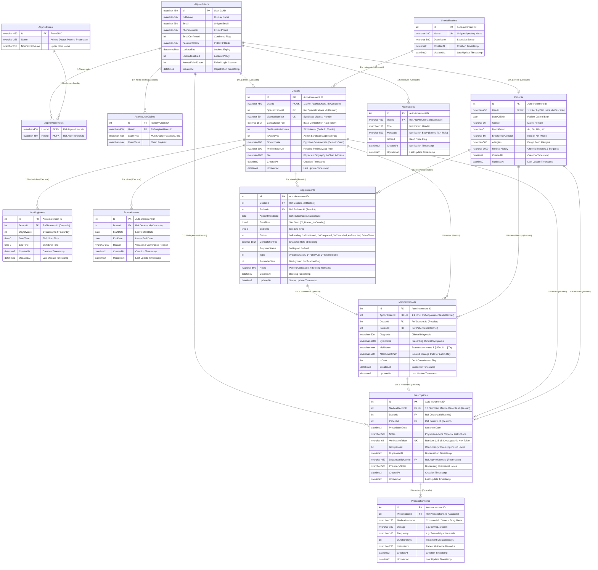

# Chapter 5: System Design

This chapter presents the architectural and behavioral design models of the **MediCare** clinic management and appointment system. The design models are derived strictly from the verified C# ASP.NET Core source code, Entity Framework Core mappings, database configurations, and business service implementations.

---

## 5.0 Architectural Realities & Code Audit Notes (Notes & Uncertainties)

To maintain absolute academic transparency, the following technical facts summarize the persistence boundaries verified against `ApplicationDbContextModelSnapshot.cs` and the production C# service layer:

1. **Payment Processing:** There is no dedicated `Payments` table in the database schema. Payment transactions are simulated in memory within `PaymentService.cs`, which validates card format via the Luhn algorithm and evaluates promotional codes (`DEPI2026` for 20% off, `MEDICARE50` for 50% off). Upon successful checkout, the appointment record is updated to `PaymentStatus = Paid`, and a deterministic transaction reference (`TXN-{Timestamp}-{AppointmentId}`) is generated and preserved in the message payload of a `Notification` entity sent to the patient.
2. **Clinical Vital Signs:** The `MedicalRecords` table does not possess separate numeric columns for blood pressure, pulse, temperature, glucose, or weight. Instead, `MedicalRecordService.cs` serializes recorded vital signs into a structured header tag (`[VITALS: BP:... | HR:... | Temp:... | Glucose:... | Weight:...]`) prepended to the `VisitNotes` text column, and deserializes this string via regular expressions when rendering clinical details.
3. **Queue & Reception Check-in:** The `Appointments` table does not store a `QueueNumber` or `CheckedInAt` timestamp. The `QueueNumber` is an ordinal index calculated dynamically at query time in `AppointmentService.cs` based on the chronological sequence of active appointments for that doctor on that day. The reception check-in action in `AppointmentsController` performs doctor ownership validation and surfaces a temporary confirmation notification without modifying database state.
4. **Doctor Clinic Location & Insurance Discounts:** The `Doctors` database table persists `Governorate`, but does not contain separate columns for clinic street address, geographical coordinates (Latitude/Longitude), or insurance acceptance flags. The clinic address and insurance acceptance status (simulated at 90% acceptance with 20%–35% discounts) are enriched deterministically in memory by `DoctorService.GetDoctorProfileMetadata` based on the physician's biography and ID. The interactive Leaflet clinic map resolves coordinates on the client side using a static JavaScript dictionary of Egypt's 27 governorate geographic centers.
5. **Patient Ratings & Reviews:** There is no `Reviews` or `Ratings` database table. Numerical ratings (4.7–5.0) and sample reviews displayed on doctor profile cards are deterministically synthesized in memory. The review submission form in the doctor profile view triggers a client-side JavaScript alert and does not write to the persistent store.
6. **Telemedicine Video Rooms:** The video consultation meeting link is not stored in the database. It is an expression-bodied computed property in C# (`AppointmentDTOs.cs`) dynamically generated as `https://meet.jit.si/MediCare-Appt-{Id}-D{DoctorId}`.
7. **Double-Booking Prevention Boundaries:** SQL Server filtered unique index `IX_Appointments_Doctor_NoOverlap` on `(DoctorId, AppointmentDate, StartTime)` prevents concurrent race conditions where two bookings request the identical start time. Prevention of arbitrary partial interval overlaps is guaranteed by business logic in `AppointmentService.cs`, which mathematically enforces slot grid alignment: `(StartTime - ShiftStartTime) % SlotDuration == 0`.

---

## 5.1 Use Case Diagram & Specification

The system accommodates four distinct primary actors whose responsibilities and workflows correspond to specialized portals within the web application:
1. **Patient**: Registers an account, manages health profile data, explores medical specialties, consults an automated triage guidance assistant, books appointment slots with conflict prevention, processes simulated payments, and accesses electronic medical records and prescriptions.
2. **Doctor**: Submits practice credentials for licensing review, configures recurring weekly working schedules, manages vacation leaves with conflict detection, tracks daily queues, checks in patients at reception, conducts clinical encounters, uploads diagnostic attachments, and issues electronic prescriptions.
3. **Pharmacist**: Authenticates under mandatory initial password replacement, scans or enters a 128-bit prescription verification token, reviews medication items, and executes atomic, one-time medication dispensing protected by optimistic concurrency tokens.
4. **System Administrator**: Conducts credential vetting for physician registrations, provisions pharmacist accounts, tracks audit logs, exports analytics reports (CSV, Excel, PDF), and uses emergency offline CLI commands for account recovery on the server host.

---

### Figure 5.1: MediCare System Use Case Diagram

**Caption (Figure 5.1):** MediCare Use Case Diagram depicting interactions across Patient, Doctor, Pharmacist, and System Administrator actors within the web application boundaries.

**Plain-Language Explanation:**  
This diagram models how the four distinct roles interact with the system modules. Patients manage appointments, payments, and medical history. Doctors manage clinical encounters, schedules, and electronic prescriptions. Pharmacists scan prescription QR tokens and dispense medications once. Administrators verify medical licenses, provision staff accounts, and export analytics reports.

**How to Explain This in the Discussion:**  
> *"The system establishes role-based separation of concerns across four primary actors. Rather than a generic monolithic user model, each actor has a distinct workflow reflecting clinic operations: the patient books conflict-free slots, the doctor conducts the clinical encounter and issues a signed electronic prescription, the pharmacist validates the token to dispense medication atomically, and the administrator audits, approves provider credentials, and exports operational reports."*

---

### Detailed Use Case Specifications

The tables below specify the core operational use cases of the MediCare platform.

#### Table 5.1: Use Case Description — UC-P5: Book Appointment Slot
| Field | Details |
| :--- | :--- |
| **Use Case ID** | **UC-P5** |
| **Use Case Name** | Book Appointment Slot |
| **Primary Actor** | Registered Patient |
| **Preconditions** | 1. Patient is authenticated with a valid session. 2. Selected doctor is approved (`IsApproved == true`) and has active weekly schedule slots. |
| **Main Success Scenario** | 1. Patient selects a doctor, date, and appointment type (Consultation, Follow-Up, or Telemedicine). 2. System validates that the date is between tomorrow and 30 days in advance (`Date <= Today + 30d`). 3. System computes available non-overlapping time slots based on the doctor's `WorkingHours`, subtracting approved `DoctorLeaves` and existing bookings (`Status != Cancelled && Status != Rejected`). 4. Patient selects an open slot and submits the booking form. 5. System verifies in a database transaction that the slot remains unreserved. 6. System creates an `Appointment` record with `Status = Confirmed`, sets `PaymentStatus = Unpaid`, and displays payment options. |
| **Alternative / Error Flows** | **4a. Slot Concurrency Conflict:** Another patient booked the same slot milliseconds earlier. System catches filtered unique index violation (`IX_Appointments_Doctor_NoOverlap`), aborts transaction, returns an error message, and prompts the patient to pick another slot. **2a. Date Exceeds Booking Horizon:** Patient requests a date beyond 30 days. System displays validation error: *"Appointments cannot be booked more than 30 days in advance."* |
| **Postconditions** | 1. A new `Appointment` record is persisted in the database. 2. Slot is locked against double-booking. 3. Automated background reminder job schedules notification 24 hours prior to appointment time. |

---

#### Table 5.2: Use Case Description — UC-D6 & UC-D8: Conduct Clinical Encounter & Issue Prescription
| Field | Details |
| :--- | :--- |
| **Use Case ID** | **UC-D6 & UC-D8** |
| **Use Case Name** | Conduct Clinical Encounter and Issue Digital Prescription |
| **Primary Actor** | Treating Doctor |
| **Preconditions** | 1. Doctor is authenticated. 2. Appointment belongs to the logged-in doctor (`Appointment.DoctorId == currentDoctor.Id`). 3. Appointment is confirmed or arrived at reception (`Status == Confirmed`). |
| **Main Success Scenario** | 1. Doctor opens the clinical encounter workspace for the patient's appointment. 2. Doctor records vital signs, primary diagnosis, symptoms, and clinical examination notes. 3. (Optional) Doctor attaches diagnostic lab results or imaging files (validated against allowed MIME magic bytes). 4. Doctor adds prescription items specifying medication name, dosage, frequency, and duration in days. 5. Doctor submits the completed clinical encounter form. 6. System creates a `MedicalRecord` linked to the `Appointment`. 7. System generates an associated `Prescription` record with a cryptographically secure random 128-bit verification token (`Convert.ToHexString(RandomNumberGenerator.GetBytes(16))`). 8. System renders a local, server-side QR code representing the secure verification URL. 9. System updates appointment `Status = Completed`. |
| **Alternative / Error Flows** | **2a. IDOR / Ownership Breach:** A doctor attempts to open an encounter for another doctor's patient. System returns `403 Forbidden` and logs a security alert with user details. **3a. Invalid File Upload:** Doctor attaches an executable or spoofed file. System inspects file header magic bytes, rejects the file, and displays an invalid format warning. |
| **Postconditions** | 1. `MedicalRecord` and `Prescription` records are permanently stored. 2. Prescription verification token is indexed uniquely in the database (`IX_Prescriptions_VerificationToken`). 3. Patient can immediately view and print the prescription QR code from their portal. |

---

#### Table 5.3: Use Case Description — UC-Ph4: Atomic Medication Dispensing
| Field | Details |
| :--- | :--- |
| **Use Case ID** | **UC-Ph4** |
| **Use Case Name** | Verify and Dispense Prescription |
| **Primary Actor** | Authenticated Pharmacist |
| **Preconditions** | 1. Pharmacist has logged in (and completed mandatory initial password change if new account). 2. Prescription exists and has a valid verification token. |
| **Main Success Scenario** | 1. Pharmacist scans patient's prescription QR code or enters the verification token in the pharmacy portal. 2. System looks up prescription using token index `IX_Prescriptions_VerificationToken` (without requiring public login). 3. System displays patient name, prescribing doctor credentials, medication items, dosages, and current dispensation status (`IsDispensed`). 4. Pharmacist reviews items, prepares medication, enters optional pharmacy notes, and clicks *"Confirm Dispense"*. 5. System verifies `IsDispensed == false`, sets `IsDispensed = true`, records `DispensedAt = DateTime.UtcNow` and `DispensedByUserId = currentUserId`. 6. System commits the update with optimistic concurrency verification. 7. System displays success confirmation and permanently locks the prescription against re-dispensing. |
| **Alternative / Error Flows** | **4a. Prescription Already Dispensed:** System displays a prominent warning badge: *"Prescription was already dispensed on [Date] by Pharmacist [Name]. Re-dispensing is prohibited."* The dispense button is disabled. **5a. Concurrent Dispensing Race Condition:** Two pharmacists attempt to dispense identical token simultaneously. EF Core concurrency token detects conflict (`DbUpdateConcurrencyException`), rolls back the second transaction, and displays an alert. |
| **Postconditions** | 1. Prescription status is permanently marked as dispensed. 2. Audit metadata (`DispensedAt`, `DispensedByUserId`, `PharmacyNotes`) is stored for regulatory compliance. |

---

#### Table 5.4: Use Case Description — UC-A2 & UC-A5: Doctor Credential Review & Analytics Export
| Field | Details |
| :--- | :--- |
| **Use Case ID** | **UC-A2 & UC-A5** |
| **Use Case Name** | Review Doctor Registration and Export Clinic Analytics |
| **Primary Actor** | System Administrator |
| **Preconditions** | 1. Administrator is authenticated (`Role == "Admin"`). |
| **Main Success Scenario** | 1. Administrator reviews pending doctor licensing applications and approves credentials, triggering doctor activation and welcoming notification. 2. Administrator navigates to the Analytics & Reports workspace. 3. Administrator reviews KPIs: total appointments, revenue, confirmed/cancelled rates, and specialty distribution. 4. Administrator triggers on-demand data export in CSV, Excel (.xlsx), or PDF formats. 5. System generates data streams server-side and downloads the formatted document directly to the client browser. |
| **Alternative / Error Flows** | **1a. Licensing Application Rejection:** Administrator enters rejection feedback. System removes the unapproved doctor record and purges the associated unconfirmed identity user account to eliminate orphaned records. |
| **Postconditions** | 1. Doctor status is updated in the database. 2. Export file is generated and transmitted with audit logging. |

---

## 5.3 Entity-Relationship Diagram (ERD)

The MediCare database schema comprises 17 persistent tables: 7 tables generated by Microsoft ASP.NET Core Identity to manage security principals, roles, logins, and claims; and 10 domain tables mapped by Entity Framework Core to support outpatient clinic workflows.

All concrete domain tables inherit primary key (`Id int`) and temporal audit tracking fields (`CreatedAt datetime2`, `UpdatedAt datetime2`) from the abstract mapped base class `BaseAuditableEntity`, which is intentionally omitted as an independent entity in the ERD to reflect proper relational normalization.

---

### Figure 5.3: MediCare Conceptual & Logical ERD

**Caption (Figure 5.3):** Entity-Relationship Diagram (ERD) of MediCare illustrating 10 clinical domain tables and 4 core ASP.NET Identity tables, foreign key constraints, and unique relational cardinality.

**Plain-Language Explanation:**  
This diagram visualizes how clinical and security data is structured and linked in the SQL Server database. Each user account can link to either a doctor profile or a patient profile. A doctor sets recurring working hours and vacation periods. Appointments link a doctor with a patient; once conducted, an appointment is linked 1-to-1 to a medical examination record, which in turn links 1-to-1 to an electronic prescription containing individual medication items. When dispensed, the prescription references the dispensing pharmacist's user account.

**How to Explain This in the Discussion:**  
> *"The database schema is designed around referential integrity and strict clinical auditability. Critical relations are enforced at the database engine level: MedicalRecords and Prescriptions maintain strict 1-to-1 foreign key relationships protected by unique indexes. Clinical entities enforce `Restrict` delete behavior to prevent accidental cascading destruction of historical patient consultations, while operational child records like prescription items, working shifts, and vacation leaves utilize `Cascade` delete to eliminate orphaned rows. Optimistic concurrency tokens on the prescription table guard against concurrent dispensation attacks."*

---

### Instructions for Rendering Diagram 5.3
The Mermaid source code is preserved in `docs/academic/diagrams/5.3-erd.mmd`.
- **Online rendering:** Copy the source into [Mermaid Live Editor](https://mermaid.live) and export as PNG (2400px width) or SVG.
- **Local CLI rendering:** Run `npx @mermaid-js/mermaid-cli -i docs/academic/diagrams/5.3-erd.mmd -o docs/academic/diagrams/5.3-erd.png -w 2000`
